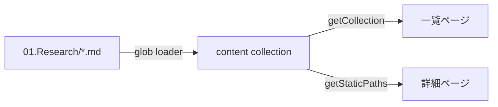

> このファイルは Research Hub の表示確認用サンプルです。不要になれば削除してください。

## 📌 結論 (TL;DR)

Astro のコンテンツコレクションは、Markdown / MDX に frontmatter スキーマ（zod）を付けて型安全に読み込み、一覧・詳細ページを静的生成するための仕組み。Astro 5 の Content Layer により、`glob()` ローダーで任意パス（例: リポジトリ直下の `01.Research/`）を読めるようになった。

## 🔍 調査結果

### スキーマ検証とローダー

- `defineCollection` に `loader` と `schema` を渡して定義する
- `glob({ pattern, base })` で任意ディレクトリの Markdown を収集できる
- `schema` は zod で記述し、ビルド時に frontmatter を検証する（型崩れを早期検出）

### 一覧・詳細の生成

- 一覧: `getCollection('research')` で全件取得し、日付降順に並べて描画
- 詳細: `getStaticPaths` で各エントリを 1 ページに割り当て、`render(entry)` で本文を HTML 化

## ⚠️ 注意点

- `tags` の表記ゆれ（`Astro` と `astro`）は絞り込みを壊すため、小文字で統一する
- frontmatter のキー名・型はサイト側スキーマと一致させる必要がある

## 📚 参照ソース一覧

- 公式:
  - [Content collections - Astro Docs](https://docs.astro.build/en/guides/content-collections/)
  - [Astro 5.0 — Content Layer](https://astro.build/blog/astro-5/)
