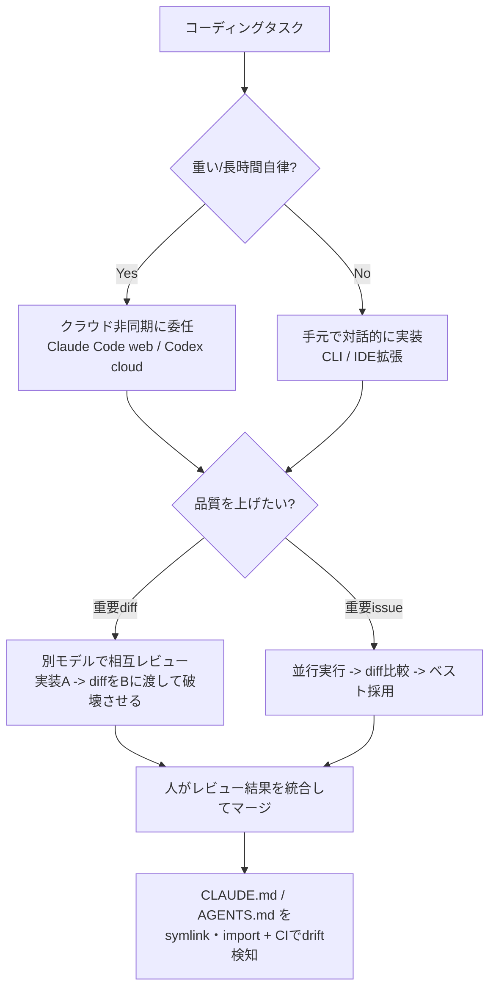
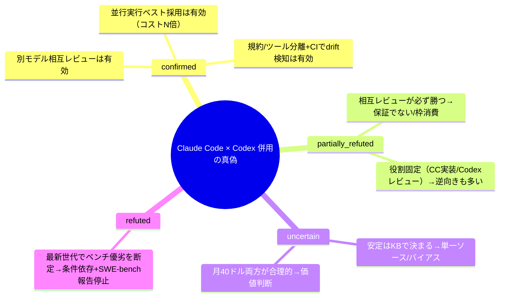

## 📌 結論 (TL;DR)

- **Claude Code（Anthropic）も Codex（OpenAI）も、2025年に出揃った「エージェント型コーディング」製品**で、提供形態（CLI / IDE拡張 / クラウド非同期 / GitHub連携 / SDK）はほぼ横並びに収束。差は **素のモデル性能・料金・操作感** に寄っている。
- **「どちらが上か」はモデル更新のたびに入れ替わり、しかも測定条件依存**。さらに2026年に **OpenAI は SWE-bench Verified の公式報告を停止**（汚染・不良テストを理由に）し、ベンダ横断の同条件比較は事実上できなくなった。スナップショットの優劣を恒久ルールにするのは危険。
- **併用 How-To で堅いのは "別モデルで相互レビュー / 並行実行して良い方を採る" という workflow 設計**。複数の実務者が「自己レビューは自分の判断を擁護して盲点を見逃す」→「diff を相手ツールに渡して壊させる」で効果を報告。ただし **"必ず勝つ" わけではなく、利用枠（コスト）を食う**。
- 「設計・実装は Claude Code、レビューは Codex」という役割分担は **よく見るが "定番固定" ではない**（逆向き＝Codex調査→CC実装 も多数）。**世代・タスク・KB(spec/plan)の充実度に依存**する。
- 併用の実コストは **料金プラン二重持ち（$40〜$220/月）** と **`CLAUDE.md` / `AGENTS.md` の二重メンテ（drift）**。「とりあえず両方」ではなく、**相互レビューなど明確な目的があって初めて黒字化**する。

## 🔍 調査結果

### 軸1. 製品・機能の対応関係（何が同じで何が違うか）

名前の対応がややこしいので先に整理する。

- **Claude Code（Anthropic）** … ターミナル常駐のエージェント型コーディングツール。提供面は **CLI（中核）/ IDE拡張（VS Code・Cursor・JetBrains）/ デスクトップアプリ / Web（claude.ai/code）/ iOS / GitHub `@claude` / Agent SDK**。全サーフェスが同一エンジンを共有し、`CLAUDE.md`・MCP 設定を横断利用。最新は v2.1.158（2026-05-30）。npm 配布は deprecated、現在はネイティブインストーラ / Homebrew / WinGet 推奨。
- **OpenAI Codex** … 2025年5月に再ローンチした SWE エージェント（初代 `codex-1` ＝ o3 の SWE 最適化版）。提供面は **Codex CLI（Rust 製 OSS, Apache-2.0）/ IDE拡張（VS Code・Cursor・Windsurf・JetBrains）/ Codex Web（chatgpt.com/codex のクラウド並列実行）/ GitHub `@codex`（PR・自動レビュー）/ SDK（TypeScript 本番 + Python 実験的）**。
  - ※ **2021年の旧 Codex（code-davinci 系 API, 2023年廃止）とは別物**。現行は「エージェント Codex」。

| 機能カテゴリ | Claude Code | OpenAI Codex |
|---|---|---|
| ターミナルCLI | ◎（中核） | ◎（`openai/codex`, Rust/OSS） |
| IDE拡張 | ◎ VS Code / Cursor / JetBrains | ◎ VS Code / Cursor / Windsurf / JetBrains |
| クラウド非同期実行 | ○（Web / バックグラウンド） | ◎（出自がクラウド並列） |
| プロジェクト指示ファイル | `CLAUDE.md` | `AGENTS.md`（階層連結） |
| MCP（外部ツール接続） | ◎ | ◎ |
| サブエージェント / 並列 | ◎（subagents / agent teams、Opus 4.8 で dynamic workflows） | ○（クラウド並列タスク） |
| 拡張・制御 | hooks / skills(SKILL.md) / plan mode / checkpoints(`/rewind`) / Routines | 承認モード / サンドボックス / カスタムプロンプト |
| GitHub 連携 | GitHub Actions / GitLab CI | `@codex` PR・自動レビュー |
| SDK | Claude Agent SDK | Codex SDK（TS / Python） |

要点：**カテゴリ単位では「ほぼ同じことができる」状態に収束**。決定的な機能差ではなく、**モデルの癖・料金・操作感**で選ぶフェーズ。

**根拠**:
- [Claude Code overview（公式 docs）](https://code.claude.com/docs/en/overview) / [anthropics/claude-code（GitHub）](https://github.com/anthropics/claude-code)
- [OpenAI Codex（developers.openai.com）](https://developers.openai.com/codex/) / [openai/codex（GitHub）](https://github.com/openai/codex) / [Introducing Codex（2025-05）](https://openai.com/index/introducing-codex/)

> "Codex reads AGENTS.md files before doing any work."（Codex は作業前に AGENTS.md を読み込む）
> — [developers.openai.com/codex](https://developers.openai.com/codex/)

### 軸2. モデル・コンテキスト窓・料金（2026-05-31 時点）

| モデル | API ID | コンテキスト窓 | 最大出力 | 入力/出力（per 1M） | リリース |
|---|---|---|---|---|---|
| Claude Opus 4.8 | `claude-opus-4-8` | 1M | 128K | $5 / $25（fast mode $10 / $50） | 2026-05-28 |
| Claude Sonnet 4.6 | `claude-sonnet-4-6` | 1M | 64K | $3 / $15（daily driver） | 2026-02 |
| Claude Haiku 4.5 | `claude-haiku-4-5` | 200K | 64K | $1 / $5 | 2025-10 |
| GPT-5-Codex | `gpt-5-codex` | 400K | 128K | $1.25 / $10（Responses API のみ） | 2025-09-15 |
| GPT-5.1-Codex-Max | — | 複数窓を compaction で横断（数百万トークン級） | — | （API 従量） | 2025-11-18 |

- **サブスク**：Claude は **Pro $20/月（Claude Code 込み）/ Max $100〜$200/月（5x・20x、Claude.ai と利用枠共有）**。Codex は **ChatGPT Plus $20 / Pro $100（5x）/ Pro $200（20x）/ Business $25**。Codex は **2026年4月にメッセージ単価制から API トークン消費連動へ移行**。
- **トークン課金の癖**：Claude Code はサブスク枠 or API 従量で駆動。Codex CLI は標準 272K 超のコンテキストで **使用量2倍課金**（実験的 1M 対応）。
- **ポイント**：Claude は Opus/Sonnet が **1M コンテキスト**で大規模コードベースの一括投入に強い。一方 **GPT-5-Codex 系のトークン単価は安い傾向**（$1.25/$10）。ただし実コストは「エージェントが何トークン消費するか（探索量）」で逆転しうる。

**根拠**:
- [Models overview（platform.claude.com）](https://platform.claude.com/docs/en/about-claude/models/overview) / [Introducing Claude Opus 4.8](https://www.anthropic.com/news/claude-opus-4-8)
- [Introducing upgrades to Codex（GPT-5-Codex, 2025-09）](https://openai.com/index/introducing-upgrades-to-codex/) / [developers.openai.com/codex](https://developers.openai.com/codex/)

> "On Claude Opus 4.8, the `effort` parameter defaults to `high` on all surfaces, including the Claude API and Claude Code."
> （Opus 4.8 では effort パラメータが Claude API・Claude Code を含む全サーフェスで既定 high）
> — [platform.claude.com/docs](https://platform.claude.com/docs/en/about-claude/models/overview)

### 軸3. コーディング性能ベンチ（条件依存に注意）

**最重要前提：SWE-bench Verified の数字は「モデル正式名 × 発表日 × scaffold / 思考予算 / 試行数 / test-time compute」で大きく変わる**。各社の自社発表値で、測定環境が揃っていないため横並びの単純比較は不可。

| モデル（発表元） | SWE-bench Verified | 測定条件 | その他 | 発表 |
|---|---|---|---|---|
| Claude Sonnet 4.5 | 77.2%（並列TTCで 82.0%） | 10試行平均・TTCなし・200K thinking・2ツールscaffold | OSWorld 61.4% | 2025-09-29 |
| Claude Opus 4.5 | 80.9% | 5試行平均・64K thinking・default high・TTCなし | Terminal-Bench 59.3% | 2025-11-24 |
| Claude Opus 4.6 | 80.84%（prompt改変で81.42%） | 公式値 | — | 2026-02-05 |
| Claude Opus 4.8 | **公式ニュースに非掲載** | — | **Online-Mind2Web 84%** を強調 | 2026-05-28 |
| GPT-5 | 74.9% | reasoning有効・n=477 subset | Aider Polyglot 88% | 2025-08-07 |
| GPT-5-Codex | 74.5% | 公式値 | 内部リファクタベンチ 51.3%（GPT-5は33.9%） | 2025-09-15 |
| GPT-5.1-Codex-Max | 76.5%(high) / 77.9%(xhigh) | reasoning effort 依存 | Terminal-Bench 2.0 58.1% | 2025-11-18 |

**重大トピック：OpenAI は2026年に SWE-bench Verified の公式報告を停止**。理由は同ベンチの汚染・不良テスト（問題タスクの相当割合にテスト不備）で、以降の Codex 系（GPT-5.2/5.3/5.5-Codex 等）は **SWE-bench Pro / Terminal-Bench 2.0** で報告する方針に切り替えた。**Anthropic も Opus 4.8 で SWE-bench Verified を前面に出さず Online-Mind2Web 84% 等を強調**しており、両社とも「SWE-bench 一本での優劣比較」から離れつつある。

要点：**確度高く言えるのは "両者とも実用水準（SWE-bench 70%台後半〜80%前後）に到達済み" まで**。最新世代（Opus 4.8 / GPT-5.x-Codex）はベンチ報告軸自体がズレており、**ベンダ横断の同条件比較は現状ほぼ不能**。

**根拠**:
- [Claude Sonnet 4.5](https://www.anthropic.com/news/claude-sonnet-4-5) / [Claude Opus 4.5](https://www.anthropic.com/news/claude-opus-4-5) / [Claude Opus 4.8](https://www.anthropic.com/news/claude-opus-4-8)
- [GPT-5](https://openai.com/index/introducing-gpt-5/) / [GPT-5-Codex](https://openai.com/index/introducing-upgrades-to-codex/) / [GPT-5.1-Codex-Max](https://openai.com/index/gpt-5-1-codex-max/)
- [Why we no longer evaluate SWE-bench Verified（OpenAI）](https://openai.com/index/why-we-no-longer-evaluate-swe-bench-verified/)

### 軸4. 「2つを使い分けて開発体験を上げる」How-To（実務者の一次知見）

コミュニティの一次体験から、再現性のある併用パターン:

1. **相互レビュー（cross-review）**：一方に実装させ、その diff をもう一方に「徹底的に壊せ」と渡す。**異なるモデル＝異なる盲点**。Chandler Nguyen は「Opus にプランを批判させ→GPT に修正版を批判させ、を数往復」で単独超えを報告。
2. **並行実行＆ベスト採用**：同じ issue を両方に投げ、diff を比較して良い方を採用／合成。エージェントの非決定性を「数」で均す。
3. **役割分担（タスク種別で振り分け）**：例「設計・実装＝CC / レビュー・調査＝Codex」。ただし後述のとおり **逆向き運用も多く、固定ではない**。
4. **探索の癖で使い分け**：「CC＝DFS（仮説に突進）/ Codex＝BFS（広く探索）」。複雑リファクタは **Codex で全体探索 → 人が方針を圧縮 → CC で実装**（クラシルの実例、10年もの大規模リファクタを 6:4 併用）。
5. **"差し込み" 導入**：完全乗り換えではなく「Claude を主担当、Codex をレビュアー／調査役として差し込む」だけで始められる（`/codex:review` → Claude で日本語要約）。
6. **指示ファイルの設計**：`AGENTS.md`＝共通規約（何が正しいか）/ `CLAUDE.md`＝Claude 固有のツール索引（何が使えるか）に分離し、symlink/import ＋ CI で drift 検知。
7. **呼び出しルール化**：セカンドオピニオンのトリガー（成果物作成後・重要決定前・2回失敗時）を決め、**1タスクに使う AI は最大2つまで**。

DX 向上の本質は **「1モデルへの依存をやめる冗長性」と「別視点レビューの自動化」**。製品比較というより **エージェント workflow 設計** の話。

**根拠**:
- [note - Codex を別視点レビュアーとして差し込む（tyamaoka, 2026-04-12）](https://note.com/tyamaoka/n/n8448af8d37b8)
- [Zenn - CC=DFS/Codex=BFS 大規模リファクタ併用（dely zhu tianren, 2026-05-26）](https://zenn.dev/dely_jp/articles/cfac9a04904113)
- [Chandler Nguyen - Dual-wielding AI coding tools（2026-03-13）](https://chandlernguyen.com/blog/2026/03/13/codex-gpt-5-4-vs-claude-code-opus-4-6-dual-wielding-ai-coding-tools/)
- [Zenn - AGENTS.md / CLAUDE.md 二重管理の設計（minewo, 2026）](https://zenn.dev/minewo/articles/dual-agent-repo-codex-and-claude-code)
- [findy-tools - Codex全振り→併用回帰、鍵はKB（gccj, 2026-04-02）](https://findy-tools.io/products/codex/1063/893)

> "When Claude Code finishes an implementation, I hand the diff to Codex and ask it to tear it apart. The model agrees with its earlier choices. It defends the decisions it just made. It misses the things it was always going to miss."
> （Claude Code が実装を終えたら、その diff を Codex に渡して徹底的に壊させる。モデルは自分の判断を擁護し、もともと見逃すものは見逃す＝だから別モデルに当てる）
> — [XDA Developers（Mahnoor Faisal, 2026-05-17）](https://www.xda-developers.com/use-claude-code-and-codex-together-combination-does-something-neither-can-do-alone/)

### 軸5. その How-To の「真偽」検証（反証検証）

| 主張 | 判定 | 根拠・理由 |
|---|---|---|
| 別モデルで相互レビュー（diff を相手に壊させる）は有効 | **confirmed** | 複数の独立した一次体験が「自己レビューは自分の判断を擁護し盲点を見逃す」と一致。異なる学習・異なる失敗モードで独立性が効く |
| 並行実行して良い方を採るのは有効 | **confirmed（条件付き）** | エージェント出力は非決定的でN本引けば当たりが上がる。ただし**コストN倍**。「質・速さ vs 費用」のトレードオフ |
| 相互レビューは自己レビューより **必ず** 多くのバグを検出する | **partially refuted** | 方向性は支持されるが「必ず」は誤り。両モデルが同じ盲点を共有しうる／false positive／**レビュー実行が週次・5時間枠を大きく消費**（コスト倒れの声あり）。"有効だが保証ではない" |
| 「設計・実装＝CC / レビュー＝Codex」が併用の **定番固定** である | **partially refuted** | よく見るパターンだが固定ではない。**逆向き（Codex で広く探索→CC で実装）** も同程度に多い。役割は**タスク種別・モデル世代・KBの充実度**で入れ替わる |
| `AGENTS.md` 単一真実＋`CLAUDE.md` 薄い import で二重管理は **ほぼ解消** する | **confirmed（要注意）** | 規約／ツールの分離＋symlink/import は有効。ただし `.claude/skills` と `.agents/skills` 等の **drift（乖離）に気づけない落とし穴**があり、CI 差分チェックが要る。"ほぼ解消" は楽観 |
| 安定はモデルでなく **KB（spec.md/plan.md）** で決まる | **uncertain** | 文脈設計が効くのは一般論として妥当だが、強い実証は単一ソース寄りで**併用推進派の自己選択バイアス**が乗りやすい。確度を下げて扱う |
| 1ツール依存はリスク、月$40 で両方契約が合理的 | **uncertain** | 価値判断。利用量・チーム規模・タスク次第で ROI は変動。「明確な目的（相互レビュー等）」があって初めて黒字 |
| 最新世代で「どちらが上か」をベンチで断定できる | **refuted** | 世代で逆転＋条件依存。さらに **OpenAI が SWE-bench Verified 報告を停止**し、横断同条件比較が成立しない |

**反証の総括**：堅いのは **"別モデル相互レビュー" と "並行実行ベスト採用" という workflow パターン**（confirmed）。逆に **「必ず勝つ」「役割は固定」「二重管理はほぼ解消」「どちらが上か断定」** 系は、絶対化・固定化した瞬間に崩れる（partially refuted / refuted）。

## ⚠️ 注意点・矛盾・反証結果

- **ベンチ数値は発表元の自己申告・条件依存**（scaffold / effort / 並列 TTC で上振れ）。表の値は各社公式の条件付き値で、**測定環境が揃っていないため横並び比較は不可**。
- **OpenAI は2026年に SWE-bench Verified の公式報告を停止**（汚染・不良テストが理由。具体の「不良テスト割合」は OpenAI 記事に基づく要点で、本runの軽量 fetch では数値を逐語抽出できず＝原文確認を推奨）。Anthropic も Opus 4.8 で SWE-bench を前面に出さない。→ **「最新同士の SWE-bench 直接比較」は今は成立しない**。
- **矛盾（両論併記）**：Terminal-Bench は **バージョン差**に注意。Anthropic が併記した GPT-5.1 の Terminal-Bench 47.6% は Anthropic 側測定環境の値、OpenAI 自身は GPT-5.1-Codex-Max で **Terminal-Bench 2.0** 58.1% を報告。ベンチのバージョン・測定者が異なり直接比較不可。
- **役割分担の主張は割れている**：「CC 実装／Codex レビュー」と「Codex 探索／CC 実装」が併存。**どちらか一方を "正解" として固定しない**。
- **料金は改定が速い**（Codex は2026-04にトークン消費連動へ移行、Pro の倍率ボーナスは 2026-05-31 まで等の期間限定あり）。**契約前に公式 pricing を再確認**。
- **コミュニティ知見の発信者バイアス**：併用記事は「併用推進派」が書きがちで、コスト・手間の過小評価が混じる。投稿日とモデル世代（Opus 4.6 / GPT-5.4 等）も併記したが、**数週間で前提が変わる**速度に注意。
- **製品名の混同注意**：現行 Codex は2025年のエージェント版。2021年の旧 Codex API とは別物。

## 📚 参照ソース一覧

- 公式（一次情報）:
  - [Claude Code overview](https://code.claude.com/docs/en/overview) / [Models overview](https://platform.claude.com/docs/en/about-claude/models/overview) / [anthropics/claude-code](https://github.com/anthropics/claude-code)
  - [Claude Opus 4.8](https://www.anthropic.com/news/claude-opus-4-8) / [Claude Opus 4.5](https://www.anthropic.com/news/claude-opus-4-5) / [Claude Sonnet 4.5](https://www.anthropic.com/news/claude-sonnet-4-5)
  - [OpenAI Codex docs](https://developers.openai.com/codex/) / [openai/codex](https://github.com/openai/codex) / [Introducing Codex](https://openai.com/index/introducing-codex/)
  - [GPT-5-Codex（upgrades to Codex）](https://openai.com/index/introducing-upgrades-to-codex/) / [GPT-5.1-Codex-Max](https://openai.com/index/gpt-5-1-codex-max/) / [GPT-5](https://openai.com/index/introducing-gpt-5/)
  - [Why we no longer evaluate SWE-bench Verified](https://openai.com/index/why-we-no-longer-evaluate-swe-bench-verified/)
- コミュニティ（併用 How-To・一次体験）:
  - [note - Codex を別視点レビュアーとして差し込む（tyamaoka, 2026-04-12）](https://note.com/tyamaoka/n/n8448af8d37b8)
  - [Zenn - CC=DFS/Codex=BFS（dely zhu tianren, 2026-05-26）](https://zenn.dev/dely_jp/articles/cfac9a04904113)
  - [Zenn - AGENTS.md / CLAUDE.md 二重管理（minewo, 2026）](https://zenn.dev/minewo/articles/dual-agent-repo-codex-and-claude-code)
  - [Chandler Nguyen - Dual-wielding AI coding tools（2026-03-13）](https://chandlernguyen.com/blog/2026/03/13/codex-gpt-5-4-vs-claude-code-opus-4-6-dual-wielding-ai-coding-tools/)
  - [XDA - Use Claude Code and Codex together（2026-05-17）](https://www.xda-developers.com/use-claude-code-and-codex-together-combination-does-something-neither-can-do-alone/)
  - [findy-tools - Codex全振り→併用回帰、鍵はKB（gccj, 2026-04-02）](https://findy-tools.io/products/codex/1063/893)
  - [Qiita - セカンドオピニオン呼び出しのルール化（nogataka, 2026-04）](https://qiita.com/nogataka/items/b2b4a84ba611ccaf8447)
- ベンチ横断（独立系・参考）:
  - [SWE-bench Leaderboard](https://www.swebench.com/) / [Terminal-Bench](https://www.tbench.ai/) / [Artificial Analysis](https://artificialanalysis.ai/)
