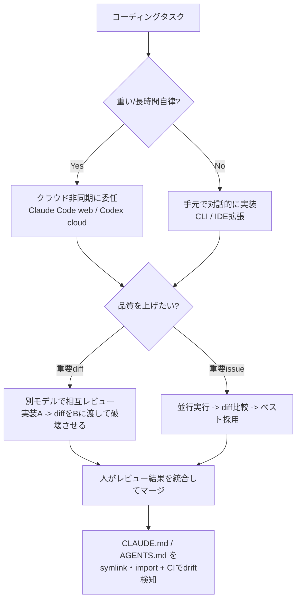
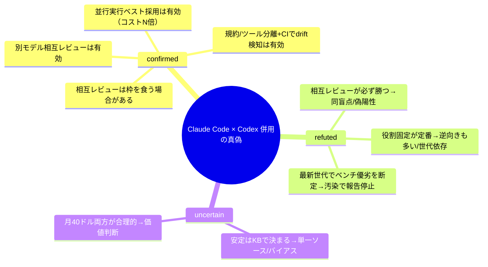

## 📌 結論 (TL;DR)

- **Claude Code（Anthropic）も Codex（OpenAI）も、2025年に出揃った「エージェント型コーディング」製品**で、提供形態（CLI / IDE拡張 / クラウド非同期 / GitHub連携 / SDK）はほぼ横並びに収束。差は **素のモデル性能・料金・操作感** に寄っている。
- **ベンチ比較は信用しすぎ禁物**。2026年2月に **OpenAI は SWE-bench Verified の公式評価を停止**（失敗タスクの **59.4%** が不良テスト＋全フロンティアモデルに学習汚染の疑い）。**Verified で 80% 級のモデルが、汚染耐性のある SWE-bench Pro では 23〜69% 程度に落ちる**。優劣は「どのベンチ・どの条件・どの世代か」で激変する。
- **併用 How-To で堅いのは "別モデルで相互レビュー / 並行実行して良い方を採る" という workflow 設計**。複数の実務者が「自己レビューは自分の判断を擁護して盲点を見逃す」→「diff を相手ツールに渡して壊させる」で効果を報告。ただし **"必ず勝つ" は誤り**（両モデルが同じ盲点で同時に誤る・偽陽性増・利用枠を食う）。
- 「設計・実装は Claude Code、レビューは Codex」という役割分担は **よく見るが "定番固定" ではない**。**逆向き（Codex=executor / Claude=planner）も同程度に存在**し、モデル世代が変わるたびに推奨が入れ替わる。
- 併用の実コストは **料金プラン二重持ち（$40〜$220/月）** と **`CLAUDE.md` / `AGENTS.md` の二重メンテ（drift）**。「とりあえず両方」ではなく、**相互レビューなど明確な目的があって初めて黒字化**する。

## 🔍 調査結果

### 軸1. 製品・機能の対応関係（何が同じで何が違うか）

名前の対応がややこしいので先に整理する。

- **Claude Code（Anthropic）** … ターミナル常駐のエージェント型コーディングツール。提供面は **CLI（中核）/ IDE拡張（VS Code・Cursor・JetBrains）/ デスクトップアプリ / Web（claude.ai/code）/ iOS / GitHub `@claude` / Agent SDK**。全サーフェスが同一エンジンを共有し、`CLAUDE.md`・MCP 設定を横断利用。最新は v2.1.158（2026-05-30）。npm 配布は deprecated、現在はネイティブインストーラ / Homebrew / WinGet 推奨。
- **OpenAI Codex** … 2025年5月に再ローンチした SWE エージェント（初代 `codex-1` ＝ o3 の SWE 最適化版）。提供面は **Codex CLI（Rust 製 OSS, Apache-2.0）/ IDE拡張（VS Code・Cursor・Windsurf・JetBrains）/ Codex Web（chatgpt.com/codex のクラウド並列実行）/ GitHub `@codex`（PR・自動レビュー）/ SDK（TypeScript 本番 + Python 実験的）**。
  - ※ **2021年の旧 Codex（code-davinci 系 API, 2023年廃止）とは別物**。現行は「エージェント Codex」。

| 機能カテゴリ | Claude Code | OpenAI Codex |
|---|---|---|
| ターミナルCLI | ◎（中核） | ◎（`openai/codex`, Rust/OSS） |
| IDE拡張 | ◎ VS Code / Cursor / JetBrains | ◎ VS Code / Cursor / Windsurf / JetBrains |
| クラウド非同期実行 | ○（Web / バックグラウンド） | ◎（出自がクラウド並列） |
| プロジェクト指示ファイル | `CLAUDE.md` | `AGENTS.md`（階層連結） |
| MCP（外部ツール接続） | ◎ | ◎ |
| サブエージェント / 並列 | ◎（subagents / agent teams、Opus 4.8 で dynamic workflows） | ○（クラウド並列タスク） |
| 拡張・制御 | hooks / skills(SKILL.md) / plan mode / checkpoints(`/rewind`) / Routines | 承認モード / サンドボックス / カスタムプロンプト |
| GitHub 連携 | GitHub Actions / GitLab CI | `@codex` PR・自動レビュー |
| SDK | Claude Agent SDK | Codex SDK（TS / Python） |

要点：**カテゴリ単位では「ほぼ同じことができる」状態に収束**。決定的な機能差ではなく、**モデルの癖・料金・操作感**で選ぶフェーズ。

**根拠**:
- [Claude Code overview（公式 docs）](https://code.claude.com/docs/en/overview) / [anthropics/claude-code（GitHub）](https://github.com/anthropics/claude-code)
- [OpenAI Codex（developers.openai.com）](https://developers.openai.com/codex/) / [openai/codex（GitHub）](https://github.com/openai/codex) / [Introducing Codex（2025-05）](https://openai.com/index/introducing-codex/)

> "Codex reads AGENTS.md files before doing any work."（Codex は作業前に AGENTS.md を読み込む）
> — [developers.openai.com/codex](https://developers.openai.com/codex/)

### 軸2. モデル・コンテキスト窓・料金（2026-05-31 時点・公式値で裏取り済み）

| モデル | API ID | コンテキスト窓 | 最大出力 | 入力/出力（per 1M） | リリース |
|---|---|---|---|---|---|
| Claude Opus 4.8 | `claude-opus-4-8` | 1M | 128K | $5 / $25（fast mode $10 / $50） | 2026-05-28 |
| Claude Sonnet 4.6 | `claude-sonnet-4-6` | 1M | 64K | $3 / $15（daily driver） | 2026-02 |
| Claude Haiku 4.5 | `claude-haiku-4-5` | 200K | 64K | $1 / $5 | 2025-10 |
| GPT-5-Codex | `gpt-5-codex` | 400K | 128K | $1.25 / $10（Responses API のみ） | 2025-09-15 |
| GPT-5.2-Codex | — | （compaction で複数窓横断） | — | $1.75 / $14 | 2026 |

- **サブスク**：Claude は **Pro $20/月（Claude Code 込み）/ Max $100〜$200/月（5x・20x、Claude.ai と利用枠共有）**。Codex は **ChatGPT Plus $20 / Pro $100（5x）/ Pro $200（20x）/ Business $25**。Codex は **2026年4月2日にメッセージ単価制から API トークン消費連動へ移行**（Business・新 Enterprise が先行、Plus/Pro は順次）。
- **トークン課金の癖**：Claude は Opus/Sonnet が **1M コンテキストを標準料金で**含む（追加課金なし）。Codex CLI は標準 272K 超で **使用量2倍課金**（実験的 1M 対応）。
- **ポイント**：大規模コードベースの一括投入は **Claude の 1M** が有利。一方 **GPT-5-Codex のトークン単価は安い傾向**（$1.25/$10）。ただし実コストは「エージェントが何トークン消費するか」で逆転（ある比較では「同一タスクで Claude は Codex の 3〜4 倍トークンを消費」との報告）。

**根拠**:
- [Pricing / Models overview（platform.claude.com）](https://platform.claude.com/docs/en/about-claude/pricing) … Opus 4.8 $5/$25・fast $10/$50、Sonnet 4.6 $3/$15、Haiku 4.5 $1/$5、Opus/Sonnet の 1M を標準料金で含む点を確認
- [developers.openai.com/codex/pricing](https://developers.openai.com/codex/pricing) … 2026-04-02 のトークン課金移行 / [GPT-5-Codex 仕様](https://developers.openai.com/codex/)

> "Opus 4.8, Opus 4.7, Opus 4.6, and Sonnet 4.6 include the full 1M token context window at standard pricing."
> （Opus 4.8・4.7・4.6・Sonnet 4.6 は標準料金で 1M トークンの全コンテキスト窓を含む）
> — [platform.claude.com/docs](https://platform.claude.com/docs/en/about-claude/pricing)

### 軸3. コーディング性能ベンチ（"汚染" 問題で地殻変動あり）

**最重要前提：SWE-bench Verified はもう "信頼できる優劣指標" ではない**。2026年2月23日、OpenAI は GPT-5.2 が64回の独立実行で一貫して失敗した138タスクを監査し、**そのうち 59.4% が不良テスト**だったこと、さらに **GPT-5.2 / Claude Opus 4.5 / Gemini 3 Flash など全フロンティアモデルにベンチ解答の学習汚染の痕跡**を見つけたとして、**SWE-bench Verified の公式評価を停止**。代替に **SWE-bench Pro** を推奨した。汚染耐性のある Pro では **「Verified 80% 級 → Pro では 23% 前後」** まで落ちる例も報告される。

下表は各社公式の条件付き値。**Verified（汚染あり・高めに出る）と Pro（汚染耐性・厳しめ）を分けて読む**こと。測定環境が社ごとに違うため横並び比較は不可。

| モデル（発表元） | SWE-bench Verified | SWE-bench Pro | Terminal-Bench | その他 / 条件 | 発表 |
|---|---|---|---|---|---|
| Claude Sonnet 4.5 | 77.2%（並列TTCで 82.0%） | — | — | 10試行平均・TTCなし・200K thinking・2ツールscaffold | 2025-09-29 |
| Claude Opus 4.5 | 80.9% | — | 59.3% | 5試行平均・64K thinking・default high・TTCなし | 2025-11-24 |
| Claude Opus 4.8 | 88.6%（Opus 4.7=87.6%） | 69.2%（Opus 4.7=64.3%） | 74.6%（TB **2.1**） | Online-Mind2Web 84%・"GPT-5.5 を多くのベンチで上回る" | 2026-05-28 |
| GPT-5 | 74.9% | — | — | reasoning有効・n=477 subset | 2025-08-07 |
| GPT-5.1-Codex-Max | 76.5%(high)/77.9%(xhigh) | — | 58.1%（TB **2.0**） | reasoning effort 依存 | 2025-11-18 |
| GPT-5.2-Codex | （Verified 報告停止後） | 56.4% | 64.0%（TB **2.0**） | Pro / TB2.0 で SOTA を主張 | 2026 |

要点：**確度高く言えるのは "両者とも実用水準に到達済み" まで**。直近のベンチ報告軸は **Verified → SWE-bench Pro / Terminal-Bench** へシフトしつつあり、しかも **Terminal-Bench はバージョン差（Anthropic は 2.1、OpenAI は 2.0）で直接比較できない**。**最新同士の "公平な同条件 SWE 比較" は現状ほぼ不能**と考えるのが安全。

**根拠**:
- [Claude Opus 4.8](https://www.anthropic.com/news/claude-opus-4-8) / [Claude Opus 4.5](https://www.anthropic.com/news/claude-opus-4-5) / [Claude Sonnet 4.5](https://www.anthropic.com/news/claude-sonnet-4-5)
- [GPT-5.1-Codex-Max](https://openai.com/index/gpt-5-1-codex-max/) / [GPT-5.2-Codex](https://openai.com/index/introducing-gpt-5-2-codex/) / [GPT-5](https://openai.com/index/introducing-gpt-5/)
- [Why we no longer evaluate SWE-bench Verified（OpenAI）](https://openai.com/index/why-we-no-longer-evaluate-swe-bench-verified/) / [Decrypt（2026-02-24）](https://decrypt.co/359012/openai-benchmark-measure-ai-coding-supremacy-contaminated)

> "It ultimately concluded that 59.4% of those tasks are broken."
> （最終的に、それらのタスクの 59.4% が壊れていると結論づけた）
> — [Decrypt（2026-02-24、OpenAI 分析を引用）](https://decrypt.co/359012/openai-benchmark-measure-ai-coding-supremacy-contaminated)

### 軸4. 「2つを使い分けて開発体験を上げる」How-To（実務者の一次知見）

コミュニティの一次体験から、再現性のある併用パターン:

1. **相互レビュー（cross-review）**：一方に実装させ、その diff をもう一方に「徹底的に壊せ」と渡す。**異なるモデル＝異なる盲点**。Chandler Nguyen は「Opus にプランを批判させ→GPT に修正版を批判させ、を数往復」で単独超えを報告。
2. **並行実行＆ベスト採用**：同じ issue を両方に投げ、diff を比較して良い方を採用／合成。エージェントの非決定性を「数」で均す。
3. **役割分担（タスク種別で振り分け）**：例「設計・実装＝CC / レビュー・調査＝Codex」。ただし後述のとおり **逆向き（Codex=executor / CC=planner）も多く、固定ではない**。
4. **探索の癖で使い分け**：「CC＝DFS（仮説に突進）/ Codex＝BFS（広く探索）」。複雑リファクタは **Codex で全体探索 → 人が方針を圧縮 → CC で実装**（クラシルの実例、10年もの大規模リファクタを 6:4 併用）。
5. **"差し込み" 導入**：完全乗り換えではなく「Claude を主担当、Codex をレビュアー／調査役として差し込む」だけで始められる（`/codex:review` → Claude で日本語要約）。
6. **指示ファイルの設計**：`AGENTS.md`＝共通規約（何が正しいか）/ `CLAUDE.md`＝Claude 固有のツール索引（何が使えるか）に分離し、symlink/import ＋ CI で drift 検知。
7. **呼び出しルール化**：セカンドオピニオンのトリガー（成果物作成後・重要決定前・2回失敗時）を決め、**1タスクに使う AI は最大2つまで**。

DX 向上の本質は **「1モデルへの依存をやめる冗長性」と「別視点レビューの自動化」**。製品比較というより **エージェント workflow 設計** の話。

**根拠**:
- [note - Codex を別視点レビュアーとして差し込む（tyamaoka, 2026-04-12）](https://note.com/tyamaoka/n/n8448af8d37b8)
- [Zenn - CC=DFS/Codex=BFS 大規模リファクタ併用（dely zhu tianren, 2026-05-26）](https://zenn.dev/dely_jp/articles/cfac9a04904113)
- [Chandler Nguyen - Dual-wielding AI coding tools（2026-03-13）](https://chandlernguyen.com/blog/2026/03/13/codex-gpt-5-4-vs-claude-code-opus-4-6-dual-wielding-ai-coding-tools/)
- [findy-tools - Codex全振り→併用回帰、鍵はKB（gccj, 2026-04-02）](https://findy-tools.io/products/codex/1063/893)
- [Qiita - Claude Code=planner / Codex=executor（nogataka, 2026-04-25）](https://qiita.com/nogataka/items/b2b4a84ba611ccaf8447)

> "When Claude Code finishes an implementation, I hand the diff to Codex and ask it to tear it apart. The model agrees with its earlier choices. It defends the decisions it just made. It misses the things it was always going to miss."
> （Claude Code が実装を終えたら、その diff を Codex に渡して徹底的に壊させる。モデルは自分の判断を擁護し、もともと見逃すものは見逃す＝だから別モデルに当てる）
> — [XDA Developers（Mahnoor Faisal, 2026-05-17）](https://www.xda-developers.com/use-claude-code-and-codex-together-combination-does-something-neither-can-do-alone/)

### 軸5. その How-To の「真偽」検証（反証検証）

主要な主張を別エージェントに **反証** させた結果:

| 主張 | 判定 | 根拠・理由 |
|---|---|---|
| 別モデルで相互レビュー（diff を相手に壊させる）は有効 | **confirmed** | 複数の独立した一次体験が「自己レビューは自分の判断を擁護し盲点を見逃す」と一致。異なる失敗モードで独立性が効く |
| 並行実行して良い方を採るのは有効 | **confirmed（条件付き）** | エージェント出力は非決定的でN本引けば当たりが上がる。ただし**コストN倍** |
| 相互レビューは自己レビューより **必ず** 多くのバグを検出する | **refuted** | 「必ず」は不成立。①両モデルが**同じ盲点で同時に誤る**（特に新API等、学習カットオフ起因）②**偽陽性が増えノイズ化**（FPR 5〜15%）③同一モデルレビュー擁護論も存在。正しくは「独立した誤り分布を持つ場合に検出が増える "傾向"」 |
| 併用（相互レビュー）は利用枠を食いコスト倒れの **場合がある** | **confirmed（条件付き）** | サブエージェント並列・2系統運用で消費が加算。「重要設計ドキュメントに限定」して初めて黒字、との運用報告 |
| 「設計・実装＝CC / レビュー＝Codex」が併用の **定番固定** である | **refuted** | よく見るが固定ではない。**逆向き（Codex=executor / CC=planner）も同程度に存在**し、「タスク/フェーズ依存で固定しない」派も多い。**モデル世代が変わるたび推奨が入れ替わる**（findy: 秋は Codex 全振り→Opus 4.6 で CC 主体に回帰） |
| `AGENTS.md` 単一真実＋`CLAUDE.md` 薄い import で二重管理は **ほぼ解消** する | **confirmed（要注意）** | 規約／ツール分離＋symlink/import は有効。ただし `.claude/skills` と `.agents/skills` の **drift に気づけない落とし穴**があり CI 差分チェックが要る。"ほぼ解消" は楽観 |
| 安定はモデルでなく **KB（spec.md/plan.md）** で決まる | **uncertain** | 文脈設計が効くのは一般論として妥当だが、強い実証は単一ソース寄りで**併用推進派の自己選択バイアス**が乗りやすい |
| 1ツール依存はリスク、月$40 で両方契約が合理的 | **uncertain** | 価値判断。利用量・チーム規模・タスク次第で ROI は変動 |
| 最新世代で「どちらが上か」をベンチで断定できる | **refuted** | 世代で逆転＋条件依存＋**SWE-bench Verified の汚染で報告停止**。横断同条件比較が成立しない |

**反証の総括**：堅いのは **"別モデル相互レビュー" と "並行実行ベスト採用" という workflow パターン**（confirmed）。逆に **「必ず勝つ」「役割は固定が定番」「どちらが上か断定」** 系は **refuted**。"二重管理ほぼ解消" と "安定は KB" は条件付き／要注意。

## ⚠️ 注意点・矛盾・反証結果

- **ベンチ数値は発表元の自己申告・条件依存**（scaffold / effort / 並列 TTC で上振れ）。さらに **SWE-bench Verified は汚染で OpenAI が報告停止**（2026-02-23、不良テスト 59.4%、全フロンティアモデルに学習汚染の疑い）。**Verified の高スコアを鵜呑みにせず、SWE-bench Pro / Terminal-Bench を併読**すること。
- **ソース間の食い違い（両論併記）**：Opus 4.8 の SWE-bench Verified について、「公式は 88.6% を提示」という解説（vellum 等）と「比較表からは Verified を落とした」という解説（byteiota）がある。本レポートは **報告値 88.6% を採用しつつ、力点は Pro 69.2%・agentic 系へ移った**と整理。なお Online-Mind2Web 84% は **第三者（Browserbase）報告** の可能性があり、Anthropic 一次値かは uncertain。
- **Terminal-Bench はバージョン差に注意**：Anthropic は TB **2.1**（Opus 4.8 = 74.6%）、OpenAI は TB **2.0**（GPT-5.1-Codex-Max 58.1% / GPT-5.2-Codex 64.0%）で報告。**バージョン・測定者が違い直接比較不可**。
- **反証で覆った主張**：「相互レビューは必ず勝つ」「役割は CC実装/Codexレビューで固定が定番」「最新世代でベンチ優劣を断定」は **refuted**。役割分担は **逆向き運用も同程度に存在**するため、どちらか一方を "正解" として固定しない。
- **料金は改定が速い**（Codex は 2026-04 にトークン消費連動へ移行、Pro 倍率ボーナスは 2026-05-31 まで等の期間限定あり）。**契約前に公式 pricing を再確認**。
- **コミュニティ知見の発信者バイアス**：併用記事は「併用推進派」が書きがちで、コスト・手間の過小評価が混じる。投稿日・モデル世代（Opus 4.6 / GPT-5.4 等）を併記したが、**数週間で前提が変わる**速度に注意。
- **製品名の混同注意**：現行 Codex は2025年のエージェント版。2021年の旧 Codex API とは別物。

## 📚 参照ソース一覧

- 公式（一次情報）:
  - [Claude Code overview](https://code.claude.com/docs/en/overview) / [Pricing・Models overview](https://platform.claude.com/docs/en/about-claude/pricing) / [anthropics/claude-code](https://github.com/anthropics/claude-code)
  - [Claude Opus 4.8](https://www.anthropic.com/news/claude-opus-4-8) / [Claude Opus 4.5](https://www.anthropic.com/news/claude-opus-4-5) / [Claude Sonnet 4.5](https://www.anthropic.com/news/claude-sonnet-4-5)
  - [OpenAI Codex docs / pricing](https://developers.openai.com/codex/pricing) / [openai/codex](https://github.com/openai/codex) / [Introducing Codex](https://openai.com/index/introducing-codex/)
  - [GPT-5.1-Codex-Max](https://openai.com/index/gpt-5-1-codex-max/) / [GPT-5.2-Codex](https://openai.com/index/introducing-gpt-5-2-codex/) / [GPT-5](https://openai.com/index/introducing-gpt-5/)
  - [Why we no longer evaluate SWE-bench Verified](https://openai.com/index/why-we-no-longer-evaluate-swe-bench-verified/)
- コミュニティ（併用 How-To・一次体験・反証）:
  - [Decrypt - ベンチ汚染（2026-02-24）](https://decrypt.co/359012/openai-benchmark-measure-ai-coding-supremacy-contaminated)
  - [note - Codex を別視点レビュアーとして差し込む（tyamaoka, 2026-04-12）](https://note.com/tyamaoka/n/n8448af8d37b8)
  - [Zenn - CC=DFS/Codex=BFS（dely zhu tianren, 2026-05-26）](https://zenn.dev/dely_jp/articles/cfac9a04904113)
  - [classmethod - クロスレビューでも同じ盲点で誤る（2026-05-28）](https://dev.classmethod.jp/articles/claude-code-codex-cross-review/)
  - [Chandler Nguyen - Dual-wielding AI coding tools（2026-03-13）](https://chandlernguyen.com/blog/2026/03/13/codex-gpt-5-4-vs-claude-code-opus-4-6-dual-wielding-ai-coding-tools/)
  - [XDA - Use Claude Code and Codex together（2026-05-17）](https://www.xda-developers.com/use-claude-code-and-codex-together-combination-does-something-neither-can-do-alone/)
  - [findy-tools - Codex全振り→併用回帰、鍵はKB（gccj, 2026-04-02）](https://findy-tools.io/products/codex/1063/893)
  - [Qiita - Claude Code=planner / Codex=executor（nogataka, 2026-04-25）](https://qiita.com/nogataka/items/b2b4a84ba611ccaf8447)
- ベンチ横断（独立系・参考）:
  - [SWE-bench Leaderboard](https://www.swebench.com/) / [Terminal-Bench](https://www.tbench.ai/) / [Artificial Analysis](https://artificialanalysis.ai/)
