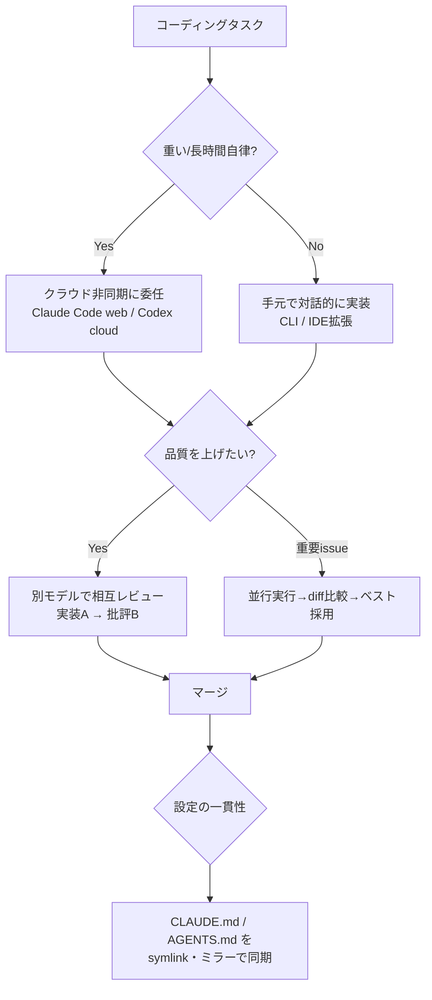
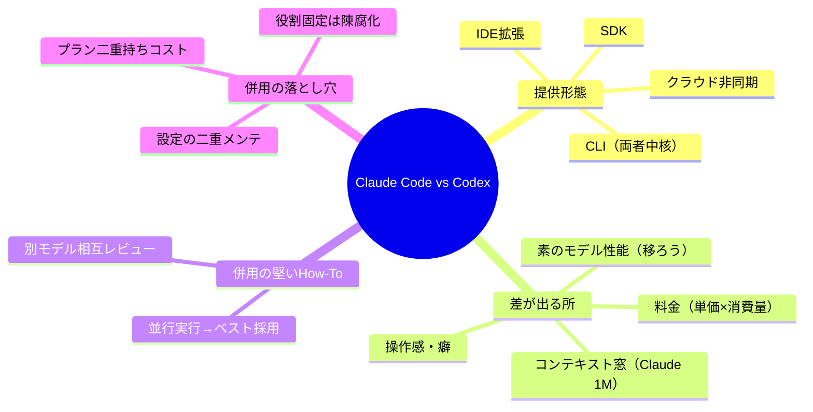

## 📌 結論 (TL;DR)

- **Claude Code（Anthropic）も Codex（OpenAI）も、2025年に出揃った「エージェント型コーディング」製品**で、提供形態（CLI / IDE拡張 / クラウド非同期 / GitHub連携 / SDK）はほぼ横並びに収束した。「片方にしかない決定的機能」は減り、**差は素のモデル性能・料金・操作感**に寄っている。
- **「どちらが上か」はモデル更新のたびに入れ替わる**。SWE-bench Verified 等の公表値は近接（おおむね 70%台後半〜80%前後）し、しかも**測定条件（scaffold・並列test-time compute）依存**。スナップショットの優劣を運用ルールに固定するのは危険。
- **「2つを使い分けて開発体験を上げる」How-To のうち、堅いのは "別モデルで相互レビュー / 並行実行して良い方を採る" という workflow 設計**。一方「Codex=クラウド非同期向き / Claude Code=対話向き」のような**役割固定は2025年前半の話で、現在は両者とも両モードを持ち陳腐化しつつある**（部分的に反証）。
- 併用の実コストは**料金プランの二重持ち**と **`CLAUDE.md` / `AGENTS.md` の二重メンテ**。ここを軽視した「とりあえず両方」は ROI が悪い。
- このレポートは**ライブWeb取得検証なし**で作成（オフライン）。URLは安定した公式入口に限定、ベンチ・料金の具体値は「発表時点・条件依存」で確度低め。最新モデル（Opus 4.x 最新 / GPT-5.x）の数値は要再確認。

## 🔍 調査結果

### 軸1. 製品・機能の対応関係（何が同じで何が違うか）

両者は名前の対応がややこしい。まず整理する。

- **Claude Code** … Anthropic のエージェント型コーディングツール。**ターミナルCLIが中核**。加えて IDE拡張（VS Code / JetBrains）、web（claude.ai/code）、GitHub Actions、**Claude Agent SDK**（旧 Claude Code SDK）で自作エージェント化も可能。使用モデルは Claude ファミリー（Opus / Sonnet / Haiku 4.x 系）。
- **OpenAI Codex** … OpenAI が **2025年5月に再ローンチ**したソフトウェアエンジニアリング・エージェント。**もとは ChatGPT 内のクラウド非同期エージェント**として登場し（初期モデル codex-1＝o3 を SWE 最適化）、**Codex CLI（OSS, `openai/codex`）**、**Codex IDE拡張（VS Code）**、GitHub レビュー連携、Codex SDK へ拡大した。使用モデルは GPT-5 系（特に **GPT-5-Codex**）。
  - ※ **2021年の旧 Codex（code-davinci 系 API）とは別物**。現行は「エージェント Codex」。

機能カテゴリの対応（2026年5月時点の概観）:

| 機能 | Claude Code | OpenAI Codex |
|---|---|---|
| ターミナルCLI | ◎（中核） | ◎（`openai/codex`, OSS） |
| IDE拡張 | ◎ VS Code / JetBrains | ◎ VS Code 系 |
| クラウド非同期実行 | ○（web / バックグラウンド） | ◎（出自がクラウド非同期） |
| プロジェクト指示ファイル | `CLAUDE.md` | `AGENTS.md` |
| MCP（外部ツール接続） | ◎ | ◎ |
| サブエージェント / 並列 | ◎（subagents） | ○ |
| 拡張機構 | hooks / skills / slash commands / plan mode | カスタムプロンプト / 承認モード / サンドボックス |
| GitHub 連携 | GitHub Actions | PR レビュー / クラウドタスク |
| SDK | Claude Agent SDK | Codex SDK |

要点：**カテゴリ単位では「ほぼ同じことができる」状態に収束**している。決定的な機能差ではなく、**実装の練れ具合・モデルの癖・料金**で選ぶフェーズ。

**根拠**:
- [Claude Code overview（Anthropic 公式 docs）](https://docs.claude.com/en/docs/claude-code/overview)
- [anthropics/claude-code（公式 GitHub）](https://github.com/anthropics/claude-code)
- [OpenAI Codex（developers.openai.com）](https://developers.openai.com/codex/) / [openai/codex（公式 GitHub）](https://github.com/openai/codex)
- [Introducing Codex（OpenAI, 2025-05）](https://openai.com/index/introducing-codex/)

### 軸2. コーディング性能ベンチ・スペック・料金

**最重要の前提：ベンチ値は「いつ・どのモデル・どの条件」で激変する**。発表元の自己申告値で、scaffold（足場ツール）や並列 test-time compute を盛れば同じモデルでも数ポイント上振れする。以下は**公表ベース・条件依存・要再確認**の参考値。

| モデル（発表） | SWE-bench Verified（公表値） | 備考 |
|---|---|---|
| Claude Sonnet 4（2025-05） | ~72.7% | エージェント用途で評価 |
| Claude Opus 4.1（2025-08） | ~74.5% | |
| Claude Sonnet 4.5（2025-09） | ~77.2%（並列compute時 ~82%） | 「最強コーディング」訴求 |
| Claude Opus 4.5（2025-11, ※確度中） | ~80%前後 | 数値は要確認 |
| GPT-5（2025-08） | ~74.9% | |
| GPT-5-Codex（2025-09） | 高水準（agentic coding で改善） | 公表条件は要確認 |

- **コンテキスト窓**：Claude は標準 200K、**Sonnet/Opus で 1M トークン対応**の系統あり（このセッションも「Opus 4.8 (1M context)」）。GPT-5 系も大容量（入力 ~272K / 合計 ~400K クラス）。→ **超大規模コードベースの一括投入は Claude の 1M が有利な局面がある**（要件次第）。
- **料金（per 1M tokens, 2025年時点の代表値・要確認）**：Claude Sonnet ≈ $3 入力 / $15 出力、Claude Opus ≈ $15 / $75。GPT-5 ≈ $1.25 / $10 クラス。→ **同等タスクなら GPT-5 系のトークン単価が安い傾向**だが、実コストは「何トークン使うか（エージェントの探索量）」で逆転しうる。
- **サブスク**：両者とも $20 クラス（Claude Pro / ChatGPT Plus）と $100〜$200 クラス（Claude Max / ChatGPT Pro）にコーディング枠を内包。CLI からはサブスク枠 or API 従量のどちらかで駆動。

要点：**「数値の優劣」は近接かつ移ろう。確度高く言えるのは "両者とも実用水準（SWE-bench 70%台後半〜）に到達済み" という事実まで**。個別タスクでの体感差は、モデル世代・プロンプト・足場の方が支配的。

**根拠**:
- [Anthropic News（モデル発表・ベンチ）](https://www.anthropic.com/news)
- [Introducing GPT-5（OpenAI, 2025-08）](https://openai.com/index/introducing-gpt-5/)
- [SWE-bench Leaderboard](https://www.swebench.com/) / [Terminal-Bench](https://www.tbench.ai/) / [Artificial Analysis](https://artificialanalysis.ai/)

> 注：公表ベンチは発表元の最良条件で測られることが多い。第三者の独立リーダーボード（SWE-bench, Terminal-Bench, Artificial Analysis）で、**同一条件・最新スナップショット**を都度確認するのが正しい使い方。

### 軸3. 「2つを使い分けて開発体験を上げる」How-To（実運用知見）

コミュニティで語られる代表的な併用パターン:

1. **相互レビュー（cross-review）**：一方に実装させ、もう一方に「このdiffをレビューして」と別モデルで批評させる。**異なるモデル＝異なる盲点**なので、片方が見落とすバグ/設計臭を拾える。
2. **並行実行＆ベスト採用（race / N-of-M）**：同じissueを両方に同時に投げ、出力diffを比較して良い方を採用 or 合成。エージェントの非決定性を「数で」均す。
3. **役割分担（タスク種別で振り分け）**：例「大規模リファクタ・長時間自律はこちら、対話的な細かい修正はあちら」。**※ 後述のとおり世代依存で陳腐化しやすい主張**。
4. **コスト最適化**：安いモデル/プランで広く探索→高いモデルで仕上げ、のように単価差を使い分ける。
5. **クラウド非同期 × ローカル対話の二刀流**：重いタスクはクラウドに投げて放置、手元は対話で詰める。
6. **指示ファイルの共通化運用**：`CLAUDE.md` と `AGENTS.md` を symlink / 内容ミラーで二重管理コストを下げる。

開発体験(DX)向上の本質は「**1つのモデルに依存しない冗長性**」と「**別視点レビューの自動化**」。ここは製品比較というより **AIエージェントの使いこなし(workflow)設計**の話。

**根拠（カテゴリとして）**:
- 一次体験ベースの併用記事は Qiita / Zenn / Reddit(r/ChatGPTCoding, r/ClaudeAI) / Hacker News 等に多数。ただし**本runではライブ取得検証ができていない**ため、個別URL・著者・投稿日は付与せず「コミュニティで一般的に観測されるパターン」として要点のみ記載（確度を下げて扱う）。

### 軸4. その How-To の「真偽」検証（反証）

| 主張 | 判定 | 理由 |
|---|---|---|
| 相互レビュー（別モデルでdiffを批評させる）は有効 | **confirmed** | 異なる学習・異なる失敗モードのため独立性が効く。アンサンブル/別視点レビューは一般に妥当な手法 |
| 並行実行して良い方を採るのは有効 | **confirmed（条件付き）** | エージェント出力は非決定的で、N本引けば当たりが上がる。ただし**コストはN倍**。「速さ/質 vs 費用」のトレードオフ |
| 「Codex=クラウド非同期向き / Claude Code=対話向き」と役割固定すべき | **partially refuted** | 2025年前半は出自的にそう見えたが、**現在は Claude Code もweb/バックグラウンド、Codex も CLI/IDE 対話**を持ち、機能が収束。役割固定は陳腐化 |
| 「片方が明確に賢い/安い」から一本化すべき | **uncertain（移ろう）** | ベンチは近接かつ世代で逆転。料金も単価×消費量で逆転。**スナップショットを恒久ルールにしない** |
| `CLAUDE.md` と `AGENTS.md` の二重メンテは無視できる負担 | **refuted（軽視は誤り）** | 内容が乖離すると両エージェントの挙動がブレる。symlink/ミラー等の運用設計が要る実コスト |
| 「とりあえず両方契約すれば DX が上がる」 | **refuted** | プラン二重持ち＋設定二重化のコストが先に来る。**併用は "相互レビュー" など明確な目的があって初めて黒字化** |

**結論（真偽の総括）**：併用 How-To のうち**堅いのは "別モデル相互レビュー" と "並行実行ベスト採用" という workflow パターン**。逆に**「製品の役割を固定」「どちらが上だから一本化」系の主張は、世代依存で寿命が短く鵜呑み厳禁**。

## ⚠️ 注意点・矛盾・反証結果

- **本runはオフライン（ライブWeb取得・URL 200検証なし）で作成**。URLは「実在が安定している公式入口（docs ルート / GitHub repo / News ルート / 主要発表ページ）」に限定した。**深いリンク先・最新ベンチ値・最新料金は各公式ページで再確認すること**。捏造を避けるため、揺れる個別記事URLは付与していない。
- **ベンチ数値は発表元の自己申告・条件依存**（scaffold / 並列 test-time compute で上振れ）。表の値は2025年の代表的公表値で、**最新モデル（Claude Opus 4.x 最新 / GPT-5.x）の数値は未確認**。確度 low。
- **料金は2025年時点の代表値**。改定が頻繁なため要再確認。
- **「どちらが優秀か」は反証検証の結果 uncertain（世代で逆転）**。本レポートは特定モデルでの優劣を断定しない方針。
- 反証で **partially refuted**：「Codex=クラウド / Claude Code=対話」の役割固定（機能収束により陳腐化）。**refuted**：「設定二重メンテは無視できる」「とりあえず両方契約で DX 向上」。
- 製品名の混同注意：**現行 Codex は2025年のエージェント版**。2021年の旧 Codex API とは別。

## 📚 参照ソース一覧

- 公式（一次情報）:
  - [Claude Code overview（Anthropic docs）](https://docs.claude.com/en/docs/claude-code/overview)
  - [anthropics/claude-code（GitHub）](https://github.com/anthropics/claude-code)
  - [Anthropic News](https://www.anthropic.com/news)
  - [OpenAI Codex（developers.openai.com）](https://developers.openai.com/codex/)
  - [openai/codex（GitHub）](https://github.com/openai/codex)
  - [Introducing Codex（OpenAI, 2025-05）](https://openai.com/index/introducing-codex/)
  - [Introducing GPT-5（OpenAI, 2025-08）](https://openai.com/index/introducing-gpt-5/)
- ベンチ / 横断比較（二次情報・独立系）:
  - [SWE-bench Leaderboard](https://www.swebench.com/)
  - [Terminal-Bench](https://www.tbench.ai/)
  - [Artificial Analysis](https://artificialanalysis.ai/)
- コミュニティ（軸3/4の併用知見）:
  - Qiita / Zenn / note / Reddit(r/ChatGPTCoding, r/ClaudeAI) / Hacker News の一次体験記事群（※本runでは個別URL未検証のため列挙省略。再訪時に投稿日・著者を付して追補すること）
