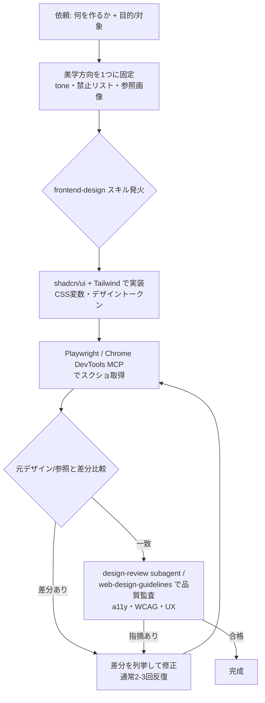

## 📌 結論 (TL;DR)

- ユーザーが挙げた `frontend-design` は **Anthropic 公式の Agent Skill**（`anthropics/skills` repo / 公式 plugin marketplace 収録）で、「generic な “AI slop” 美学を避け、大胆で意図的なデザインに振り切らせる」ための指示書スキル。
- UI/UX 特化はこれ 1 つではない。**公式**だけでも `web-artifacts-builder` / `theme-factory` / `brand-guidelines` / `canvas-design` / `algorithmic-art` / `webapp-testing`、加えて Figma・shadcn・Playwright・Chrome DevTools の各 **MCP**、Vercel の `web-design-guidelines` スキルがある。**コミュニティ**では `design-review`（Playwright でブラウザレビュー）、`superdesign`、`stagewise`、`magic-mcp` 等が活発。
- ベストプラクティスの核は **「①美学方向を 1 つに振り切る → ②アンチパターンを名指しで禁止 → ③スキル＋具体ブリーフ＋参照画像を併用 → ④スクショを撮らせて視覚フィードバックで反復」**。スキルは方向づけ、MCP は“目”、design-review は“批評家”という役割分担で組み合わせると効く。
- **反証で覆った点**: 「スキルを置くだけで高品質 UI が出る」は誤り（ベースラインは上がるが、ブリーフ・禁止リスト・参照と併用してこそ効く）。視覚フィードバックループ自体は公式推奨だが、巷でよく引かれる「1 回目 70%・2 回目 25%」という数値は**公式ではなく個人ブログの体感値**。

## 🔍 調査結果

### 軸1: `frontend-design` スキルの正体と設計思想

- **正体**: Anthropic 公式の Agent Skill。`anthropics/skills` の `skills/frontend-design/`（`gh api` で実在確認。同 repo の skill 一覧は `algorithmic-art / brand-guidelines / canvas-design / frontend-design / theme-factory / web-artifacts-builder / webapp-testing` 等を含む 17 件）に存在し、公式 plugin marketplace `claude-plugins-official` 経由で `/plugin install frontend-design@claude-plugins-official` で導入できる。著者は Prithvi Rajasekaran・Alexander Bricken（ともに Anthropic）。
- **仕組み（Agent Skills）**: `SKILL.md` の YAML frontmatter（必須は `name` ＋ `description`）が起動時に常時ロードされ、ユーザー要求が `description` にマッチすると Claude が bash で本文を読み込む（progressive disclosure）。だから「web コンポーネント/ページ/アプリを作って」と言うだけで自動発火する。
- **設計思想 = “AI slop” の回避**: 汎用フォント（Inter/Roboto/Arial/system fonts）、白背景＋紫グラデーション、予測可能なレイアウトを**名指しで禁止**し、tone を 1 つの極端な方向（brutally minimal / maximalist chaos / editorial 等）に振り切らせる。この思想は著者本人の Engineering 記事「Harness design for long-running application development」（2026-03-24）の採点基準（Design Quality / Originality / Craft / Functionality）と直結し、cookbook `prompting_for_frontend_aesthetics.ipynb` の知見を凝縮した実運用版にあたる。

**根拠**:
- [frontend-design SKILL.md (anthropics/skills)](https://github.com/anthropics/skills/tree/main/skills/frontend-design)
- [Agent Skills overview (Claude docs)](https://platform.claude.com/docs/en/agents-and-tools/agent-skills/overview)
- [prompting_for_frontend_aesthetics.ipynb](https://github.com/anthropics/claude-cookbooks/blob/main/coding/prompting_for_frontend_aesthetics.ipynb)
- [Harness design for long-running application development (2026-03-24)](https://www.anthropic.com/engineering/harness-design-long-running-apps)

**引用**:
> "NEVER use generic AI-generated aesthetics like overused font families (Inter, Roboto, Arial, system fonts), cliched color schemes (particularly purple gradients on white backgrounds), predictable layouts and component patterns, and cookie-cutter design that lacks context-specific character."
> （訳）使い古されたフォント（Inter, Roboto, Arial, system fonts）、陳腐な配色（特に白背景の紫グラデーション）、予測可能なレイアウト/コンポーネント、文脈固有の個性を欠いた金太郎飴的デザイン——こうした generic な AI 生成美学を**決して使うな**。
> — [frontend-design SKILL.md](https://github.com/anthropics/skills/tree/main/skills/frontend-design)

> "CRITICAL: Choose a clear conceptual direction and execute it with precision. Bold maximalism and refined minimalism both work - the key is intentionality, not intensity."
> （訳）重要: 明確なコンセプト方向を選び、精密に実行せよ。大胆なマキシマリズムも洗練ミニマリズムも有効——鍵は強度ではなく**意図性**だ。
> — [frontend-design SKILL.md](https://github.com/anthropics/skills/tree/main/skills/frontend-design)

### 軸2: `frontend-design` 以外の UI/UX 特化スキル・サブエージェント・MCP（エコシステム）

UI/UX 特化は frontend-design 単体ではなく、**「創作（生成）」「品質ゲート（監査/レビュー）」「視覚フィードバック（MCP）」** の 3 レイヤーにツールが分布している。役割が違うので競合ではなく**併用**するのが正解。

| 名前 | 区分 | 何をするか | 連携方式 | URL | 規模/状態（調査時点・概算） |
|---|---|---|---|---|---|
| frontend-design | 公式 | 創作的なデザイン方向づけ（AI slop 回避） | skill / plugin | [link](https://github.com/anthropics/skills/tree/main/skills/frontend-design) | 公式 |
| web-artifacts-builder | 公式 | React+Tailwind+shadcn の複合 HTML アーティファクト構築 | skill | [link](https://github.com/anthropics/skills/tree/main/skills/web-artifacts-builder) | 公式 |
| theme-factory | 公式 | テーマ/配色生成 | skill | [link](https://github.com/anthropics/skills/tree/main/skills/theme-factory) | 公式 |
| brand-guidelines | 公式 | ブランドガイドライン準拠 | skill | [link](https://github.com/anthropics/skills/tree/main/skills/brand-guidelines) | 公式 |
| canvas-design / algorithmic-art | 公式 | キャンバスデザイン / 生成アート | skill | [link](https://github.com/anthropics/skills/tree/main/skills) | 公式 |
| webapp-testing | 公式 | Web アプリのブラウザ越し検証 | skill | [link](https://github.com/anthropics/skills/tree/main/skills/webapp-testing) | 公式 |
| Figma MCP / plugin | 公式(Figma×Anthropic) | デザイン→コード、トークン読取、双方向同期 | plugin + MCP | [link](https://claude.com/plugins/figma) | 公式 |
| shadcn 公式 MCP | 公式(shadcn) | レジストリ横断でコンポーネント検索/導入 | MCP (.mcp.json) | [link](https://ui.shadcn.com/docs/mcp) | 公式 |
| playwright-mcp | 公式(Microsoft) | ブラウザ自動化・スクショ・視覚フィードバック | MCP | [link](https://github.com/microsoft/playwright-mcp) | 33k★級 |
| chrome-devtools-mcp | 公式(Google) | Chrome 制御・Lighthouse 監査・視覚確認 | MCP | [link](https://github.com/ChromeDevTools/chrome-devtools-mcp) | 42k★級 |
| vercel-labs/agent-skills（web-design-guidelines） | 公式(Vercel) | UI コードを a11y/perf/UX の 100+ ルールで監査（品質ゲート） | skill | [link](https://github.com/vercel-labs/agent-skills) | 27,326★ ✅実測 |
| OneRedOak/claude-code-workflows（design-review） | コミュニティ | Playwright MCP で実装をブラウザ表示しデザイン/a11y レビュー | `/design-review` slash command + subagent + CLAUDE.md snippet | [link](https://github.com/OneRedOak/claude-code-workflows/tree/main/design-review) | 3,808★ ✅実測（最終更新 2025-09） |
| superdesign | コミュニティ | IDE 内 OSS デザインエージェント（UI モック生成） | 拡張 + MCP | [link](https://github.com/superdesigndev/superdesign) | 6.5k★級 |
| stagewise | コミュニティ(YC) | ブラウザで要素クリック→ローカルコード修正 | toolbar/IDE（Claude Code 対応） | [link](https://github.com/stagewise-io/stagewise) | 6.7k★級 |
| 21st-dev/magic-mcp | コミュニティ | `/ui` で UI コンポーネント生成（"v0 in your IDE"） | MCP | [link](https://github.com/21st-dev/magic-mcp) | 5k★級 |
| accessibility-agents | コミュニティ | WCAG 2.2 AA 強制の専門 a11y レビュー agent 群 | subagents | [link](https://github.com/Community-Access/accessibility-agents) | 小〜中規模 |

> ※ Star 数は調査時点の概算。`OneRedOak/claude-code-workflows`（3,808★）と `vercel-labs/agent-skills`（27,326★）は `gh api` で実測確認済み。他は調査エージェントの取得値で、変動する。`imsaif/design-with-claude`（8★）など実績の浅いものは**参考扱い**。
>
> ※ ユーザー想定の「`OneRedOak/design-review` 単独 repo」は **404 で存在しない**。実体は `OneRedOak/claude-code-workflows` 配下の `design-review/` ディレクトリ（`design-review-agent.md` / `design-review-slash-command.md` / `design-review-claude-md-snippet.md` 等）。

**引用**:
> "comprehensive feedback on front-end code changes using ... Playwright MCP browser automation and specialized Claude Code agents to ensure UI/UX consistency, accessibility compliance"
> （訳）Playwright MCP のブラウザ自動化と専用 Claude Code エージェントを使い、フロントエンド変更に対し UI/UX 一貫性・アクセシビリティ準拠の包括的フィードバックを行う。
> — [OneRedOak/claude-code-workflows (design-review)](https://github.com/OneRedOak/claude-code-workflows/tree/main/design-review)

> "Audits your code for 100+ rules covering accessibility, performance, and UX"
> （訳）アクセシビリティ・パフォーマンス・UX をカバーする 100 以上のルールでコードを監査する。
> — [vercel-labs/agent-skills の web-design-guidelines](https://github.com/vercel-labs/agent-skills)

### 軸3: ベストプラクティスとなる指示・テクニック

公式（cookbook / SKILL.md / Claude Code best practices）とコミュニティ実例から、効くテクニックは次に集約される。

1. **美学の方向性を最初に 1 つへ振り切る**: コーディング前に tone を極端な 1 方向に固定（「強度ではなく意図性」）。例: *"Show me 3 directions for the hero section - one minimal, one expressive, one retro-technical."*（3 方向出させて比較）。
2. **アンチパターンを名指しで禁止**: `Inter/Roboto/Arial/Open Sans/Lato/system fonts` 禁止、`白背景に紫グラデーション` 禁止、世代をまたいだ `Space Grotesk` への収束禁止。デフォルトを潰す “anti-default” が肝。
3. **4 次元を個別に具体指示**: Typography（display＋body のペア、極端なウェイト）／Color&Theme（CSS 変数、支配色＋鋭いアクセント）／Motion（散発的 micro-interaction より、staggered reveal のページロード 1 回に集中）／Backgrounds（gradient mesh / noise / 幾何パターンで奥行き）。
4. **スキル単体に頼らず、具体ブリーフ・参照画像・デザインシステム固定と併用**（★反証で確認した最重要点）: スキルはベースラインを上げる“ガードレール”であって“治療”ではない。Figma フレームや参照サイト（"like Stripe / Linear"）を渡し、`CLAUDE.md` に配色/タイポ/spacing トークンと「最小 diff で」を恒久コンテキストとして固定する。
5. **視覚フィードバックループ（公式推奨）**: スクショを撮らせ「元と比較して差分を直せ」と回す。Playwright / Chrome DevTools MCP で自動化。通常 2〜3 回で収束。
6. **コンポーネントライブラリ指定で品質・一貫性を担保**: shadcn/ui（a11y 内蔵）＋ Tailwind を明示し、WCAG 準拠やデザイントークン使用を要求。
7. **イテレーション＋自己批評**: 一発完璧を狙わず、口語で「ここが generic」「padding 広すぎ」と指摘して反復。「このデザインは 10 点満点で何点？改善点は？」と self-critique させてから直させると速い。
8. **品質ゲート/レビューを別レイヤーで回す**: 生成は frontend-design、監査は web-design-guidelines、ブラウザ実機レビューは design-review subagent、と役割を分ける。

**根拠**:
- [prompting_for_frontend_aesthetics.ipynb](https://github.com/anthropics/claude-cookbooks/blob/main/coding/prompting_for_frontend_aesthetics.ipynb)
- [Claude Code best practices — Give Claude a way to verify its work](https://code.claude.com/docs/en/best-practices)
- [Improving frontend design through Skills](https://claude.com/blog/improving-frontend-design-through-skills)
- [Claude Code for designers (Builder.io, 2026-02-25)](https://www.builder.io/blog/claude-code-for-designers)
- [The Claude Code frontend design skill (wmedia.es)](https://wmedia.es/en/tips/claude-code-frontend-design-skill)

**引用**:
> "&lt;frontend_aesthetics&gt; You tend to converge toward generic, 'on distribution' outputs. In frontend design, this creates what users call the 'AI slop' aesthetic. Avoid this: make creative, distinctive frontends that surprise and delight."
> （訳）あなたは generic で“分布の中央”な出力に収束しがちだ。フロントエンドではこれが俗に言う “AI slop” 美学を生む。これを避け、驚きと喜びを与える独創的で個性的なフロントエンドを作れ。
> — [cookbook の DISTILLED_AESTHETICS_PROMPT](https://github.com/anthropics/claude-cookbooks/blob/main/coding/prompting_for_frontend_aesthetics.ipynb)

> "[paste screenshot] implement this design. take a screenshot of the result and compare it to the original. list differences and fix them"
> （訳）[スクショを貼付] このデザインを実装し、結果のスクショを撮って元と比較、差分を列挙して直せ。
> — [Claude Code best practices（"Verify UI changes visually"）](https://code.claude.com/docs/en/best-practices)

> "The skill works like a co-author with good taste — not a substitute for the brief. Without a brief, the skill gives you a generic brief — and generic is exactly what you wanted to avoid."
> （訳）スキルは“センスの良い共著者”として働くのであって、ブリーフ（要件・方向性）の代替ではない。ブリーフが無ければスキルは汎用ブリーフを返し、それこそ避けたかった generic そのものになる。
> — [wmedia.es](https://wmedia.es/en/tips/claude-code-frontend-design-skill)

#### 推奨ワークフロー（生成 → 視覚FB → レビュー）

## ⚠️ 注意点・矛盾・反証結果

- **【反証 refuted】「スキルを置くだけで高品質 UI が出る／追加指示は不要」は誤り（確度: 高）**。公式ブログも「タスクが専門的なほど与える文脈は増える」とし、実務者（wmedia / Jack Pearce / izanami.dev）も「ブリーフ・禁止リスト・参照画像と併用してこそ」と一致。スキルは*無指示時の汎用化*を防ぎベースラインを上げるが、最高品質には具体指示が必須。コミュニティの「出力が別物になった」という賞賛（[Qiita](https://qiita.com/kamome_susume/items/41300417840aa107472e) / [Zenn](https://zenn.dev/junpei_katayama/articles/frontend-design-claude-code-plugins)）と矛盾するように見えるが、両者は「ベースライン向上は本物／高品質には追加指示が必要」で**整合する**（程度の問題）。
- **【反証 一部 refuted】視覚フィードバックループ自体は公式推奨（[best practices docs](https://code.claude.com/docs/en/best-practices) に near-verbatim で記載）だが、巷でよく引かれる「1 回目で 70%・2 回目で 25% の差分が埋まる」は公式数値ではなく、[aidesigner.ai（Tyler Yin）](https://www.aidesigner.ai/blog/claude-code-frontend-design)の個人体感値**（本人が "In my testing" と明記）。公式の表現は「通常 2〜3 回の反復で一致」程度。
- **【反証 confirmed・要留保】Claude Design（Anthropic Labs）は実在**（2026-04-17 発表、Claude Opus 4.7 ベース）。会話→第一版→インラインコメント/直接編集/スライダーで反復し、コードベース/デザインファイルから design system を自動構築・継承する。ただし**一般提供ではなく research preview**（Pro/Max/Team/Enterprise 向け、Enterprise はデフォルト無効）。「公式の安定版プロダクト」と紹介すると誤解を生む。
- **既知のバグ（※単一〜少数ソース）**: `claude-code` issue [#14290](https://github.com/anthropics/claude-code/issues/14290)（v2.0.71）で frontend スキル使用時にプランモードが「30 分以上ゼロトークンでハング」する回帰報告（not planned でクローズ）。バージョン依存の可能性。
- **古さの注記**: `OneRedOak/claude-code-workflows` は最終更新 2025-09 とやや停滞気味だが repo は実在・3,808★。MCP 周辺は更新が速いので、導入時は各 repo の最新版を確認すること。
- **日本語詳細プロンプトでも青紫グラデ癖が残存する**という報告あり（[Qiita, nolanlover0527](https://qiita.com/nolanlover0527/items/340910a91de72ca9af66)）。フォント/配色の禁止は**明示的に**書くのが確実。

## 📚 参照ソース一覧

- 公式:
  - [frontend-design SKILL.md (anthropics/skills)](https://github.com/anthropics/skills/tree/main/skills/frontend-design)
  - [Improving frontend design through Skills (Claude blog)](https://claude.com/blog/improving-frontend-design-through-skills)
  - [prompting_for_frontend_aesthetics.ipynb (claude-cookbooks)](https://github.com/anthropics/claude-cookbooks/blob/main/coding/prompting_for_frontend_aesthetics.ipynb)
  - [Claude Code best practices](https://code.claude.com/docs/en/best-practices)
  - [Agent Skills overview (Claude docs)](https://platform.claude.com/docs/en/agents-and-tools/agent-skills/overview)
  - [Harness design for long-running application development (2026-03-24)](https://www.anthropic.com/engineering/harness-design-long-running-apps)
  - [Introducing Claude Design by Anthropic Labs (2026-04-17)](https://www.anthropic.com/news/claude-design-anthropic-labs)
  - [vercel-labs/agent-skills (web-design-guidelines)](https://github.com/vercel-labs/agent-skills)
  - [microsoft/playwright-mcp](https://github.com/microsoft/playwright-mcp) / [ChromeDevTools/chrome-devtools-mcp](https://github.com/ChromeDevTools/chrome-devtools-mcp) / [shadcn MCP](https://ui.shadcn.com/docs/mcp)
- コミュニティ:
  - [OneRedOak/claude-code-workflows — design-review](https://github.com/OneRedOak/claude-code-workflows/tree/main/design-review)（3,808★）
  - [superdesign](https://github.com/superdesigndev/superdesign) / [stagewise](https://github.com/stagewise-io/stagewise) / [21st-dev/magic-mcp](https://github.com/21st-dev/magic-mcp)
  - [Claude Code フロントエンド設計スキルを使ってみた (Zenn, 片山潤平, 2025-12-02)](https://zenn.dev/junpei_katayama/articles/frontend-design-claude-code-plugins)
  - [frontend-design skill を入れたら出力が別物に (Qiita, 2026-04-19)](https://qiita.com/kamome_susume/items/41300417840aa107472e)
  - [The Claude Code frontend design skill (wmedia.es)](https://wmedia.es/en/tips/claude-code-frontend-design-skill)
  - [Why AI loves purple gradients (Jack Pearce)](https://www.jackpearce.co.uk/notes/purple-gradient-ai-aesthetics/)
  - [Claude Code frontend design — 70/25 の体感値 (aidesigner.ai, 2026-05-02)](https://www.aidesigner.ai/blog/claude-code-frontend-design)
  - [Playwright で UI レビューを自動化 (Qiita, 2026-05-27)](https://qiita.com/sakutto-panda/items/5620e4a37c9c63ab5f43)
  - [Claude Code for designers (Builder.io, 2026-02-25)](https://www.builder.io/blog/claude-code-for-designers)
  - [UI生成プロンプトのコツ (Qiita, nolanlover0527, 2025-12-07)](https://qiita.com/nolanlover0527/items/340910a91de72ca9af66)
