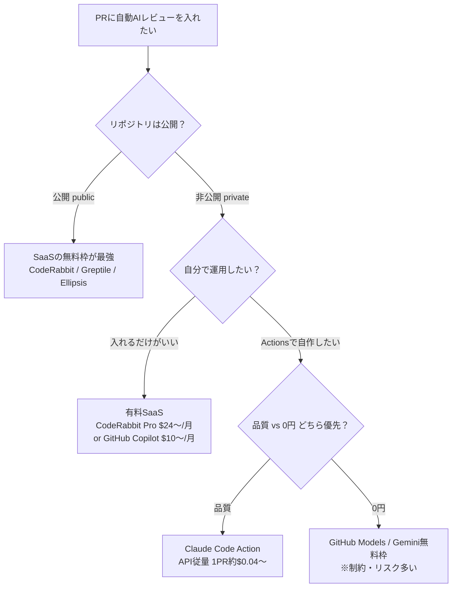

## 📌 結論 (TL;DR)

PR作成時のAI自動コードレビューは大きく3系統 — **①GitHub公式Copilot**（有料、設定だけで完結）、**②SaaSツール**（CodeRabbit / Greptile / Ellipsis など、**公開リポジトリは無料**が多い）、**③GitHub Actions上で自作**（Claude Code Action / GitHub Models / Gemini API を呼ぶ）— に分かれる。

**「コストがかからない方法」は存在する**が、条件付き。最も堅いのは **(A) 公開リポジトリならCodeRabbitを入れるだけ（永久無料・フル機能）**、**(B) Claude Code Action をOSSとして自分のActionsで動かし、API従量課金（1PR ≈ $0.04〜0.3）だけ払う**。GitHub Models や Gemini API の無料枠を使う「完全0円自作」も可能だが、**反証検証で「本番常用には前提が崩れる」と判明**（入力トークン上限・実験用途限定・無料枠は入力がモデル学習に使われる、等）。

GitHub Actions の実行基盤自体は **公開リポジトリなら無料**、private でも GitHub Free で月2,000分の無料枠があるため、基盤コストはほぼ問題にならない。

## 🔍 調査結果

### 軸1. どんな方法があるか（3系統）



**①GitHub公式 Copilot code review**
- リポジトリ/Org の **Branch rules で "Automatically request Copilot code review" を有効化**すると、対象ブランチへのPRで自動レビューがリクエストされる。"Review new pushes" / "Review draft PRs" で挙動を調整。Copilotは常に "Comment" レビューで Approve/Request changes はしない。
- **無料プラン(Copilot Free)ではPR自動レビュー不可**。Pro($10/月)以上が必要。

**②サードパーティSaaS（GitHub Appを入れるだけ）**
- CodeRabbit / Qodo Merge / Greptile / Ellipsis 等。要約＋行レベル指摘＋auto-fix。多くが**公開リポジトリ無料**。

**③GitHub Actions上で自作**
- `on: pull_request` でトリガーし、ジョブ内でLLM（Claude / GitHub Models / Gemini）を呼んでPRにコメント。Anthropic公式の `anthropics/claude-code-action`（MIT）を使うのが代表格。GitHub Models なら `GITHUB_TOKEN` + `permissions: models: read` だけで外部キー不要。

**根拠**:
- [GitHub Docs - Configure automatic code review by Copilot](https://docs.github.com/en/copilot/how-tos/copilot-on-github/set-up-copilot/configure-automatic-review)
- [anthropics/claude-code-action](https://github.com/anthropics/claude-code-action)
- [GitHub Blog - Automate your project with GitHub Models in Actions](https://github.blog/ai-and-ml/generative-ai/automate-your-project-with-github-models-in-actions/)

**引用**:
> "Under 'Branch rules,' select 'Automatically request Copilot code review'."
> （「Branch rules」で「Copilotのコードレビューを自動的にリクエストする」を選択します。）
> — [GitHub Docs](https://docs.github.com/en/copilot/how-tos/copilot-on-github/set-up-copilot/configure-automatic-review)

### 軸2. コスト構造（料金体系と無料枠）

| 手段 | 種別 | 公開リポジトリ | 非公開リポジトリ | 備考 |
|---|---|---|---|---|
| **GitHub Copilot code review** | 公式 | 有料(Pro $10/月〜) | 同左 | Freeプラン不可。日本語コメント未対応の声あり |
| **CodeRabbit** | SaaS | **永久無料(Pro+相当)** | Pro $24/user/月(年)〜 | OSSはPRレビュー1〜10回/時で変動 |
| **Greptile** | SaaS | OSS(MIT/Apache/GPL)は100%無料 | $30/seat/月(50レビュー込) | 14日無料トライアル |
| **Ellipsis** | SaaS | **完全無料** | $20/dev/月 | 公開リポは機能制限なし |
| **Qodo Merge (ホスト)** | SaaS | Freeは月250クレジット | Teams $30/user/月 | — |
| **PR-Agent (OSS自己ホスト)** | OSS | **ソフト無料** | ソフト無料 | LLM API料金は自己負担(Apache-2.0) |
| **Claude Code Action** | OSS+API | ソフト無料 | ソフト無料 | **API従量課金**: 1PR ≈ $0.04〜0.3 |
| **GitHub Models 自作** | 自作 | 無料枠あり | 無料枠あり | High系 50req/日, 入力8,000token上限 ⚠️ |
| **Gemini API 自作** | 自作 | 無料枠あり | 無料枠あり | 無料枠は**入力が学習利用される** ⚠️ |

**GitHub Actions 基盤コスト**（どの自作手段でも共通）:
- 公開リポジトリ: **無料**
- 非公開: GitHub Free **2,000分/月**、Pro/Team 3,000分/月の無料枠。超過は Linux 2-core で **$0.006/分**（2026年1月に最大39%値下げ）。

**根拠**:
- [GitHub Docs - Plans for GitHub Copilot](https://docs.github.com/en/copilot/get-started/plans)
- [CodeRabbit - Plans](https://docs.coderabbit.ai/management/plans) / [Greptile Pricing](https://www.greptile.com/pricing) / [Ellipsis](https://www.ellipsis.dev/)
- [GitHub Docs - About billing for GitHub Actions](https://docs.github.com/en/billing/managing-billing-for-github-actions/about-billing-for-github-actions)
- [Qiita - Claude Code Action導入とコスト試算 (nogataka, 2026-04)](https://qiita.com/nogataka/items/ceae4e70fc4cca2e2c9e)

**引用**:
> "Open-source projects receive Pro+ features with no paid subscription required."
> （オープンソースプロジェクトは、有料サブスクリプション不要でPro+機能を受けられる。）
> — [CodeRabbit Docs - Plans](https://docs.coderabbit.ai/management/plans)

> "Each Claude interaction consumes API tokens based on the length of prompts and responses. ... Claude Code runs on GitHub-hosted runners, which consume your GitHub Actions minutes."
> （Claudeとの各やり取りはプロンプト/応答の長さに応じてAPIトークンを消費する。…GitHubホストランナー上で動作しActions分数を消費する。）
> — [Claude Docs - GitHub Actions](https://code.claude.com/docs/en/github-actions)

> 「400行程度のdiffでSonnet 4.6を使った場合：1PRあたり0.04ドル前後」
> — [Qiita (nogataka, 2026-04)](https://qiita.com/nogataka/items/ceae4e70fc4cca2e2c9e)

### 軸3. 実装方法とハマりどころ

**Claude Code Action の最小workflow例**（出典: [docs/solutions.md](https://github.com/anthropics/claude-code-action/blob/main/docs/solutions.md)）:

```yaml
on:
  pull_request:
    types: [opened, synchronize]
jobs:
  review:
    runs-on: ubuntu-latest
    permissions:
      contents: read
      pull-requests: write   # コメント投稿に必須
      id-token: write
    steps:
      - uses: actions/checkout@v6
      - uses: anthropics/claude-code-action@v1
        with:
          anthropic_api_key: ${{ secrets.ANTHROPIC_API_KEY }}
          prompt: |
            Please review this pull request ...
```

`prompt` を渡すと **@claude メンション不要の自動実行モード**になる。

**実運用のハマりどころ（コミュニティ知見）**:
1. **fork PRでsecretsが渡らない**: `on: pull_request` は外部fork からのPRに secrets を渡さない（仕様）。`pull_request_target` で渡せるが、PRコードをcheckoutして実行すると秘密情報を抜かれる "Pwn Request" になる。回避はラベルゲート（`types: [labeled]` + write権限検証）。
2. **permissions漏れで403**: `permissions: pull-requests: write` 未設定だとコメント投稿が403。保護ブランチ/ruleset対象PRでは `GITHUB_TOKEN` が制限され、PAT/GitHub Appトークンが必要なケースも。
3. **diffが大きいと入力トークン超過**: GitHub Models無料枠は入力8,000トークン上限。ファイル名＋変更ステータスに絞る等の工夫が要る。
4. **SaaSはデフォルト設定だと低品質**: CodeRabbitは `.coderabbit.yaml` でカスタマイズして初めて使える、という1年運用者の声。

**根拠**:
- [pankona - pull_request_targetの危険性 (2021-03)](https://pankona.github.io/blog/2021/03/29/github-actions-pull-request-target/) ※仕様は現行も有効
- [Zenn - Gemini 2.0 Flashで自動PRレビュー (nasubikun, 2024-12)](https://zenn.dev/nasubikun/articles/e182565f426018)
- [Qiita - CodeRabbit 1年運用 (aoinakanishi, 2025-12)](https://qiita.com/aoinakanishi/items/4ddeae10a36c92700dae)

**引用**:
> 「pull request の author が悪いやつで、CI の最中に secrets をダンプ…するようなコードを pull request で送りつけられてしまうと、一発で secrets が漏れる」
> — [pankona blog (2021-03)](https://pankona.github.io/blog/2021/03/29/github-actions-pull-request-target/)

> 「デフォルト設定で出てくるコメントは正直ゴミみたいな指摘ばかり」「`.coderabbit.yaml`でカスタマイズを始めた瞬間、全てが変わった」
> — [Qiita (aoinakanishi, 2025-12)](https://qiita.com/aoinakanishi/items/4ddeae10a36c92700dae)

## ⚠️ 注意点・矛盾・反証結果

反証検証（4件）の結果: **confirmed 1 / uncertain 3 / refuted 0**。「無料運用」系の主張に重大な前提条件が見つかった。

- **【uncertain】「Claudeサブスク(Pro/Max)のOAuthトークンでPR自動レビューを追加課金ゼロで運用できる」**
  → **条件付きで要注意**。①Anthropicは2026年2月にOAuthトークンの「Agent SDK含む他製品での利用は不許可」と明言しており、Claude Code GitHub ActionはAgent SDK上にあるため字義上の緊張がある。②**2026年6月15日以降**、Agent SDK利用がプラン使用量にカウントされなくなり別建ての月次クレジット枠に乗る（=この日付以前は通常のサブスク枠を消費し、対話作業分まで枯渇しうる）。③クレジット枯渇後は標準APIレート（従量課金）にフォールバック。"完全に課金ゼロ"とは言い切れない。
  根拠: [Authentication - Claude Docs](https://code.claude.com/docs/en/authentication) / [Use the Claude Agent SDK with your Claude plan](https://support.claude.com/en/articles/15036540-use-the-claude-agent-sdk-with-your-claude-plan) / [The Register (2026-02)](https://www.theregister.com/2026/02/20/anthropic_clarifies_ban_third_party_claude_access/)

- **【uncertain】「GitHub Models で無料の本番PRレビューBotが自作できる」**
  → 技術的に `GITHUB_TOKEN`+`models: read` だけで呼べるのは事実(confirmed)。だが ①入力**8,000トークン上限**で大型diffは非現実的、②公式が無料枠を「**prototyping and experimentation 向け**」と明記し本番想定外、③**public preview**で仕様変更リスク。PoC・小型diffなら可、本番常用は有料オプトイン推奨。
  根拠: [GitHub Docs - billing for GitHub Models](https://docs.github.com/en/billing/managing-billing-for-your-products/about-billing-for-github-models)（"designed to support prototyping and experimentation"）

- **【uncertain】「Gemini API無料枠でPR自動レビューを完全0円で実用運用できる」**
  → 機能的には0円で動く。だが **無料(Unpaid)枠は送信した入力がGoogleのモデル学習に利用される**（公式規約明記）。**業務・受託・機密コードを流すのは重大なプライバシーリスク**で、OSS/公開コード以外には不適。加えてレート制限（複数PR集中で詰まる）、2026年4月にPro系モデルが無料枠から除外、等の前提あり。
  根拠: [Gemini API Terms](https://ai.google.dev/gemini-api/terms)（"Google uses the content you submit ... to improve ... machine learning technologies" / 有料枠は "doesn't use your prompts ... to improve"）

- **【confirmed】「CodeRabbitは公開リポジトリでPro+相当を永久無料」**
  → 公式FAQ/docsで裏取り成功（"free reviews forever for public repositories"）。**ただし用語注意**: 公式の「**Free plan**」（無料"プラン"）はPR要約とIDE/CLIレビューのみの制限版で別物。"公開リポジトリ無料"とは異なるので混同しないこと。OSS向けレート枠は人気で1〜10 PR/時と変動（有料より低い）。

- **古い情報の注記**: pull_request_target の解説(2021)は古いが仕様は現行も有効。Copilotの日本語非対応(2025-03)は2026年にエージェント型へ刷新されており要再確認。

## 📚 参照ソース一覧

- 公式:
  - [GitHub Docs - Configure automatic code review by Copilot](https://docs.github.com/en/copilot/how-tos/copilot-on-github/set-up-copilot/configure-automatic-review)
  - [GitHub Docs - Plans for GitHub Copilot](https://docs.github.com/en/copilot/get-started/plans)
  - [anthropics/claude-code-action (GitHub)](https://github.com/anthropics/claude-code-action)
  - [Claude Docs - GitHub Actions](https://code.claude.com/docs/en/github-actions)
  - [Claude Docs - Code Review (managed)](https://code.claude.com/docs/en/code-review)
  - [Claude Docs - Authentication](https://code.claude.com/docs/en/authentication)
  - [CodeRabbit Docs - Plans](https://docs.coderabbit.ai/management/plans) / [CodeRabbit FAQ](https://www.coderabbit.ai/faq)
  - [qodo-ai/pr-agent (Apache-2.0)](https://github.com/qodo-ai/pr-agent) / [Qodo Pricing](https://www.qodo.ai/pricing/)
  - [Greptile Pricing](https://www.greptile.com/pricing) / [Ellipsis](https://www.ellipsis.dev/)
  - [GitHub Docs - About billing for GitHub Actions](https://docs.github.com/en/billing/managing-billing-for-github-actions/about-billing-for-github-actions)
  - [GitHub Docs - Prototyping with AI models](https://docs.github.com/en/github-models/use-github-models/prototyping-with-ai-models) / [billing for GitHub Models](https://docs.github.com/en/billing/managing-billing-for-your-products/about-billing-for-github-models)
  - [GitHub Blog - Automate your project with GitHub Models in Actions](https://github.blog/ai-and-ml/generative-ai/automate-your-project-with-github-models-in-actions/)
  - [Gemini API Terms](https://ai.google.dev/gemini-api/terms) / [Gemini API Pricing](https://ai.google.dev/gemini-api/docs/pricing)
- コミュニティ:
  - [pankona - pull_request_targetの危険性 (2021-03)](https://pankona.github.io/blog/2021/03/29/github-actions-pull-request-target/)
  - [michaelheap - Access secrets from forks (2023-09)](https://michaelheap.com/access-secrets-from-forks/)
  - [Zenn - Gemini 2.0 Flashで自動PRレビュー (nasubikun, 2024-12)](https://zenn.dev/nasubikun/articles/e182565f426018)
  - [Zenn - Gemini無料枠で0円PR自動レビュー (itsuki_y, 2026-01)](https://zenn.dev/itsuki_y/articles/e8f280f231431c)
  - [Qiita - Claude Code Action導入とコスト試算 (nogataka, 2026-04)](https://qiita.com/nogataka/items/ceae4e70fc4cca2e2c9e)
  - [Qiita - CodeRabbit 1年運用 (aoinakanishi, 2025-12)](https://qiita.com/aoinakanishi/items/4ddeae10a36c92700dae)
  - [Zenn - GitHub Copilotでレビュー (parayan, 2025-03)](https://zenn.dev/parayan/articles/used-copilot-to-review-pull-request)
  - [Dev.to - CodeRabbit Pricing in 2026 (rahulxsingh, 2026-03)](https://dev.to/rahulxsingh/coderabbit-pricing-in-2026-free-tier-pro-plans-and-enterprise-costs-1pc4)
