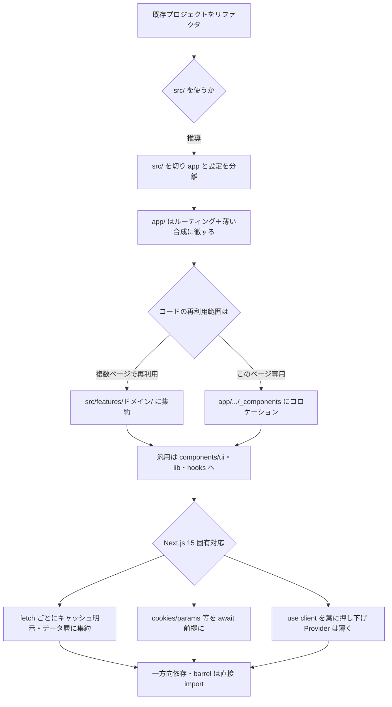

## 📌 結論 (TL;DR)

- **公式は「unopinionated（構成に意見を持たない）」**。`app/` の規約（フォルダ＝URL セグメント、`page`/`route` だけが公開、`_folder` は非公開、`(folder)` は URL に出ない）だけが絶対ルールで、それ以外の整理方法は自由。最重要は「**チームで一貫させる**」こと。
- リファクタリングの現実解は **「`src/` を切る → `app/` はルーティング＋薄い合成に徹する → ロジックは `src/features/{ドメイン}/`（components / hooks / actions / types）に出す → 汎用は `components/ui`・`lib`・`hooks` → ページ専用 UI は `app/.../_components` にコロケーション」**。bulletproof-react を土台に「再利用するものは features・ページ専用は `_components`」という折衷ルールを足すのが多数派。
- **Next.js 15 固有の破壊的変更がアーキテクチャに効く**: ①`fetch`・`GET` Route Handler がデフォルト非キャッシュ化、Client Router Cache の page セグメントは `staleTime=0`、②`cookies()`/`headers()`/`draftMode()`/`params`/`searchParams` が**非同期化**。データ取得層を「キャッシュ前提・同期前提」で薄く書けなくなり、`fetch` ごとのキャッシュ明示と `await` 前提の設計が要る。
- **`'use client'` は葉に押し下げる**。上位に付けるとツリー全体がクライアント化する。Provider は `children` を受ける薄い Client ラッパに切り出す。
- **反証で覆った点に注意**: 「Server Actions は feature コロケーションが**公式推奨**」は誤り（公式チュートリアルはむしろ `app/lib/actions.ts` 集約を推奨。コロケーションはコミュニティ慣習）。「`optimizePackageImports` は node_modules **限定**」も不正確。

## 🔍 調査結果

### 軸1: App Router のファイル/ディレクトリ規約（公式・絶対ルール）

この層だけはフレームワークが強制する規約で、リファクタリングでも逸脱できない。

- **フォルダ＝ルートセグメント、ファイル＝UI**。フォルダのネストが URL セグメントのネストになる。
- **`page` または `route` があって初めてルートが公開される**。さらに公開後もクライアントへ送られるのは `page`/`route` が**返した内容のみ**。→ だから `app/` 内に component / hook / test を**安全にコロケーション**できる（誤ってルート化しない）。
- **特殊ファイル**: `layout`（共有 UI・状態保持）/ `template`（毎回再マウント・状態リセット）/ `page` / `loading`（Suspense 境界）/ `error`（Error Boundary）/ `global-error` / `not-found` / `route`（API・`.ts/.js` のみ）/ `default`（並列ルートのフォールバック）。ネスト時は子が親の**内側**に再帰的に入る。
- **ルーティング修飾フォルダ**: `(folder)`＝Route Group（URL に出さず整理・複数 root layout 可）、`_folder`＝Private Folder（配下すべてルーティング除外）、`[slug]`/`[...slug]`/`[[...slug]]`＝動的ルート、`@folder`＝並列ルート（名前付きスロット）、`(.)`/`(..)`/`(...)`＝インターセプトルート。
- **`route.ts` の配置制約**: 同一セグメントに `page.js` と `route.js` は**共存不可**（競合）。`app/api/users/route.ts` のように別セグメントなら可。各ファイルがそのルートの全 HTTP メソッドを引き受ける。
- **`src/` ディレクトリ**: `app` を含むアプリコードを任意の `src/` 配下に置ける（設定ファイルと分離する目的）。

**根拠**:
- [公式 - Project structure and organization](https://nextjs.org/docs/app/getting-started/project-structure)
- [公式 - Layouts and Pages](https://nextjs.org/docs/app/getting-started/layouts-and-pages)
- [公式 - route.js File Conventions](https://nextjs.org/docs/app/api-reference/file-conventions/route)

**引用**:
> A route is **not publicly accessible** until a `page.js` or `route.js` file is added to a route segment ... only the **content returned** by `page.js` or `route.js` is sent to the client. This means that project files can be **safely colocated** inside route segments in the `app` directory.
> （ルートセグメントに `page.js` または `route.js` が追加されるまでルートは**公開されない**。…公開後もクライアントに送られるのは `page.js`/`route.js` が**返した内容**のみ。よってプロジェクトファイルは `app` 内のルートセグメントに**安全にコロケーション**できる。）
> — [Project structure and organization](https://nextjs.org/docs/app/getting-started/project-structure)

```
src/
└── app/
    ├── layout.tsx              # ルートレイアウト（必須・html/body 必須）
    ├── page.tsx                # /
    ├── (marketing)/            # Route Group（URL に出ない）
    │   └── about/page.tsx      # /about
    ├── blog/
    │   ├── loading.tsx
    │   ├── _components/        # 非公開（コロケーション）
    │   ├── page.tsx            # /blog
    │   └── [slug]/page.tsx     # /blog/:slug（動的）
    └── api/
        └── users/route.ts      # /api/users（page と別セグメントなので OK）
```

### 軸2: 公式の整理戦略 ＋ 実プロジェクトの構成パターン

#### 公式が示すのは「3つの戦略」と「一貫性を持て」だけ

- **① `app` の外（プロジェクトルートの top-level）に置く** — `app/` はルーティング専用に保つ
- **② `app` の中の top-level に置く** — `app/components`, `app/lib` 等
- **③ 機能/ルートごとに分割（split by feature or route）** — 共有は `app` ルート、固有コードは使うルートセグメント直下にコロケーション

公式は各戦略の図を示すのみで、明示的なメリット/デメリット列挙はしない。`components`/`lib`/`ui` 等の名前に**フレームワーク上の意味はない**（プレースホルダ）。**Module Path Alias（`@/*`）**は組み込みサポートされ、`create-next-app` の既定エイリアスも `@/*`。

**引用**:
> Next.js is **unopinionated** about how you organize and colocate your project files. ... The simplest takeaway is to choose a strategy that works for you and your team and be consistent across the project.
> （Next.js はファイルの整理・コロケーション方法について**意見を持たない**。…最もシンプルな結論は、自分とチームに合う戦略を選び、プロジェクト全体で一貫させること。）
> — [Project structure and organization](https://nextjs.org/docs/app/getting-started/project-structure)

#### 実プロジェクトで定着した「定番」（コミュニティ複数ソース一致）

公式が決めない以上、実チームの慣習が事実上の基準になる。複数ソースで一致した定番:

1. **`app/` はルーティングに薄く保ち、ロジックは `features/` に出す**（8ソース中6で明言）
2. **`features/{ドメイン}/` 配下に components / hooks / api(actions) / types / stores をまとめる**（feature-based + colocation）
3. **`components/ui`（汎用 UI）と `features/**/components`（機能固有 UI）を分離**
4. **`src/` を切って `app/` 予約フォルダと衝突回避**

- **bulletproof-react**（Star 約3万のデファクト規約）: `src/` 直下に `app/components/config/features/hooks/lib/stores/types/utils`。**依存は一方向（shared → features → app）**、**feature 間の相互 import は禁止**し、合成は app 層で行う。`index.ts` で各 feature の公開 API を絞る。
- **レバテックLAB の折衷案**: **複数ページで再利用するもの → `src/features/`、そのページ専用 → `app/.../_components`** と役割分担。「Feature-based は共通コンポーネントの置き場所が曖昧になりがち、Colocation はドメインロジックがページ間で重複しやすい」という両者の弱点を補い合う。
- **Feature-Sliced Design (FSD)**: 6層（app/pages/widgets/features/entities/shared）。`app/**/page.tsx` は「import してparams を渡し UI を返すだけのオーケストレーション」に徹する。ただし widgets/entities 層は FSD 固有概念で、素直な `features/` より複雑（採用は大規模・厳格分離が要る場合のみ）。

**根拠**:
- [公式 - Project structure / Installation（Module Path Aliases）](https://nextjs.org/docs/app/getting-started/installation)
- [bulletproof-react - project-structure.md (alan2207)](https://github.com/alan2207/bulletproof-react/blob/master/docs/project-structure.md)
- [レバテックLAB - Next.jsのディレクトリ構成 (中川幸哉 / 監修 山田祥寛, 2025-09)](https://levtech.jp/media/article/column/detail_721/)
- [Qiita - Next.js(App Router) features 構成 (@miumi, 2024-04)](https://qiita.com/miumi/items/359b8a77bbb6f9666950)
- [CyberAgent - ジャンプTOON フロントエンド設計 (浅原昌大, 2024-08)](https://developers.cyberagent.co.jp/blog/archives/49429/)
- [Feature-Sliced Design × Next.js App Router (FSD 公式, 2026-01)](https://feature-sliced.design/blog/nextjs-app-router-guide)

**引用**:
> Features should not import from other features.（機能は他の機能から import してはならない）
> shared parts of the code to the application (shared -> features -> app)（共有 → 機能 → アプリの一方向で依存させる）
> — [bulletproof-react - project-structure.md](https://github.com/alan2207/bulletproof-react/blob/master/docs/project-structure.md)

```
src/
├── app/                       # ルーティング＋薄い合成のみ
│   ├── (marketing)/
│   └── products/[id]/
│       ├── page.tsx           # features を import して params を渡すだけ
│       └── _components/       # このページ専用 UI（コロケーション）
├── features/                  # ドメインごとのロジック
│   └── product/
│       ├── components/        # 機能固有 UI（複数ページで再利用）
│       ├── hooks/
│       ├── actions.ts         # 'use server'（この feature の mutation）
│       ├── api.ts             # データ取得関数
│       └── types.ts
├── components/ui/             # 汎用 UI（Button 等）
├── lib/                       # 汎用ユーティリティ・クライアント
└── hooks/                     # 汎用フック
```

### 軸3: Next.js 15 固有の注意点（リファクタリングで効く）

#### キャッシュのデフォルトが変わった（破壊的変更）

- **`fetch` リクエスト**: デフォルト非キャッシュ。キャッシュは個別に `cache: 'force-cache'`、セグメント全体は `export const fetchCache = 'default-cache'`。
- **`GET` Route Handlers**: デフォルト非キャッシュ。`export const dynamic = 'force-static'` でオプトイン。
- **Client Router Cache**: **page セグメントのデフォルト `staleTime` が 0 になった**（v14 の 30 秒から変更）。※「Client Router Cache が丸ごとキャッシュされなくなった」は不正確 — 共有レイアウト・`loading.js`（既定 5 分）・back/forward 復元は引き続きキャッシュされる。`staleTimes` 設定は**現在も experimental**。

→ **ファイル構成への影響**: データ取得を「キャッシュ前提で薄く」書けない。`fetch` ごとにキャッシュ戦略を明示する**データアクセス層（例 `lib/data.ts` / `features/*/api.ts`）への集約**が有効。

#### Request API が非同期化（破壊的変更）

- `cookies()`・`headers()`・`draftMode()`、および `page.js`/`layout.js`/`route.ts`/`default.js` の `params`、`page.js` の `searchParams`、`generateMetadata`/`generateViewport` の `params` が**非同期（Promise）化**。Server Component では `await`、Client Component では React の `use()` で読む。
- ※ 15.0 時点では移行猶予として**同期アクセスも警告付きで暫定許容**（即エラーではない。次のメジャーで削除予定）。codemod `npx @next/codemod@canary next-async-request-api .` あり。
- `connection()` は「非同期化された API」ではなく **15 で新規追加された別 API**（`unstable_noStore` の後継）。

→ **影響**: これらに触れる `page`/`layout`/`route` は async 前提。リクエスト依存処理が自然と Server Component / Route Handler の入口層に寄る。

#### Server/Client 境界の設計

- **`'use client'` は葉に押し下げる**。ファイルに付けた時点でその import 配下すべてがクライアントバンドルに入る。レイアウト上位に付けると兄弟ツリー全体がクライアント化する事故になる。
- **Provider は `children` を prop で受ける独立 Client Component**にし、ツリーの可能な限り深い位置に置く。Server を Client から使いたい時は import せず children/props で注入する。
- **`server-only` / `client-only`** パッケージで境界をビルド時に強制できる（例: API キーを扱う `lib/data.ts` に `import 'server-only'`）。
- **`next.config.ts`**（TypeScript 設定・`NextConfig` 型）がサポートされた。

**根拠**:
- [公式 - Next.js 15 リリースブログ](https://nextjs.org/blog/next-15)
- [公式 - Upgrading: Version 15](https://nextjs.org/docs/app/guides/upgrading/version-15)
- [公式 - Server and Client Components](https://nextjs.org/docs/app/getting-started/server-and-client-components)
- [公式 - staleTimes](https://nextjs.org/docs/app/api-reference/config/next-config-js/staleTimes)
- [Vercel Blog - Common mistakes with the App Router (Lee Robinson, 2024-01)](https://vercel.com/blog/common-mistakes-with-the-next-js-app-router-and-how-to-fix-them)

**引用**:
> To reduce the size of your client JavaScript bundles, add `'use client'` to specific interactive components instead of marking large parts of your UI as Client Components.
> （クライアント JS バンドルを小さくするには、UI の大部分を Client Component にせず、特定のインタラクティブなコンポーネントにだけ `'use client'` を付ける。）
> — [Server and Client Components](https://nextjs.org/docs/app/getting-started/server-and-client-components)

> `fetch` requests, `GET` Route Handlers, and client navigations are no longer cached by default.
> （`fetch`・`GET` Route Handler・クライアントナビゲーションはデフォルトでキャッシュされなくなった。）
> — [Upgrading: Version 15](https://nextjs.org/docs/app/guides/upgrading/version-15)

### 軸4: 落とし穴・アンチパターン（リファクタリングで踏みやすい）

| やりがちな失敗 | 推奨 |
|---|---|
| 子1つがインタラクティブだから `layout` に `'use client'` | `'use client'` を最小の葉に限定。Provider は `children` を受ける薄い Client ラッパへ |
| Server Component から自前 Route Handler を `fetch` | 不要なネットワークホップ。データ取得ロジックを Server Component から直接呼ぶ |
| 巨大な自前 barrel file（`index.ts` で大量 re-export） | dev コンパイル/Fast Refresh/バンドルに悪影響。直接 import に分解。`madge -c` で循環検出、ESLint `import/no-cycle` を CI に追加 |
| feature 間で相互 import | 一方向依存（shared → features → app）。合成は app 層で |
| 一括で Pages → App Router 書き換え | vertical slice（1機能）ずつ移行。feature flag でトラフィックを段階移行（Cal.com は両 Router 併存で約5ヶ月） |

- **barrel file 補足**: Vercel の `optimizePackageImports` 実測では `next build` 約28%・cold start 最大40%高速化。ただし後述の反証どおり、これは**自前 barrel には基本効かない**ので、自前は手で直接 import 化するのが確実。
- **テスト配置**: App Router では route segment 内にテストを安全にコロケーションできる（`page`/`route` 以外はルート化しない）。`__tests__` コロケーション/別ディレクトリは好みで、公式は「一貫性を持て」のみ。

**根拠**:
- [Vercel Blog - How we optimized package imports](https://vercel.com/blog/how-we-optimized-package-imports-in-next-js)
- [Vercel Blog - Common mistakes with the App Router (Lee Robinson, 2024-01)](https://vercel.com/blog/common-mistakes-with-the-next-js-app-router-and-how-to-fix-them)
- [Codemod Blog - Large-scale Next.js Migration at Cal.com (2024-02)](https://codemod.com/blog/cal-next-migration)

### リファクタリング判断フロー（まとめ）



## ⚠️ 注意点・矛盾・反証結果

- **【反証で refuted】「Server Actions は feature コロケーションが*公式推奨*、グローバル集約はアンチパターン」は誤り**。公式は配置（コロケーション vs 集約）を**規定していない**。むしろ公式チュートリアルは `app/lib/actions.ts` への**集約を推奨**（"We recommend having a separate file for your actions."）。feature コロケーションは**コミュニティの設計慣習**であり、公式の保証ではない。
  - 元のコミュニティ調査が根拠にした **GitHub Discussion #184740 は実在しない（幻覚 URL）**ため、参照ソースから除外した。
  - 整合する事実は「`app/api` は Route Handler 用の規約フォルダなので、Server Action を通常そこには置かない」という点のみ。
- **【反証で uncertain → 修正】「`optimizePackageImports` は node_modules *限定*、自前 barrel は*常に悪*」は不正確**。
  - 正確には「**named package として名前解決できる import が対象**」。`@/components` のような自前の相対/エイリアス barrel は基本対象外（公式 Issue #65630 では node_modules 外の index.ts も処理対象になりうると報告されており「限定」と断定はできない）。
  - 悪影響が顕著なのは**巨大な再エクスポート barrel**で、小規模なら影響は限定的。
  - バージョン経緯の誤り訂正: 13.1 で導入されたのは手動設定の `modularizeImports`。自動解析の `optimizePackageImports` は **13.5** で導入され前者を置き換えた（「13.1 で自動最適化」は誤認）。
  - 実務結論「自前 barrel は直接 import 化するのが確実」自体は妥当。
- **【反証で confirmed＋表現修正】キャッシュ既定変更**: 「Client Router Cache がキャッシュされなくなった」は誇張。正しくは「**page セグメントの staleTime が 0**」で、共有レイアウト・`loading.js`（5分）・back/forward は維持。`staleTimes` は experimental。
- **【反証で confirmed＋表現修正】非同期 Request API**: 15.0 時点では同期アクセスも**警告付きで暫定許容**（即エラーではない・次メジャーで削除予定）。`connection()` は非同期化対象ではなく新規 API。
- **公式の構成戦略は pros/cons を明示しない**: 「by feature」と「by route」も公式は同一戦略として束ねており区別しない。トレードオフ判断はコミュニティ知見で補う必要がある。
- **bulletproof-react は App Router 固有の調整を明記していない**（React 全般の規約で「Next.js でも適用しやすい」止まり）。`app/` のルーティング規約とは別レイヤーの話として読むこと。

## 📚 参照ソース一覧

- 公式:
  - [Project structure and organization](https://nextjs.org/docs/app/getting-started/project-structure)
  - [Layouts and Pages](https://nextjs.org/docs/app/getting-started/layouts-and-pages)
  - [Server and Client Components](https://nextjs.org/docs/app/getting-started/server-and-client-components)
  - [Next.js 15 リリースブログ](https://nextjs.org/blog/next-15)
  - [Upgrading: Version 15](https://nextjs.org/docs/app/guides/upgrading/version-15)
  - [Installation（Module Path Aliases）](https://nextjs.org/docs/app/getting-started/installation)
  - [route.js File Conventions](https://nextjs.org/docs/app/api-reference/file-conventions/route)
  - [staleTimes](https://nextjs.org/docs/app/api-reference/config/next-config-js/staleTimes)
  - [optimizePackageImports](https://nextjs.org/docs/app/api-reference/config/next-config-js/optimizePackageImports)
  - [Mutating Data（Server Actions）](https://nextjs.org/docs/app/getting-started/mutating-data)
  - [Learn: Mutating Data（app/lib/actions.ts 集約推奨）](https://nextjs.org/learn/dashboard-app/mutating-data)
  - [Vercel Blog - How we optimized package imports](https://vercel.com/blog/how-we-optimized-package-imports-in-next-js)
  - [Vercel Blog - Common mistakes with the App Router (Lee Robinson, 2024-01)](https://vercel.com/blog/common-mistakes-with-the-next-js-app-router-and-how-to-fix-them)
- コミュニティ:
  - [bulletproof-react - project-structure.md (alan2207, Star約3万)](https://github.com/alan2207/bulletproof-react/blob/master/docs/project-structure.md)
  - [レバテックLAB - Next.jsのディレクトリ構成 (中川幸哉/監修 山田祥寛, 2025-09)](https://levtech.jp/media/article/column/detail_721/)
  - [Qiita - Next.js(App Router) features 構成 (@miumi, 2024-04)](https://qiita.com/miumi/items/359b8a77bbb6f9666950)
  - [CyberAgent - ジャンプTOON フロントエンド設計 (浅原昌大, 2024-08)](https://developers.cyberagent.co.jp/blog/archives/49429/)
  - [Feature-Sliced Design × Next.js App Router (FSD 公式, 2026-01)](https://feature-sliced.design/blog/nextjs-app-router-guide)
  - [Codemod Blog - Large-scale Next.js Migration at Cal.com (2024-02)](https://codemod.com/blog/cal-next-migration)
