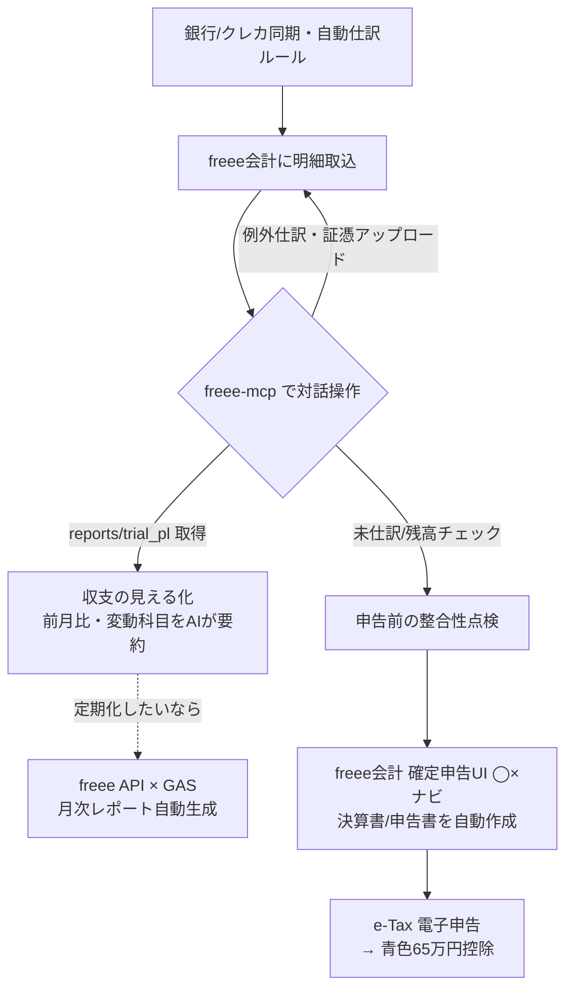
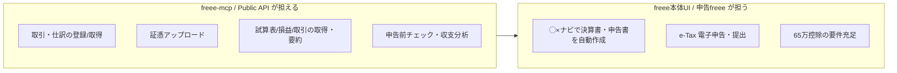

## 📌 結論 (TL;DR)

- **freeeは2026-03-02に公式MCPサーバー「freee-mcp」をOSS（Apache-2.0）で公開済み**。Claude Code / Claude Desktop / Cursor 等から、自然言語でfreeeの会計・人事労務・請求書など**約270のAPI（7領域）を操作できる**。ローカル版（`npx freee-mcp`）に加え、**リモート版（`https://mcp.freee.co.jp/mcp`、推奨）**も利用可能。
- ただし**「MCPで確定申告書の作成・e-Tax提出まで完結する」は誤り（要注意）**。MCP/Public APIが担えるのは**日々の記帳・自動仕訳・証憑アップロード・収支（試算表/損益）の取得と要約**まで。確定申告書の自動作成（◯×ナビ）とe-Tax電子申告は**freee会計の確定申告UI／申告freeeの機能**で行う。両者の役割分担を分けて設計するのが正解。
- **収支の見える化はMCPの最も実用的な使い所**。`freee_api_get` で `/reports/trial_pl`（損益）・`/reports/trial_bs`（貸借）・`/deals`（取引）を呼び、「今月の試算表を出して、前月比10%以上変動した科目を教えて」のように対話で集計・差分分析できる。定期バッチで可視化したいならGAS×freee APIでスプレッドシート連携という王道も併用できる。
- **65万円の青色申告特別控除には「複式簿記＋期限内申告」に加え、e-Tax電子申告か優良な電子帳簿保存のいずれかが必要**（令和2年分以降, 国税庁No.2072で確認）。freeeはこのe-Tax経路を標準サポートしており、これが「確定申告を楽にする」最大のレバー。
- 注意: MCPサーバー側に業務ガードレールは無く、**本番事業所のデータを書き換えうる**。まず自動作成される**開発用テスト事業所**で検証し、本番は最小権限スコープ＋AIの操作確認を徹底する。

## 🔍 調査結果

### 軸1. freee公式MCP「freee-mcp」の仕様

- **公式OSSとして実在**。freee（フリー株式会社）が2026-03-02に「freee-mcp」をOSS公開。npmパッケージ `freee-mcp` で配布され、ライセンスはGitHub上で **Apache-2.0**。約270本のAPIを網羅し、**会計・人事労務・請求書・工数管理・販売**（＋README記載のAgent Skillsでは IT管理・サイン を含む7領域）に対応。
- **2つの利用形態**。
  - **リモート版（推奨）**: Claude Desktop の「カスタムコネクタを追加」で URL `https://mcp.freee.co.jp/mcp` を登録するだけ。Node.js / ターミナル不要。
  - **ローカル版**: `npx freee-mcp` をMCPサーバーとして登録し、`npx freee-mcp configure` で対話式にOAuth認証・事業所選択。`freee サイン`はローカル版のみ対応。
- **提供されるMCPツールは“薄いラッパー”**。個別業務ごとの専用ツールではなく、汎用的な `freee_api_get` / `freee_api_post` / `freee_api_put` / `freee_api_patch` / `freee_api_delete` でfreee APIの任意パスを叩く設計。加えて `freee_authenticate` / `freee_auth_status`、事業所切替（`freee_set_current_company` 等）、`freee_file_upload`、`freee_api_list_paths` を備える。**正確なAPI利用は同梱の「Agent Skills」**（API領域ごとのリファレンス＋操作レシピをAIのコンテキストに注入）が補助する。
- **認証**。freeeアプリストア（`https://app.secure.freee.co.jp/developers`）でアプリ登録し Client ID / Client Secret を取得、コールバックURLは `http://127.0.0.1:54321/callback`。OAuth 2.0（初出のプレス／解説では PKCE 併用）で認可する。

**根拠**:
- [freee/freee-mcp（README）](https://github.com/freee/freee-mcp)
- [freeeプレスリリース（2026-03-02）](https://corp.freee.co.jp/news/20260302freee_mcp.html)
- [freee-mcp セットアップガイド（Toshiki, 2026-03-03）](https://zenn.dev/toshiki003/articles/60ccb4f6a27399)

**引用**:
> 例として「チャット上で『請求書を作って』と依頼するだけで、取引先登録から請求書発行まで一連の操作を正確に完了できる」（約270本のAPIを網羅し、会計・人事労務・請求書・工数管理・販売の5領域に対応）
> — [freeeプレスリリース](https://corp.freee.co.jp/news/20260302freee_mcp.html)

> リモート MCP（推奨）: Claude Desktop の「カスタムコネクタを追加」で名前「freee」、URL「https://mcp.freee.co.jp/mcp」を設定。
> — [freee/freee-mcp README](https://github.com/freee/freee-mcp)

> ※ プレスリリース時点（3/2）は「ローカルインストール版のみ」で、リモート版（URL接続のみ）は「今後の取り組み」と記載。READMEでは既にリモート版が推奨手段として案内されており、**3月以降に提供開始されたと判断**（後述の「注意点」で両論併記）。

### 軸2. 確定申告を楽にする方法（MCPとfreee本体の役割分担）

- **確定申告書の作成・提出は「freee本体の機能」**。freee会計（個人事業主向け）は、複式簿記を意識せず**◯×形式の質問に答えると青色申告決算書・確定申告書が自動作成**され、そのまま**e-Tax電子申告**まで対応する。スマホアプリでの所得税の電子申告にも対応。**この一連の“申告”は確定申告UI／申告freeeの守備範囲で、Public API/MCPに「確定申告書を作る」エンドポイントは見当たらない**（後述の反証検証で確認）。
- **MCPが効くのは“申告の前段”＝日々の記帳と申告前チェック**。
  - 自然言語での取引入力→勘定科目判定→税区分設定→証憑アップロードまで一気通貫（`freee_api_post` で `/deals`、`freee_file_upload`）。
  - 申告前に「未仕訳の口座明細はある？」「現金残高は合っている？」「事業按分は妥当？」をAIに点検させ、**帳簿の整合性を上げてから確定申告UIに渡す**。
- **65万円控除の要件を満たす経路がfreeeの最大の価値**。複式簿記＋期限内申告に加え、**e-Tax電子申告（または優良な電子帳簿保存）**で控除が55万→65万に上がる。freeeはe-Tax提出を標準サポートしており、紙・窓口より還付も早い（freee記載でおおよそ3週間）。

**根拠**:
- [e-Tax（電子申告）｜freee会計](https://www.freee.co.jp/accounting/individual/purpose/e-tax/)
- [青色申告｜freee会計](https://www.freee.co.jp/accounting/individual/purpose/bluereturn/)
- [確定申告書類をe-taxソフトで提出する – freee ヘルプセンター](https://support.freee.co.jp/hc/ja/articles/202849260)
- [青色申告特別控除の要件 - freee KB](https://www.freee.co.jp/kb/kb-blue-return/requirement/)

**引用**:
> freee会計では複式簿記を意識せず、〇×形式の質問に答えていくと、確定申告に必要な書類が作成できます。（e-Taxによる電子申告であれば、郵送や窓口申請よりも早く還付金を受け取れ、おおよそ3週間で受け取り可能）
> — [freee会計 e-Taxページ](https://www.freee.co.jp/accounting/individual/purpose/e-tax/)

### 軸3. 収支をわかりやすくする仕組み作り

- **MCP（対話型）で“見たい時に見る”**。MCPの `freee_api_get` で収支系エンドポイントを叩けるため、AIに自然言語で集計・差分を依頼できる。
  - 損益: `GET /api/1/reports/trial_pl`（パラメータ: `company_id`, `fiscal_year`, `start_month`, `end_month`）
  - 貸借: `GET /api/1/reports/trial_bs` / 2期比較系 `trial_bs_two_years` 等
  - 取引明細: `GET /api/1/deals`（期間・ページネーション指定）
  - `account_item_display_type=group` で決算書表示名（小カテゴリ）に丸めた集計も可能。
  - 実例プロンプト: 「今月の試算表を見せて。前月比で10%以上変動している科目を教えて」「○○の月別売上推移を直近6ヶ月分取得して」。
- **API×GAS（定期バッチ型）で“常に見える化”**。MCPは対話のたびに取得する性質上、毎月決まった形で残すならGoogle Apps Script×freee APIで試算表/取引を定期取得し、スプレッドシートでグラフ化する王道が補完的に有効。MCP（探索・アドホック分析）とGAS（定期レポート）は競合せず役割分担できる。
- **入口（仕訳）を自動化すると収支が正確になる**。銀行・クレカ同期＋自動仕訳ルールで明細を取り込み、MCPで例外仕訳と証憑付けを補助。入口がきれいだと `trial_pl` の精度が上がり、収支の見える化がそのまま申告の材料になる。

**根拠**:
- [freee API クイックスタート - freee Developers](https://developer.freee.co.jp/startguide)
- [freee MCPリモート版でできること5選（ZIDAI, 2026-04-16）](https://zidaiinc.com/method/freee-mcp-automation/)
- [freee × GASで財務分析をしてみる（Qiita, s_higeru）](https://qiita.com/s_higeru/items/880b13119cc9d204d82b)

**引用**:
> 試算表取得と変動分析: 前月比の変動科目を自動抽出 ／ プロンプト例「今月の試算表を見せて。前月比で10%以上変動している科目を教えて」
> — [ZIDAI Notebook](https://zidaiinc.com/method/freee-mcp-automation/)

#### 推奨する「仕組み」の全体像

#### 役割分担（MCP/API が担う範囲 と freee本体が担う範囲）

## ⚠️ 注意点・矛盾・反証結果

- **【反証で要注意：refuted寄り】「freee-mcpで確定申告を完結できる」は不正確**。検証の結果、確定申告書の作成・e-Tax提出はfreeeの確定申告UI／申告freeeの機能であり、Public API/MCPに該当エンドポイントは確認できなかった。MCPの貢献は「記帳・収支整理・申告前チェックの自動化」までと位置づけるのが正確（※「申告APIが無い」ことの“不在の証明”は性質上限界があるため「公開APIでは確認できない」と表現）。
- **【confirmed（要精緻化）】65万円控除の要件**。freeeは「e-Taxで65万円」と簡潔に表現するが、国税庁No.2072では正確には「複式簿記＋期限内申告」に加え**e-Tax電子申告“または”優良な電子帳簿保存（届出書提出）**のいずれか。令和2年分以降適用。実務上はe-Taxが最短経路。控除額・要件は年度改正で変わりうるため申告年の最新情報を要確認。
- **【両論併記】リモート版の提供時期**。2026-03-02プレスは「現在はローカル版のみ／リモートは今後」と記載。一方READMEとコミュニティ記事（ZIDAI, 2026-04）はリモート版（`mcp.freee.co.jp/mcp`）を推奨手段として案内。**3月時点＝ローカルのみ → 4月以降＝リモート提供開始、と解釈**（本記事は2026-06時点）。
- **【confirmed】安全性の留意**。MCPサーバー側に業務ガードレールは無く、AIの操作はClaude側の確認ダイアログに依存。Client Secretはローカルに平文保存される、との指摘あり。**まず自動作成される開発用テスト事業所で検証→本番は最小権限スコープ＋操作確認**。AI仕訳の精度は100%ではなく人のレビュー前提（ZIDAI/著者とも一致）。
- **古さ・単一ソース**: 約270 API・7領域・PKCE等の細部は公式プレス＋READMEが一次情報。レート制限の具体値・リモート版が全270 APIを同等に開放するかは未確認（※要一次ドキュメント確認）。`/reports/trial_*` 等のパス・パラメータはAPIリファレンス由来の確立した仕様。

## 📚 参照ソース一覧

- 公式:
  - [freee/freee-mcp（GitHub README）](https://github.com/freee/freee-mcp)
  - [freee-mcp OSS公開プレスリリース（2026-03-02）](https://corp.freee.co.jp/news/20260302freee_mcp.html)
  - [freee API クイックスタート - freee Developers Community](https://developer.freee.co.jp/startguide)
  - [e-Tax（電子申告）｜freee会計](https://www.freee.co.jp/accounting/individual/purpose/e-tax/)
  - [青色申告｜freee会計](https://www.freee.co.jp/accounting/individual/purpose/bluereturn/)
  - [青色申告特別控除の要件 - freee KB](https://www.freee.co.jp/kb/kb-blue-return/requirement/)
  - [確定申告書類をe-taxソフトで提出する – freee ヘルプセンター](https://support.freee.co.jp/hc/ja/articles/202849260)
  - [No.2072 青色申告特別控除 - 国税庁](https://www.nta.go.jp/taxes/shiraberu/taxanswer/shotoku/2072.htm)
- コミュニティ:
  - [freee-mcp セットアップガイド（Toshiki, Zenn, 2026-03-03）](https://zenn.dev/toshiki003/articles/60ccb4f6a27399)
  - [freee MCPリモート版でできること5選（ZIDAI Notebook, 2026-04-16）](https://zidaiinc.com/method/freee-mcp-automation/)
  - [freee × GASで財務分析をしてみる（s_higeru, Qiita）](https://qiita.com/s_higeru/items/880b13119cc9d204d82b)
  - [freeeがMCPサーバーをOSS公開（gihyo.jp, 2026-03）](https://gihyo.jp/article/2026/03/freee-mcp)
