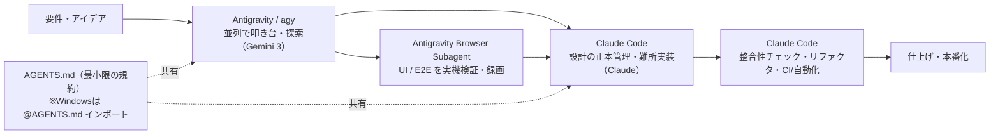

## 📌 結論 (TL;DR)

**「Antigravity CLI（コマンド `agy`、Go製、Gemini CLI の公式後継、2026-05-19 全員提供開始）」は実在する。** Claude Code（ターミナル中心・Git密着・サブエージェント/MCP/headless）と組み合わせる開発体制は成立するが、構成の決め手は**「課金とアカウントを混ぜないこと」**。`agy` と Claude Code は **それぞれ自前の正規サブスク（Google AI Pro/Ultra と Anthropic Pro/Max）で別々に動かす**のが安全な前提で、**Antigravity 内の Claude を外部の Claude Code へプロキシ転用するとアカウント制限/BAN の対象**になる（公式・複数報告で確認）。

役割分担の定番は **直列モデル**：「Antigravity で並列の叩き台・UI/ブラウザ実機検証・探索 → Claude Code で設計の正本管理・難所実装・整合性チェック・CI/自動化」。`agy` を Claude Code から呼ぶ連携（`mcp__agy__agy_ask` など）も可能だが、それは **agy のネイティブ MCP 機能ではなく第三者ブリッジ**（`agy -p` headless をラップ）で壊れやすい。一方 **Claude Code を MCP サーバ化する `claude mcp serve` は公式機能**。設定共有は AGENTS.md を軸にできるが、**「文脈ファイルを盛る」と逆効果**（研究で実証）。Windows では symlink でなく `@AGENTS.md` インポートが公式推奨。

## 🔍 調査結果

### 1. 前提の確定：Antigravity CLI（agy）とは何か

- Antigravity は Google のエージェント型開発**プラットフォーム**で、構成要素は「スタンドアロンアプリ／IDE／**CLI**／SDK」。2025-11-18 にパブリックプレビュー公開、対応OSは macOS / Windows / Linux。
- **Antigravity CLI は実在する独立ツール**。コマンドは `agy`、**Go製**、**Gemini CLI の公式後継**。2026-05-19（I/O 2026）に全員提供開始、**Gemini CLI と Gemini Code Assist IDE 拡張は 2026-06-18 にリクエスト提供を停止**（＝本レポート作成の翌日）。
- モデルは選択制で、**Gemini 3 Pro / Claude Sonnet 系 / GPT-OSS** を選べる。Agent Skills・Hooks・Subagents・Extensions（Antigravity プラグイン）を継承。

**根拠**:
- [Google Developers Blog - Build with Google Antigravity (2025-11-20)](https://developers.googleblog.com/build-with-google-antigravity-our-new-agentic-development-platform/)
- [Google Developers Blog - Transitioning Gemini CLI to Antigravity CLI (2026-05-19)](https://developers.googleblog.com/an-important-update-transitioning-gemini-cli-to-antigravity-cli/)
- [Google Codelabs - Hands-on with Antigravity CLI](https://codelabs.developers.google.com/antigravity-cli-hands-on)

**引用**:
> "Built in Go, Antigravity CLI is snappier and more responsive."
> （Go で構築された Antigravity CLI は、より軽快でレスポンシブです。）
> — [Google Developers Blog (2026-05-19)](https://developers.googleblog.com/an-important-update-transitioning-gemini-cli-to-antigravity-cli/)

> "On June 18, 2026, Gemini CLI and Gemini Code Assist IDE extensions will stop serving requests for Google AI Pro and Ultra, as well as those using it free of charge..."
> （2026年6月18日に、Gemini CLI と Gemini Code Assist IDE 拡張は、AI Pro/Ultra および無償の個人ユーザーに対してリクエスト提供を停止します。）
> — 同上

> ※反証検証での訂正：上記の停止は**一律ではない**。Gemini Code Assist Standard/Enterprise ライセンスや**有償の Gemini / API キー利用の組織はレガシー CLI を継続利用可能**。「全員が 6/18 に使えなくなる」は誤読。

### 2. 構成・セッティング（どう組むべきか）

#### 2-1. 安全な土台：アカウント・課金は「混ぜない」

最初に決めるべきは技術構成より**課金境界**。両ツールは**別系統の課金**で動く。Antigravity 内の Claude は **Google の AI Pro/Ultra 経由**で課金され Anthropic への直接支払いは不要だが、それを外部の Claude Code に流用するのは規約違反（§4 参照）。

- **Claude Code** = Anthropic の Pro/Max サブスク or API（`ANTHROPIC_API_KEY` を設定すると**サブスクではなくAPI従量課金**になる点に注意）
- **Antigravity / agy** = Google AI Pro/Ultra の OAuth ログイン。コミュニティ報告では `GEMINI_API_KEY` / `ANTIGRAVITY_API_KEY` を環境変数に設定すると **OAuth サブスク枠をバイパスして従量課金**になるため、無料/サブスク枠で回したいなら設定しない（※単一ソース・公式未確認だが、Claude Code 側の挙動と同型で蓋然性は高い）。

#### 2-2. インストールと初期設定（agy）

- インストール（公式 Codelab）: macOS/Linux は `curl -fsSL https://antigravity.google/cli/install.sh | bash`、Windows PowerShell は `irm https://antigravity.google/cli/install.ps1 | iex`。初回起動で Google OAuth ログイン。モデル指定は `agy --model "..."`。
- ルール/設定ファイル: グローバルは `~/.gemini/GEMINI.md`、ワークスペースは `.agents/rules/`、クロスツール標準の `AGENTS.md` も読む。スキルは `~/.gemini/config/skills/` または `<project>/.agents/skills/`。MCP 設定は `~/.gemini/config/mcp_config.json`。

#### 2-3. 3通りの「つなぎ方」

| 方式 | 中身 | 評価 |
|------|------|------|
| **A. 並走（推奨の既定）** | 別ウィンドウ/ターミナルで両者を起動。プロジェクト文脈を `AGENTS.md` で共有（Windows は `@AGENTS.md` インポート）。MCP サーバ群も各々の設定で共有 | 最も安全・素直。まずこれ |
| **B. agy を Claude Code から呼ぶ** | 第三者製 **MCP ブリッジ**が `agy -p`（headless）をラップ。`mcp__agy__agy_ask` / `agy_continue` 等のツールが生え、Claude Code を司令塔・agy を実装役にできる | **agy のネイティブ MCP 機能ではない**。`agy -p` の stdout バグ回避で transcript を読む等、壊れやすい。Windows は MCP が古い PATH を継承し agy を見失う罠あり |
| **C. Claude Code を MCP サーバ化** | `claude mcp serve` で Claude Code 自身を MCP サーバにし、他アプリへ View/Edit/LS 等を公開 | **公式機能**。ただし stdio 限定・認証なし・ローカル接続のみ |

**根拠**:
- [Google Codelabs - Getting Started with Google Antigravity](https://codelabs.developers.google.com/getting-started-google-antigravity)
- [Claude Code Docs - MCP](https://code.claude.com/docs/en/mcp) / [Headless](https://code.claude.com/docs/en/headless) / [Memory](https://code.claude.com/docs/en/memory)
- [Qiita - Claude Code × Antigravity CLI 協業環境 (fallout, 2026-06-15)](https://qiita.com/fallout/items/d699df3d6931c07eb38d)
- [GitHub - Claude-Code-Antigravity-CLI-MCP-Server (SinanTufekci)](https://github.com/SinanTufekci/Claude-Code-Antigravity-CLI-MCP-Server)

**引用**:
> "You can use Claude Code itself as an MCP server that other applications can connect to: `claude mcp serve`"
> （Claude Code 自身を、他アプリが接続できる MCP サーバとして使える: `claude mcp serve`）
> — [Claude Code Docs - MCP](https://code.claude.com/docs/en/mcp)

> "MCP bridge that exposes Google's Antigravity CLI (agy) to Claude Code as a sub-agent. Works around the headless `agy -p` stdout bug by reading the response from agy's own transcript files."
> （agy を Claude Code のサブエージェントとして公開する MCP ブリッジ。headless `agy -p` の stdout バグを、agy 自身の transcript ファイルから回答を読むことで回避する。）
> — [GitHub - Claude-Code-Antigravity-CLI-MCP-Server](https://github.com/SinanTufekci/Claude-Code-Antigravity-CLI-MCP-Server)

### 3. どのような恩恵を受けられるか

- **並列性 × 精密編集の両取り**：Antigravity の Agent Manager が複数エージェントを非同期に走らせ（叩き台・探索・雑務を物量で）、Claude Code が Git 密着で正本を1本に保つ。
- **実機ブラウザ検証**：Antigravity の Browser Subagent は実 Chrome を起動してクリック/入力/スクショ/録画で UI を自律検証する。これは **Claude Code がネイティブに持たない領域**。
- **Artifacts（レビュー可能な成果物）**：タスクリスト・実装計画・コード diff・スクショ・ブラウザ録画を生成し、人間の確認ポイントを作れる。
- **モデル使い分け**：Gemini 3 Pro/Flash を広く、要所を Claude（Sonnet/Opus）に。Antigravity は 1 ミッション単位でモデル割当が可能。
- **相互レビュー**：片方の出力をもう片方にレビューさせる運用。
- **体感速度**：「VS Code 単体ワークフローの約2倍速で完成」という実構築レポートあり（※単一の体験談）。

**根拠**:
- [Google Developers Blog (2025-11-20)](https://developers.googleblog.com/build-with-google-antigravity-our-new-agentic-development-platform/)
- [XDA - twice as fast as VS Code (2026-06-14)](https://www.xda-developers.com/claude-code-google-antigravity-full-project-twice-fast-vs-code/)
- [Claude Code Docs - Sub-agents](https://code.claude.com/docs/en/sub-agents)

**引用**:
> "a dedicated interface where you can spawn, orchestrate, and observe multiple agents working asynchronously"
> （複数のエージェントを非同期に生成・統括・観察できる専用インターフェース）
> — [Google Developers Blog (2025-11-20)](https://developers.googleblog.com/build-with-google-antigravity-our-new-agentic-development-platform/)

### 4. どのようなことができないか（限界・制約・注意）

#### 4-1. 【最重要】プロキシ転用は規約違反・BAN リスク

**Antigravity の Claude/Gemini を、プロキシ経由で外部ツール（Claude Code CLI 等）に転用するとアカウントが制限/BAN される。** 公式（Antigravity 公式 X／gemini-cli メンテナ）が違反として明言し、復帰対応も行っている。短時間（約1時間）の利用で BAN された報告もある（※具体時間は実質単一ソース）。

ただし**切り分けが重要**：

| 行為 | リスク |
|------|--------|
| Antigravity の**正規モデル選択**で Claude を使う（IDE/agy 内の通常利用） | **安全。問題なし** |
| プロキシで OAuth トークンを**外部ツールへ転用** | **規約違反・BAN 対象** |

- 反証検証での訂正：**「Google アカウントが丸ごと永久 BAN（Gmail/Drive まで停止）」は誤読**。実際は Antigravity/Gemini アクセスのみブロックで、Gmail 等は無事という公式整理が主流。「永久」も Google が復帰運用しており uncertain。

#### 4-2. レート制限・無料枠の不安定さ

- 無料枠は launch から縮小方向（公式も "subject to modification" と明記）だが、よく出回る **「1日250→20リクエスト・92%減」は一次/公式/報道に裏付けがなく、SEO まとめサイトの又聞き**（uncertain、誇張の疑い）。公式は無料枠を「日次」でなく**週次**枠と説明。
- 一方で **「上限到達後 168時間（7日）ロックアウト」報告は公式フォーラムに実在**（confirmed、ただし主に Pro ユーザー）。Pro は本来「5時間ごと更新」。
- 非 Gemini モデル（Claude 等）は**容量制約で別個の固定レート枠**＝ Claude は枠に達しやすい構造。
- 「2026年3月にクレジット課金＋週次クォータを新規導入」は不正確：3月に価格/枠の変更と反発はあった（The Register 等）が、クレジットは**5月にベース層から撤去**された。

#### 4-3. アカウント・環境の制約

- **個人 Gmail 必須**。Google Workspace アカウントは非対応。地域（アカウント登録国）による利用不可エラーの報告も。

#### 4-4. 安定性・安全性

- 大規模/重要コードベースでは Claude Code 等に比べ**安定性・速度で劣る**との評価。タスク中断・クラッシュ・ファイル誤上書きの報告あり。
- **Turbo モード**（拒否リスト以外を自動実行）は最速だが危険。ドキュメント閲覧時の**プロンプトインジェクション**や、悪意ある `.agent` ルールによる**永続的コード実行**の脆弱性指摘もある。

#### 4-5. 連携自体の限界

- **agy はネイティブの MCP サーバではない**（MCP クライアント）。Claude Code から呼ぶ B 方式は第三者ブリッジ頼みで壊れやすい。
- `agy plugin import claude`（Claude 資産を agy に取込）は**単一コミュニティソースのみ・公式未確認**（`agy plugin import gemini` は確実）。

**根拠**:
- [Antigravity 公式 X（制限アカウント復帰）](https://x.com/antigravity/status/2027435365275967591) / [gemini-cli メンテナ説明 (#20632)](https://github.com/google-gemini/gemini-cli/discussions/20632)
- [discuss.ai.google.dev - BAN 報告 (約1時間で BAN)](https://discuss.ai.google.dev/t/appeal-antigravity-ban-for-unintentional-tos-violation-via-claude-code-cli-pro-subscriber-appeal-form-submitted-3x-no-response/142325) / [168時間ロックアウト報告](https://discuss.ai.google.dev/t/bug-google-ai-pro-both-claude-sonnet-opus-and-gemini-non-flash-models-decayed-quota-and-locked-for-168-hours-7-days-with-zero-usage-flash-unaffected/131243)
- [The Register - 価格改定への反発 (2026-03-12)](https://www.theregister.com/software/2026/03/12/users-protest-as-google-antigravity-price-floats-upward/5227776)
- [Antigravity Docs - Plans](https://antigravity.google/docs/plans) / [GitHub - antigravity-claude-proxy（BAN警告）](https://github.com/badrisnarayanan/antigravity-claude-proxy)

**引用**:
> "Using third-party software, tools, or services to harvest or piggyback on Gemini CLI's OAuth authentication to access our backend services is a direct violation."
> （第三者のソフト/ツール/サービスを使って Gemini CLI の OAuth 認証に便乗しバックエンドにアクセスするのは明確な違反です。）
> — [gemini-cli メンテナ (GitHub Discussions #20632)](https://github.com/google-gemini/gemini-cli/discussions/20632)

> "Only Antigravity and Gemini access was banned, not email or other google account stuff."
> （BAN されたのは Antigravity と Gemini アクセスのみで、メール等の他の Google アカウント機能ではない。）
> — Hacker News コメント（BAN の範囲について）

### 5. どのような分担をするべきか

実体験で繰り返し語られるのは**直列モデル**：探索・並列・実機検証は Antigravity、確定・正本・難所は Claude Code。

#### タスク別の振り分け

| タスク | 振り先 | 理由 |
|--------|--------|------|
| 設計・アーキ判断・難所のコーディング | **Claude Code** | 追跡可能・正本管理（single source of truth） |
| 複数ファイルの整合性・大規模リファクタ | **Claude Code** | diff 管理が緻密。直列で破綻しにくい |
| デバッグ・テスト記述 | **Claude Code** | 端末での反復が速い |
| CI/CD 連携・PR レビュー自動化・headless 自動化 | **Claude Code** | Git/Actions 密着、サブエージェント/MCP、`-p --bare --output-format json` で部品化 |
| UI/フロント実装・視覚確認 | **Antigravity** | Browser Subagent で実画面検証 |
| E2E/ブラウザ操作（クリック/入力/スクショ/録画） | **Antigravity** | 実 Chrome セッションで自律検証 |
| 並列の雑務・複数案の同時試作・スキャフォールド | **Antigravity** | Agent Manager で複数ミッション並列 |
| 初期モック・アイデア検証・叩き台 | **Antigravity** | 速度型。最速で形にする |
| 要件分析・設計案の比較探索 | **Antigravity → Claude Code** | 探索は Antigravity、確定は Claude Code |

#### モデルの使い分け

- **広く回す層**：Gemini 3 Pro（深い推論）/ Gemini 3 Flash（高速・雑務）を Antigravity 側で。
- **要所**：指示追従・精密リファクタ・レビューに Claude Sonnet、複雑実装に Opus。Claude Code 側は Anthropic モデルを直接。
- コスト最適化の注意：「Antigravity 無料枠で広く回す」前提は無料枠縮小・ロックアウトで**揺らいでいる**ため過信しない。

**根拠**:
- [DataCamp - Claude Code vs. Antigravity (2026-03-16)](https://www.datacamp.com/blog/claude-code-vs-antigravity)
- [Addy Osmani - The Code Agent Orchestra (2026-03-26)](https://addyosmani.com/blog/code-agent-orchestra/)
- [SSW.Rules - Symlink AGENTS.md to CLAUDE.md](https://www.ssw.com.au/rules/symlink-agents-to-claude)

**引用**:
> "Verification is the bottleneck, not generation."
> （ボトルネックは生成ではなく検証だ。）
> — [Addy Osmani - The Code Agent Orchestra (2026-03-26)](https://addyosmani.com/blog/code-agent-orchestra/)

## ⚠️ 注意点・矛盾・反証結果

- **【反証で覆った】「Google アカウント丸ごと永久 BAN」は誤読**：実害は Antigravity/Gemini アクセスのブロックで、Gmail 等は無事という公式整理が主流。「永久」も復帰運用あり（uncertain）。ただし**プロキシ転用が規約違反で制限対象**である点自体は confirmed。
- **【反証で覆った】「無料枠 1日250→20・92%減」**：一次/公式/報道に裏付けなし。SEO まとめの又聞き（uncertain・誇張の疑い）。確実なのは「168時間ロックアウト報告の実在（主に Pro）」「公式は無料=週次枠」。
- **【反証で覆った】「3月にクレジット＋週次を新規導入」**：3月に変更・反発はあったが「導入」は不正確。クレジットは**5月にベース層から撤去**。レート制限の具体数値は公式非公開・変動が激しいため、最新は実機で要確認。
- **【反証で訂正】「agy を MCP サーバとして登録」**：agy は MCP クライアントで**サーバ機能なし**（refuted）。Claude Code から呼ぶ連携は第三者ブリッジ（`agy -p` ラップ、stdout バグ回避）依存で壊れやすい。一方 **`claude mcp serve` は公式機能**（confirmed）。
- **【反証で訂正】「Gemini Flash が指示外ファイルを勝手に変更」**：実在する不満は **Gemini 3 Pro** に向けられたものでモデルの取り違え（refuted 寄り）。
- **【反証で要注意】AGENTS.md の共有は単純な善ではない**：研究（[Gloaguen et al., arXiv 2602.11988](https://arxiv.org/abs/2602.11988)）で、**LLM 生成の文脈ファイルは平均 -3%**（ベンチ別 -0.5〜-2%）、人間作成でも改善は **+4%** どまり、**推論コスト +20〜23%**。結論は「**最小限の要件だけ書く**」。機械的に同内容を両ツールで共有する設計は逆効果になりうる。
  > "human-written context files should describe only minimal requirements."
  > （人間が書く文脈ファイルは最小限の要件だけを記述すべき。）
  > — arXiv 2602.11988 アブストラクト
- **【Windows 環境に直結】設定共有は symlink より `@AGENTS.md` インポート**：Claude Code は symlink を辿るが、**Windows では symlink 作成に管理者権限/開発者モードが必要**なため、公式は CLAUDE.md 冒頭に `@AGENTS.md` と書くインポート方式を推奨。本リポジトリは Windows のためこちらが無難。
- **直接併用の検証記事はまだ少数**：分担表は比較記事＋単独運用の実体験から再構成。実プロジェクトの A/B 検証ではない。
- **モデル名の表記揺れ**：Antigravity 既定を「Gemini 3 Pro」(公式) と「3.5 Flash」(一部記事)、Claude も「Sonnet 4.5/4.6」が混在。最新はドロップダウンで確認。
- **公式ページ取得の限界**：antigravity.google 系は JS レンダリングの SPA で本文取得が困難。コマンド名 `agy` は公式 GitHub Issue とインストールパスで裏取り、料金/制限の細目は公式ブログ/Codelabs/フォーラムで確認した範囲に限る。

## 📚 参照ソース一覧

- 公式:
  - [Build with Google Antigravity (Google Developers Blog, 2025-11-20)](https://developers.googleblog.com/build-with-google-antigravity-our-new-agentic-development-platform/)
  - [Transitioning Gemini CLI to Antigravity CLI (Google Developers Blog, 2026-05-19)](https://developers.googleblog.com/an-important-update-transitioning-gemini-cli-to-antigravity-cli/)
  - [Google I/O 2026 developer highlights (blog.google)](https://blog.google/innovation-and-ai/technology/developers-tools/google-io-2026-developer-highlights/)
  - [Getting Started with Google Antigravity (Google Codelabs)](https://codelabs.developers.google.com/getting-started-google-antigravity)
  - [Hands-on with Antigravity CLI (Google Codelabs)](https://codelabs.developers.google.com/antigravity-cli-hands-on)
  - [Antigravity Docs - Plans / Rate limits](https://antigravity.google/docs/plans)
  - [Claude Code Docs - MCP](https://code.claude.com/docs/en/mcp)
  - [Claude Code Docs - Memory](https://code.claude.com/docs/en/memory)
  - [Claude Code Docs - Headless](https://code.claude.com/docs/en/headless)
  - [Evaluating AGENTS.md (Gloaguen et al., arXiv 2602.11988, 2026-02)](https://arxiv.org/abs/2602.11988)
  - [Antigravity 公式 X（制限アカウント復帰表明）](https://x.com/antigravity/status/2027435365275967591)
  - [gemini-cli メンテナによる ToS 説明 (GitHub Discussions #20632)](https://github.com/google-gemini/gemini-cli/discussions/20632)
- コミュニティ:
  - [Claude Code × Antigravity CLI 協業環境 超簡単作成 (fallout, Qiita, 2026-06-15)](https://qiita.com/fallout/items/d699df3d6931c07eb38d)
  - [I built a full project with Claude Code + Antigravity, twice as fast (XDA, 2026-06-14)](https://www.xda-developers.com/claude-code-google-antigravity-full-project-twice-fast-vs-code/)
  - [Symlink AGENTS.md to CLAUDE.md (SSW.Rules)](https://www.ssw.com.au/rules/symlink-agents-to-claude)
  - [Claude-Code-Antigravity-CLI-MCP-Server (SinanTufekci, GitHub)](https://github.com/SinanTufekci/Claude-Code-Antigravity-CLI-MCP-Server)
  - [antigravity-claude-proxy（BAN警告つき, GitHub）](https://github.com/badrisnarayanan/antigravity-claude-proxy)
  - [Antigravity ban appeal（約1時間で BAN 報告, discuss.ai.google.dev）](https://discuss.ai.google.dev/t/appeal-antigravity-ban-for-unintentional-tos-violation-via-claude-code-cli-pro-subscriber-appeal-form-submitted-3x-no-response/142325)
  - [Antigravity quota 168時間ロックアウト報告 (discuss.ai.google.dev)](https://discuss.ai.google.dev/t/bug-google-ai-pro-both-claude-sonnet-opus-and-gemini-non-flash-models-decayed-quota-and-locked-for-168-hours-7-days-with-zero-usage-flash-unaffected/131243)
  - [Users protest as Google Antigravity price floats upward (The Register, 2026-03-12)](https://www.theregister.com/software/2026/03/12/users-protest-as-google-antigravity-price-floats-upward/5227776)
  - [Claude Code vs. Antigravity (DataCamp, 2026-03-16)](https://www.datacamp.com/blog/claude-code-vs-antigravity)
  - [The Code Agent Orchestra (Addy Osmani, 2026-03-26)](https://addyosmani.com/blog/code-agent-orchestra/)
</content>
</invoke>
