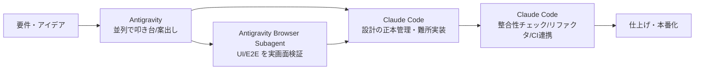

## 📌 結論 (TL;DR)

コミュニティの実体験で繰り返し語られる分担は **「直列モデル」** に集約される：**Antigravity で叩き台・並列の探索・UI/ブラウザ検証を回し → Claude Code で設計の正本管理・難所の実装・整合性チェックをやる**。Antigravity の強みは「並列エージェント＋ブラウザ Subagent による視覚検証＋ Artifacts（計画/スクショ/録画）」、Claude Code の強みは「Git/CLI 密着の正本管理（single source of truth）・サブエージェント・headless 自動化・MCP」。モデルは Gemini 3 Pro / Flash を寛大な無料枠で広く回し、要所だけ Claude（Sonnet/Opus）に振るのがコスト最適とされる。ただし Antigravity 無料枠は 2025年末〜2026年に大幅縮小しており「無料で広く回す」前提は揺らいでいる（後述）。直接の併用事例はまだ薄く、一般論（マルチエージェント＝オーケストレーション/コンテキスト分離/AGENTS.md）で補っている。

## 🔍 調査結果

### 1. 分担パターン（どのタスクをどちらに振るか）

複数のコミュニティ記事が「1つを選ぶより役割分担」を共通して主張。代表的な実例：

- **HSWorking（実務比較）**: 「Antigravity で叩き台 → Claude Code で設計と整合性 → Codex で仕上げ」という直列モデルを推奨。Antigravity=速度型（初期モック・案出し）、Claude Code=バランス型（設計〜実装〜整合性チェック、長期運用の中核）。
- **Ryo（4ツール併用）**: Cursor を起点 IDE に、Claude Code（Opus）は UI/フロントエンド実装、Codex は複雑な API/テーブル設計、Antigravity は試作・思いつきのプロトタイピングをバックグラウンドで 1〜2 個。
- **てら（note 執筆エージェント）**: Claude Code で「過去記事の並列フェッチ＋文体分析＋エージェント定義ファイル生成（約300行/5分）」、Antigravity は Google 系ツール連携での公開。Antigravity のターミナルから Claude Code を直接起動し横目で監視。

**根拠**:
- [HSWorking - 実務比較 (2026-05-25)](https://www.hsworking.com/post/antigravity-claude-code-codex-comparison-2026)
- [note - Codex と Claude Code と Antigravity と Cursor を併用する (Ryo, 2025-12-25)](https://note.com/biwakonbu/n/n1907b69fe39e)
- [note - Antigravity × Claude Code (てら, 2026-04-12)](https://note.com/ntera/n/na555f6846f3e)

**引用**:
> 「Anthropic の Claude Code は CLI と Git に密着した『設計・正本管理型』」／「Google の Antigravity はブラウザ・ターミナル・エディタを横断する『自律エージェント型』」
> — [HSWorking (2026-05-25)](https://www.hsworking.com/post/antigravity-claude-code-codex-comparison-2026)

> 「Antigravity：日常的な相談作業、ブラウザ連動調べ物、Google系ツール連携／Claude Code：特定役割に特化したエージェント作成、プロジェクト設定の固定化、並列大量ファイル分析」
> — [note (てら, 2026-04-12)](https://note.com/ntera/n/na555f6846f3e)

英語圏（DataCamp）の分担は機能ベースでより明確：

> "Claude Code takes a sequential approach to refactoring across interconnected files" while "Antigravity uses parallelism instead, spawning multiple agents across different parts of a refactoring task."
> （Claude Code は相互依存ファイル間のリファクタリングを直列で進め、Antigravity は並列で複数エージェントをリファクタリング各部に展開する）
> — [DataCamp (2026-03-16)](https://www.datacamp.com/blog/claude-code-vs-antigravity)

#### 推奨分担表（コミュニティ知見の統合）

| タスク | 振り先 | 理由（コミュニティ） |
|--------|--------|----------------------|
| 設計・アーキ判断・難所のコーディング | **Claude Code** | 直列・追跡可能・正本管理。整合性維持 |
| 複数ファイルの整合性チェック・大規模リファクタ | **Claude Code** | ファイル単位の diff 管理が緻密 |
| デバッグ・バグ修正・テスト記述 | **Claude Code** | 端末での反復イテレーションが速い |
| CI/CD 連携・PR レビュー自動化・headless 自動化 | **Claude Code** | Git/Actions 密着、サブエージェント/MCP |
| UI/フロントエンド実装・視覚確認 | **Antigravity** | ブラウザ Subagent で実画面検証 |
| E2E/ブラウザ検証（クリック・入力・スクショ・録画） | **Antigravity** | 実 Chrome セッションで自律検証 |
| 並列の雑務・スキャフォールド・複数案の同時試作 | **Antigravity** | Agent Manager で複数ミッション並列 |
| 初期モック・アイデア検証・叩き台 | **Antigravity** | 速度型。最速で形にする |
| 要件分析・設計案の比較検討 | **Antigravity → Claude Code** | 探索は Antigravity、確定は Claude Code |

※ 表は複数の二次情報（HSWorking / DataCamp / AIzen / dev.to / note）を統合したもの。**「Antigravity と Claude Code の直接併用」を一次目的に書かれた検証記事はまだ少なく**、多くは比較記事＋単独運用の実体験から再構成している点に注意。

### 2. 各ツールの機能を活かす分担

**Antigravity（並列 × ブラウザ検証 × Artifacts）** ― 公式が明言する3本柱：

- **Agent Manager**: 複数エージェントを非同期にスポーン・編成・観測する専用サーフェス
- **Browser Subagent**: 実 Chrome を起動し、DOM 操作・クリック・入力・スクショ・録画でユーザー操作を模して UI を自律検証（Claude Code がネイティブに持たない領域）
- **Artifacts**: タスクリスト/実装計画/コード diff/スクショ/ブラウザ録画を「レビュー可能な成果物」として生成。タイムラインをスクラブ・注釈・再実行できる

**根拠**:
- [Google Developers Blog - Build with Google Antigravity (2025-11-20)](https://developers.googleblog.com/build-with-google-antigravity-our-new-agentic-development-platform/)
- [Antigravity Docs - Browser](https://antigravity.google/docs/browser)

**引用（公式）**:
> "using the browser to test and verify that the new component is functioning as expected, all without synchronous human intervention."
> （ブラウザを使って新コンポーネントが期待通り動くかを、同期的な人間の介入なしにテスト・検証する）
> — [Google Developers Blog (2025-11-20)](https://developers.googleblog.com/build-with-google-antigravity-our-new-agentic-development-platform/)

**Claude Code（サブエージェント × headless × MCP × 正本管理）** ― コミュニティでの活かし方：

- **サブエージェント／並列ファイル分析**: 「過去記事11本を並列フェッチ→文体分析」のように、独立コンテキストの分業に使う
- **正本管理（single source of truth）**: 料金・FAQ・導線など複数ファイルの整合性を Git 密着で維持（HSWorking の「2時間プラン実装」事例で評価）
- **MCP / CI-CD**: PR レビュー自動化など承認ゲート付きエンタープライズ自動化向き

> Claude Code の "Sub-agents provide isolated context windows for complex tasks, while MCP plugins extend functionality."（サブエージェントは複雑タスク用に独立コンテキストを提供し、MCP プラグインが機能を拡張する）
> — [DataCamp (2026-03-16)](https://www.datacamp.com/blog/claude-code-vs-antigravity)

### 3. モデルの使い分けとコスト最適化

Antigravity は **1ミッション単位**でモデルを割当可能。利用可能：Gemini 3 Pro/Flash、Claude Sonnet 4.x、Claude Opus 4.x、GPT-OSS。

- **広く回す層**: Gemini 3 Pro（深い推論）/ Gemini 3 Flash（高速・雑務）
- **要所**: 機微なリファクタや指示追従・コードレビュー的作業に Claude Sonnet、複雑実装に Opus
- Ryo の実体験では「Antigravity の高速実装に Gemini 3 Flash（最速）、Claude Code 側で Opus を UI に惜しみなく、複雑 API は GPT-5.2-codex」と、**モデルとツールを掛け合わせて**割り当てている

**根拠**:
- [Google Developers Blog (2025-11-20)](https://developers.googleblog.com/build-with-google-antigravity-our-new-agentic-development-platform/)（Gemini 3 Pro は寛大なレート枠）
- [note (Ryo, 2025-12-25)](https://note.com/biwakonbu/n/n1907b69fe39e)

> 「Gemini 3 Flash：Antigravity の高速実装用（最も高速）／GPT-5.2-codex high：複雑な API 調査・実装に最適（遅いが本当に賢い）／Claude Opus：UI 実装に惜しみなく」
> — [note (Ryo, 2025-12-25)](https://note.com/biwakonbu/n/n1907b69fe39e)（要約引用）

**コスト最適化の注意**: 「Antigravity 無料枠で広く回す」前提は **2025年末〜2026年で崩れつつある**。無料枠は 250 req/日 → 約 20 req/日（約92%減、2025-12-07）、2026年3月にクレジット課金制（$0.01/credit）＋週次クォータに移行し、上限到達で最長168時間ロックの報告あり。Pro $20 と Ultra 約$250 の価格差も大きい。※価格・上限は変動が激しく要再確認。

### 4. マルチエージェント併用の一般論（補完）

直接事例が薄いため、Addy Osmani 等の一般知見で補完（※この節は Antigravity 固有ではなく Claude Code＋他エージェント全般の話）：

- **コンダクター型 vs オーケストレーター型**: 1エージェントを同期リアルタイムで導く（Claude Code 単体・Cursor）か、独立コンテキストの複数エージェントを非同期に編成する（Antigravity Agent Manager 等）か
- **コンテキスト分離**: 各エージェントに独立 git worktree を与え、マージ衝突を避けて真の並列を実現
- **異種混成（heterogeneity）**: 「どのモデルも全タスクで最良ではない」ので、計画は安価モデル・実装は中位・レビューは専用、と振り分ける ＝ ツール併用の本質的理由
- **人間の役割**: 「検証がボトルネックで、生成ではない」。アーキテクチャ判断と検証は人間が握る

**引用**:
> "You used to pair with one AI. Now you manage an agent team." / "Verification is the bottleneck, not generation."
> （かつては1つのAIとペアを組んだ。今はエージェントチームをマネジメントする／ボトルネックは生成ではなく検証だ）
> — [Addy Osmani - The Code Agent Orchestra (2026-03-26)](https://addyosmani.com/blog/code-agent-orchestra/)

## ⚠️ 注意点・矛盾・反証結果

- **直接併用の検証記事は少数**: 「Antigravity × Claude Code 併用」を主題に技術検証した記事は限られ、本レポートの分担表は比較記事＋単独運用の実体験から再構成している。実プロジェクトでの A/B 検証ではない点に留意。
- **AGENTS.md 共有は単純な善ではない（反証で要注意）**: 「AGENTS.md を共有すると良い」という直感は、Gloaguen et al.（arXiv 2602.11988, 2026-02）で覆る。**LLM 生成の文脈ファイルは成功率を約2-3%下げ**、人間が書いたものでも改善は約+4%に留まり、推論コストは20%超増。要点は「過剰な要求を書かず、最小限の要件だけ記述する」。AGENTS.md は OpenAI 系/Antigravity、CLAUDE.md は Claude Code が読むが、**併用時に同内容を共有する設計自体が逆効果になりうる**。
- **モデル名の表記揺れ（古い/混在）**: DataCamp は Antigravity 既定を「Gemini 3.5 Flash」と記すが、公式（2025-11）は「Gemini 3 Pro」。Claude も「Sonnet 4.5/4.6」「Opus 4.5/4.6」が混在。バージョン名は数か月で動くため、最新は各ツールのモデルドロップダウンで確認すること。
- **「同じ修正を両方に依頼すると差分管理が混乱する」**（AIzen）: 併用の実害として複数記事が指摘。どちらか一方を“正本”に決める運用が前提。
- **コスト前提の陳腐化**: 無料枠縮小により「無料で広く回す」最適化は2026年時点で弱い。最新の課金条件で再評価が必要。

## 📚 参照ソース一覧

- 公式:
  - [Build with Google Antigravity (Google Developers Blog, 2025-11-20)](https://developers.googleblog.com/build-with-google-antigravity-our-new-agentic-development-platform/)
  - [Google Antigravity Documentation - Browser](https://antigravity.google/docs/browser)
  - [Evaluating AGENTS.md (Gloaguen et al., arXiv 2602.11988, 2026-02)](https://arxiv.org/abs/2602.11988)
- コミュニティ:
  - [note - Codex と Claude Code と Antigravity と Cursor を併用する (Ryo, 2025-12-25)](https://note.com/biwakonbu/n/n1907b69fe39e)
  - [HSWorking - Antigravity・Claude Code・Codex実務比較 (2026-05-25)](https://www.hsworking.com/post/antigravity-claude-code-codex-comparison-2026)
  - [note - Antigravity × Claude Code 第1弾 (てら, 2026-04-12)](https://note.com/ntera/n/na555f6846f3e)
  - [AIzen - AntigravityとClaude Codeの違いを比較 (2026-06-09)](https://aizen-ai.co.jp/antigravity-vs-claude-code-guide/)
  - [DataCamp - Claude Code vs. Antigravity (2026-03-16)](https://www.datacamp.com/blog/claude-code-vs-antigravity)
  - [Addy Osmani - The Code Agent Orchestra (2026-03-26)](https://addyosmani.com/blog/code-agent-orchestra/)
  - [dev.to - Antigravity vs Claude Code Showdown (2025-11-30)](https://dev.to/robort-gabriel/antigravity-vs-claude-code-ultimate-agentic-dev-showdown-1njp)
