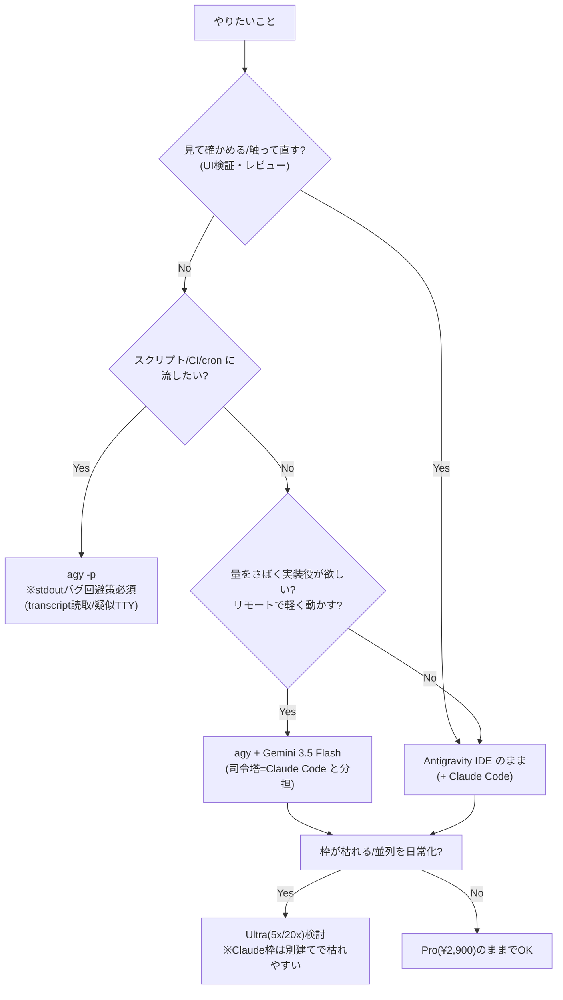

## 📌 結論 (TL;DR)

**あなたの環境（Antigravity IDE の中で Claude Code を開いて開発）を前提にすると、Antigravity CLI（`agy`）の立ち位置はハッキリしている。**

- `agy` の本質は **「GUI を捨てた代わりに “自動化・軽さ・分担” を取りに行くターミナル版」**。IDE と `agy` は **同一の agent harness・同一の MCP 設定を共有**するので、対話で使う限り **IDE でできることの大半は `agy` でもできる**。逆に言うと **GUI 目的なら IDE のままでよく、CLI に降りる動機は「スクリプト化・headless・リモート・単一バイナリの軽さ・並列の投げっぱなし」に限られる**。
- **CLI にしかできないこと**＝`agy -p` の**非対話ワンショット**（パイプ／CI／cron に組み込む）、`--dangerously-skip-permissions` の自律実行、Node/Python 不要の**単一 Go バイナリ**で SSH/コンテナ/リモートに置ける軽さ、ターミナルを占有しない**非同期バックグラウンド並列**。
- **CLI が苦手なこと**（ここが一番効く）：**組み込み Browser Agent（`/browser`）は agy CLI では未対応**（IDE/2.0 専用・公式明言）、**`agy -p` が非TTYで応答を stdout に出さない致命バグ**（CI/連携が壊れる）、**毎リクエストの固定トークン肥大でクォータが速く枯れる**、Windows の PATH 継承・symlink 破損、Agent Manager/Artifacts の**可視化が CLI では活きない**。
- **claude（ターミナル）との比較**＝あなたが既に走らせている枠の直接の競合。`agy` が勝つのは「Google 枠で Gemini を実質無料で叩ける／単一バイナリで軽い／モデル切替」、負けるのは「コード品質・指示追従・成熟度・クォータの読みやすさ」。**“司令塔=Claude Code、実装役=agy(Gemini 3.5 Flash)” の分担**が実用解。
- **料金プラン差は CLI 固有ではない**：Pro/Ultra で増えるのは**枠（クォータ）と優先度**で、IDE でも CLI でも共通（同一バックエンド）。Ultra は Pro 比 5x($100)/20x($200)＋Deep Think。

## 🔍 調査結果

### 0. 前提整理 — あなたの環境における「CLI の位置」

あなたは **Antigravity IDE をシェル（エディタ）**にして、その中で **Claude Code（拡張＋ターミナル）**を主力にしている。この構図だと `agy`（CLI）は **「ターミナルで動くエージェント」というスロットで claude と真っ向から競合**する。だから問うべきは「IDE か CLI か」ではなく **「claude を回しているそのターミナルに、`agy` を足す/差し替える意味はあるか」**。答えは §2〜§5。

### 1. Antigravity CLI（agy）の特徴

- **正体**：コマンド `agy`、**Go製の単一バイナリ**（Node/Python ランタイム不要）で軽快。**Gemini CLI の公式後継**で、**デスクトップアプリ「Antigravity 2.0」と同一の agent harness（バックエンド）を共有**。Antigravity は「アプリ／IDE／CLI／SDK」の4サーフェス構成で、`agy` はその CLI。
- **モデル選択（最大の特徴）**：`agy models` で一覧、`agy --model "..."` で起動時指定、セッション中は `/model`。選べるのは **Gemini 3.5 Flash（既定）/ Gemini 3.1 Pro / Claude Sonnet 4.6（Thinking）/ Claude Opus 4.6（Thinking）/ GPT-OSS 120B**。`--model` は **`-p` より前**に置かないと無視される引数順の癖あり。
- **権限モード**：`request-review / proceed-in-sandbox / always-proceed / strict` の段階制。`--dangerously-skip-permissions` で全ツール自動承認（YOLO）。
- **継承機能**：Agent Skills（宣言的 Markdown でスラッシュコマンド化）/ Hooks / Subagents（非同期で並列委譲）/ Extensions（“Antigravity plugins”）/ MCP（**クライアント**として、ローカル・リモート両対応）。
- **設定ファイルは IDE と共有**：MCP は `~/.gemini/config/mcp_config.json` を **2.0／IDE／CLI で共有**。コンテキスト/ルールは `GEMINI.md`・`AGENTS.md`（クロスツール標準）。

**根拠**:
- [Google Developers Blog - Transitioning Gemini CLI to Antigravity CLI](https://developers.googleblog.com/an-important-update-transitioning-gemini-cli-to-antigravity-cli/)
- [Codelabs - Hands-on with Antigravity CLI](https://codelabs.developers.google.com/antigravity-cli-hands-on) / [Developer knowledge MCP](https://codelabs.developers.google.com/developer-knowledge-mcp-antigravity)

**引用**:
> "Built in Go, Antigravity CLI is snappier and more responsive. ... Antigravity CLI shares the same agent harness as Antigravity 2.0, the new Antigravity desktop application."
> （Go製で軽快・応答性が高い。…Antigravity CLI は新デスクトップアプリ Antigravity 2.0 と同じエージェントハーネスを共有する。）
> — [Google Developers Blog](https://developers.googleblog.com/an-important-update-transitioning-gemini-cli-to-antigravity-cli/)

> "Antigravity 2.0, IDE, and CLI share a central MCP configuration in the file `~/.gemini/config/mcp_config.json`."
> （2.0・IDE・CLI は中央の MCP 設定ファイルを共有する。）
> — [Codelabs - Developer knowledge MCP](https://codelabs.developers.google.com/developer-knowledge-mcp-antigravity)

### 2. IDE と CLI（agy）の違い・使い分け

**同じバックエンド・同じ MCP 設定・同じモデル**なので、**対話で使う限り機能はほぼ等価**。差は「ガワ（GUI か端末か）」と「自動化適性」。

| 観点 | Antigravity IDE / 2.0 | Antigravity CLI（agy） |
|---|---|---|
| 操作 | GUI・エディタ統合 | 端末・キーボード/スクリプト |
| **組み込み Browser Agent (`/browser`)** | **○ 使える** | **✗ 未対応**（CLIでは Playwright/BrowserMCP で代替） |
| Agent Manager（並列の可視化） | ○ GUI で俯瞰 | △ 可視化は活きない（裏で並列は走る） |
| Artifacts（計画/図/録画の視覚レビュー） | ○ 得意 | △ レビュー体験は弱い |
| headless / スクリプト / CI | ✗（GUI前提） | **○ `agy -p` で本領** |
| リモート/SSH/コンテナ | △ | **○ 単一バイナリで軽い** |
| 起動の軽さ | 重い（エディタ） | **軽い** |

→ **使い分けの原則**：**“見て確かめる/触って直す” は IDE、“流す/組み込む/放置する” は CLI**。あなたが UI 検証やレビューをしたい局面は IDE のまま、定型処理や一括処理を回したい局面で `agy` に降りる。

**根拠**:
- [Codelabs - Agentic UI automation（Browser Agent は CLI 未対応）](https://codelabs.developers.google.com/agentic-ui-automation-with-antigravity)

**引用**:
> "The built-in browser agent is not yet supported in the terminal-first Antigravity CLI (Agy CLI). However, you can use it out-of-the-box in Antigravity IDE and Antigravity 2.0 today."
> （組み込みブラウザエージェントは、ターミナル先行の Antigravity CLI（agy）では**まだ未対応**。IDE と 2.0 では今すぐ標準で使える。）
> — [Codelabs - Agentic UI automation](https://codelabs.developers.google.com/agentic-ui-automation-with-antigravity)

### 3. CLI（agy）にしかできないこと

GUI の Antigravity ではできず、**`agy` だから成立する**こと：

- **`agy -p "..."` の非対話ワンショット**：対話 UI を出さず即実行。**シェルのパイプ・cron・git hook・CI/CD に組み込める**。「コード理解 → ドキュメント生成 → テスト生成」のような多段をスクリプトで連結。
- **`--dangerously-skip-permissions` の自律実行**：承認プロンプトを出さず CI パイプラインに直接埋め込む（※危険、後述）。
- **単一 Go バイナリの軽さ**：Node/Python 不要。**SSH 先・コンテナ・リモートサーバ・最小環境**にそのまま置ける。エディタを開かずに起動。
- **ターミナルを占有しない非同期バックグラウンド並列**：公式が CLI の利点として「ターミナルをロックせず大規模リファクタや複数トピック調査を並走」と明記。
- **シェルとの合成**：`!` トグルでの直接コマンド実行など、端末ならではの操作。

**根拠**:
- [Codelabs - Accelerating Development with Antigravity CLI](https://codelabs.developers.google.com/genai-for-dev-antigravity-cli)
- [GitHub Discussion #27274](https://github.com/google-gemini/gemini-cli/discussions/27274)

**引用**:
> "Antigravity CLI can be run in non-interactive mode within a CI/CD pipeline to automate various tasks by passing prompts and commands directly to the CLI without requiring manual intervention."
> （Antigravity CLI は CI/CD パイプライン内で非対話実行でき、手動介入なしにプロンプトを直接渡して各種タスクを自動化できる。）
> — [Codelabs](https://codelabs.developers.google.com/genai-for-dev-antigravity-cli)

> "Antigravity CLI orchestrates multiple agents for complex tasks in the background, letting you run large-scale refactors or research several topics without locking up your terminal session."
> （複数エージェントをバックグラウンドで統括し、ターミナルを占有せず大規模リファクタや複数調査を走らせられる。）
> — [GitHub Discussion #27274](https://github.com/google-gemini/gemini-cli/discussions/27274)

### 4. CLI（agy）が苦手なこと・弱み ★ここが一番効く

- **① 組み込み Browser Agent が使えない**：`/browser` の実機 UI 検証は **CLI 未対応**（§2 公式明言）。CLI でやるなら Playwright/BrowserMCP を別途繋ぐ手間。**フロントの視覚検証は IDE に戻る**のが素直。
- **② `agy -p` が非TTYで応答を stdout に出さない致命バグ**：パイプ／サブプロセス／リダイレクトで実行すると、モデル往復は成功し **exit code 0 なのに stdout が空**。実際の応答は内部の `transcript.jsonl` にしか残らない。**CI やエージェント連携の “完全なブロッカー”**。回避には transcript を読むか `script -qec '...'` で疑似TTY化が要る（1.0.9 でも継続）。
- **③ 承認まわりが両極端**：`agy -p` は**承認ゲートなしで read/write・シェル・ネットワークを自走**（危険）。逆に対話モードを非TTYで回すと、**描画されない承認プロンプトを永遠に待ってハング**。
- **④ 固定トークンオーバーヘッドでクォータが速く枯れる**：システムプロンプト＋ツール定義で**毎リクエスト約23k–25kトークン**が内容に関係なく乗るとの報告。Pro 枠が短時間で尽きやすい（※数値は個人環境依存・誇張に注意）。
- **⑤ Windows/WSL の不安定**：PATH 非継承で開いていたタブの片方だけ `agy: command not found`、移行後の旧 symlink 残存、WSL のランチャ破損で更新の度に手動修復。
- **⑥ 可視化・全文コンテキストが弱い**：Agent Manager の並列俯瞰・Artifacts の視覚レビューは CLI だと活きない。全文ファイルをコンテキストに渡しにくいという不満も。
- **⑦ BYOK 非対応・クローズド寄り**：自前 API キー持ち込みでのコスト制御がしにくい。Gemini CLI が OSS だったのに対し agy 本体は内部が追いにくい、との指摘。

**根拠**:
- [GitHub - Claude-Code-Antigravity-CLI bridge（stdout バグを transcript 読取で回避）](https://github.com/SinanTufekci/agent-intern) / [antigravitylab.net - headless non-TTY stdout 解説](https://antigravitylab.net/en/articles/integrations/antigravity-cli-agy-headless-non-tty-stdout-ci)
- [aibuilderclub - agy Command Guide（承認/トークン/BYOK）](https://www.aibuilderclub.com/blog/antigravity-cli-guide)
- [Qiita - Windows で agy が command not found (ayago, 2026-06-16)](https://qiita.com/ayago/items/207e4706183133985af9)

**引用**:
> "`agy -p` authenticates, talks to the model, gets the answer back… and then writes it to the controlling terminal instead of its stdout. ... Stdout bug persists — `-p` still doesn't print the answer to stdout on 1.0.9."
> （`agy -p` は認証してモデルと往復し答えを得るが、それを **stdout ではなく制御端末に書く**。…stdout バグは継続で、1.0.9 でも `-p` は答えを stdout に出さない。）
> — [GitHub - Claude-Code-Antigravity-CLI bridge](https://github.com/SinanTufekci/agent-intern)

### 5. agy（ターミナル）vs Claude Code（ターミナル）vs Codex

あなたが既に走らせている **claude（ターミナル）の枠**に置いて比べると：

| 観点 | **Antigravity CLI (agy)** | Claude Code（ターミナル） | OpenAI Codex (CLI) |
|---|---|---|---|
| モデル | 複数社：Gemini 3.5 Flash/3.1 Pro・**Claude Sonnet/Opus 4.6**・GPT-OSS | Claude Opus/Sonnet/Haiku 中心 | GPT-5.x/Codex 系中心 |
| 課金の入口 | Google AI 無料/Pro/Ultra に同梱 | Claude Pro/Max or API 従量 | ChatGPT プラン同梱 or API 従量 |
| 無料での実用度 | **高（Gemini 3 Pro が無料）** | 低 | 中 |
| コード品質・指示追従 | △（テスト更新漏れ等の指摘） | **◎（“本番投入可”の評価）** | ○（既存スタイル維持に強い） |
| 速度・非同期投げっぱなし | **◎** | ○ | ○ |
| 成熟度・ドキュメント | △（preview） | ◎ | ○ |
| BYOK / コスト制御 | △（非対応） | ◎ | ◎ |
| MCP | クライアント | **クライアント＋サーバ**（`claude mcp serve`） | クライアント |

- **agy が claude に勝つ点**：Google 枠で **Gemini 3.5 Flash を実質無料・爆速で叩ける**、単一バイナリで軽い、`/model` で Gemini⇄Claude 切替。
- **agy が claude に負ける点**：コード品質・指示追従、成熟度、クォータの読みやすさ、BYOK。
- **実用解＝役割分担**：日本コミュニティでも **「設計・レビューは Claude Code（司令塔）、コード生成は agy の Gemini 3.5 Flash（実装役）」**で “実装側を従量課金ゼロ化” する併用が実例化。
  - ※この「従量課金ゼロ」は **agy を自分の Google AI サブスクの OAuth で正規に動かす**話。**Antigravity の Claude をプロキシで外部 Claude Code に流用するのは ToS 違反・BAN 対象**（別問題。混同しない。詳細は [[2026-06-17_claude-code-antigravity-cli-dev-setup]]）。

**根拠**:
- [Medium - 同一タスクで3者比較 (vinamrayadav, 2026-06-04)](https://medium.com/@myselfvinamrayadav/claude-code-vs-codex-vs-antigravity-2-0-i-ran-the-same-task-through-all-three-6172de9678cf)
- [Qiita - Claude Code司令塔×agy実装役 (fallout, 2026-06)](https://qiita.com/fallout/items/5097f0575b58f4c69b81)
- [Claude Code Docs - Overview / MCP](https://code.claude.com/docs/en/overview) / [OpenAI Codex docs](https://developers.openai.com/codex/cli)

**引用**:
> "missed updating the test to inject a mock request ID"（Antigravity は3者中、モックの request ID を注入するテスト更新を落とした＝最弱）／ Claude Code は "review and ship as is"（レビューしてそのまま出荷できる）。
> — [Medium - 3者比較](https://medium.com/@myselfvinamrayadav/claude-code-vs-codex-vs-antigravity-2-0-i-ran-the-same-task-through-all-three-6172de9678cf)（※単一の実体験比較。確度中）

### 6. 料金プランによる違い（Pro / Ultra）と「CLI でのプラン差」

**結論：プランで増えるのは “枠と優先度” だけ。それは CLI でも IDE でも共通**（同一バックエンド・同一クォータ設計）。**CLI 固有のプラン差は基本的に無い**。

- **無料**（サインインのみ）：**Gemini 3 Pro・無制限タブ補完・Agent Manager・Browser 統合の全機能**が使える。リフレッシュは **週次**。
- **Pro（¥2,900/月・約$20）**：最も寛大なレート上限＋優先処理、クォータは **5時間ごと**リフレッシュ。Gemini 3 Pro に加え Vertex 経由の Claude（Sonnet）/gpt-oss の枠が増える。超過は Google One で **AIクレジット追加購入**。
- **Ultra**：クォータが Pro 比 **5倍（$100/月・¥14,500）／20倍（$200/月・¥32,000、旧$250から値下げ）**（※公式表現は「Gemini アプリ**と** Antigravity の両方で 5x/20x」）。新モデル先行アクセス＋最優先＋**Gemini 3 Pro Deep Think**。
- **⚠️ 実態**：Pro 枠は体感「お試し層」。「実コーディング45分で週次ベースライン到達」「Claude を1セッション開いただけで枠の約60%消費」「超過後 数日〜168時間ロックアウト」報告多数。**Claude 枠は Gemini と別建てで小さく消費が激しい**ため、Ultra でも Claude 使い放題にはならない。

**根拠**:
- [blog.google - Antigravity rate limits (Pro/Ultra)](https://blog.google/feed/new-antigravity-rate-limits-pro-ultra-subsribers/) / [New Google AI subscriptions](https://blog.google/products-and-platforms/products/google-one/google-ai-subscriptions/)
- [Google One ヘルプ - AI Ultra benefits](https://support.google.com/googleone/answer/16286513)
- [discuss.ai.google.dev - Pro quota limits](https://discuss.ai.google.dev/t/navigating-antigravity-pro-quota-limits/130212)

**引用**:
> "Based on your specific Google AI Ultra plan, you get 5x or 20x usage quota in Gemini and Google Antigravity compared to the Google AI Pro plan."
> （Ultra プランに応じて、Gemini と Google Antigravity で Pro 比 5倍または20倍の使用量クォータを得る。）
> — [Google One ヘルプ](https://support.google.com/googleone/answer/16286513)

### 7. 実践 — あなたの環境（IDE＋Claude Code）での使いどころ

- **基本は今のまま**：見て直す・UI 検証・レビューは **Antigravity IDE＋Claude Code** が最適。`agy` で置き換える必要はない。
- **`agy` を足すと効く場面**：
  - 定型処理を **スクリプト/CI に流す**（ただし `agy -p` の stdout バグを踏むので、transcript 読取か疑似TTYの回避策込みで）。
  - **Gemini 3.5 Flash で “量” をさばく**実装役を、Claude Code（司令塔）と分担。普段使いを Flash に寄せれば Pro 枠が長持ち。
  - **リモート/サーバ/コンテナ**で軽く動かしたいとき（単一バイナリ）。
- **クォータを溶かさない運用**：普段は Gemini 3.5 Flash（枠ほぼ0消費）、考える仕事だけ 3.1 Pro/Sonnet 4.6、一発勝負だけ Opus 4.6 を温存。使用量メーターを監視。

## ⚠️ 注意点・矛盾・反証結果

- **【前回からの訂正】`/browser`・`/artifact` は CLI でフルに使える、ではない**：公式 Codelab が「**組み込み Browser Agent は agy CLI 未対応**（IDE/2.0 専用）」と明言。フロントの視覚検証は IDE に戻るのが正。
- **【CLI最大の地雷】`agy -p` の stdout バグ（confirmed）**：非TTYで応答を stdout に出さず exit 0、応答は `transcript.jsonl` のみ。GitHub ブリッジ実装＋解説記事で一致、**1.0.9 でも継続**。CI/連携に使うなら回避策必須。
- **【反証で確定／訂正】プラン差は CLI 固有ではない**：アーキ・MCP 設定・コア能力は CLI/IDE 共有（"same agent harness"／"share a central MCP configuration"）。よって機能面のプラン差は基本共通。ただし**「クォータが全サーフェスで完全に同一」と明言する公式文は未確認**（断定は避ける）。
- **【反証で確定】Ultra「5x/20x」は公式記載**。ただし対象は「Gemini アプリ**と** Antigravity の両方」で、Antigravity 限定ではない。$250→$200 値下げ・$100/$200 の2階層も公式確認。
- **【反証で確定／要注意】二重課金回避は正しいが「Claude 使い放題」は誤り**：Antigravity 内 Claude は Vertex 経由で Google 枠で動き Anthropic 別契約は不要。だが Claude 枠は別建てで小さく、1セッションで枠の大半を溶かす報告が公式フォーラムに多数。**プロキシで外部流用は ToS 違反・BAN 対象**（別問題）。
- **【誇張に注意】「ブラウザ検証/Agent Manager/Artifacts は Antigravity 独自」**：ブラウザ検証は Codex・Claude Code も持つ（むしろ Claude Code はログイン状態共有で認証ページに強い）。Antigravity の独自性は “唯一の機能” ではなく **“無料枠の太さ × モデルの品揃え × プラットフォーム統合”**。
- **【裏取り不能・誇張】極端なクォータ数値**（「2プロンプトでロックアウト」「23k–25kトークン固定」「92%減」等）は個人環境依存・単一ソース寄り。確実なのは「枯渇/ロックアウト報告の実在」「無料=週次・有料=5時間更新」まで。**最新は実機で要確認**。
- **モデル名の確定**：agy 現行は **Gemini 3.5 Flash（既定）/ 3.1 Pro / Claude Sonnet 4.6 / Opus 4.6（4.8 ではない）/ GPT-OSS 120B**。公式ヘルプは更新ラグで「Claude 4.5 Sonnet」と古い表記が残る。最新は `/model` で確認。
- **コード消失事件の帰属注意**：「D:ドライブ全消去」は **Antigravity IDE/エージェント（Turbo mode）**が出元で、`agy` CLI 固有事象ではない（混同しない）。

## 📚 参照ソース一覧

- 公式:
  - [Transitioning Gemini CLI to Antigravity CLI (Google Developers Blog, 2026-05-19)](https://developers.googleblog.com/an-important-update-transitioning-gemini-cli-to-antigravity-cli/)
  - [google-gemini/gemini-cli Discussion #27274](https://github.com/google-gemini/gemini-cli/discussions/27274)
  - [Hands-on with Antigravity CLI (Codelabs)](https://codelabs.developers.google.com/antigravity-cli-hands-on)
  - [Accelerating Development with Antigravity CLI (Codelabs)](https://codelabs.developers.google.com/genai-for-dev-antigravity-cli)
  - [Agentic UI automation（Browser Agent は CLI 未対応）(Codelabs)](https://codelabs.developers.google.com/agentic-ui-automation-with-antigravity)
  - [Developer knowledge MCP（中央MCP設定の共有）(Codelabs)](https://codelabs.developers.google.com/developer-knowledge-mcp-antigravity)
  - [Antigravity rate limits for Pro/Ultra (blog.google)](https://blog.google/feed/new-antigravity-rate-limits-pro-ultra-subsribers/)
  - [New Google AI subscriptions / I/O 2026 (blog.google)](https://blog.google/products-and-platforms/products/google-one/google-ai-subscriptions/)
  - [Google One ヘルプ - AI Ultra benefits](https://support.google.com/googleone/answer/16286513)
  - [OpenAI Codex CLI](https://developers.openai.com/codex/cli) / [Claude Code Docs - Overview](https://code.claude.com/docs/en/overview)
- コミュニティ:
  - [Claude-Code-Antigravity-CLI bridge（stdout バグの回避実装）](https://github.com/SinanTufekci/agent-intern)
  - [antigravitylab.net - agy headless non-TTY stdout (CI) 解説 (2026-06-13)](https://antigravitylab.net/en/articles/integrations/antigravity-cli-agy-headless-non-tty-stdout-ci)
  - [Antigravity CLI: The agy Command Guide (aibuilderclub)](https://www.aibuilderclub.com/blog/antigravity-cli-guide)
  - [Claude Code司令塔×agy実装役 (fallout, Qiita, 2026-06)](https://qiita.com/fallout/items/5097f0575b58f4c69b81)
  - [Windows で agy が command not found (ayago, Qiita, 2026-06-16)](https://qiita.com/ayago/items/207e4706183133985af9)
  - [Claude Code vs Codex vs Antigravity 2.0 同一タスク比較 (vinamrayadav, Medium, 2026-06-04)](https://medium.com/@myselfvinamrayadav/claude-code-vs-codex-vs-antigravity-2-0-i-ran-the-same-task-through-all-three-6172de9678cf)
  - [Navigating Antigravity Pro quota limits (discuss.ai.google.dev)](https://discuss.ai.google.dev/t/navigating-antigravity-pro-quota-limits/130212)
  - [クォータ節約・色で使い分ける (note/kino)](https://note.com/kino_11/n/nf0d664528cdc)
</content>
</invoke>
