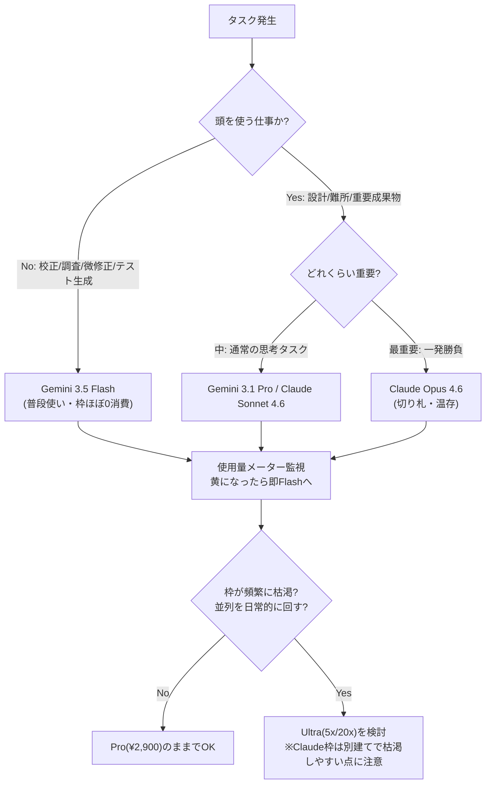

## 📌 結論 (TL;DR)

**Antigravity は「無料でも Gemini 3 Pro まで使える」のが最大の特徴。Pro（月¥2,900）に課金して増えるのは主に “実行枠（クォータ）と優先処理” で、機能そのものはほぼ無料と同じ。** あなたが Google AI Pro を「使いこなせていない」のは、機能不足ではなく **「クォータの設計を知らずにすぐ枠を溶かしている」可能性が高い**。

Antigravity CLI（コマンド `agy`、Go製、Gemini CLI の公式後継、2026-06-18 に旧 Gemini CLI を置き換え）の本質は、**1つの Google AI サブスクの中で Gemini 3.5 Flash / Gemini 3.1 Pro / Claude Sonnet 4.6 / Claude Opus 4.6 / GPT-OSS 120B を “選んで” ターミナルから使える点**。Claude Code（Claude 専用）や OpenAI Codex（GPT 専用）が自社モデル中心なのに対し、**複数ベンダーのフラッグシップを1契約・1ツールから切り替えられるのが Antigravity の効きどころ**（Anthropic への二重課金も不要）。

ただし **「Antigravity CLI にしかできない独自機能」は厳密には少ない**：ブラウザ実機検証もマルチエージェント並列も MCP も、いまや Codex / Claude Code も持つ。独自性は “機能” より **“無料枠の太さ × モデルの品揃え × プラットフォーム統合（CLI/IDE/アプリ/SDK が同一ハーネス）”** にある。**Ultra（$100=5倍／$200=20倍、Deep Think 追加）は「並列を日常的に回す人」向け**で、軽〜中量なら Pro + Flash 中心運用で足りる。

## 🔍 調査結果

### 1. Google AI Pro でできること（Antigravity で）

ポイントは **「Antigravity は無料でもかなり使える。Pro の価値は “枠と優先度” に集約される」** こと。

- **無料プラン（Google アカウントのサインインのみ・カード不要）でも、Gemini 3 Pro・無制限のタブ補完・Agent Manager・Browser 統合の “全機能” が使える**。無料と有料で**機能差はほぼ無い**。
- **Pro（¥2,900/月・約 $20）で増えるのは主に：①最も寛大なレート上限 ②優先処理（priority access）③クォータが “5時間ごと” にリフレッシュ**（無料は “週次” リフレッシュ）。
- Pro では Gemini 3 Pro に加え、**Vertex AI Model Garden 経由の Claude（Sonnet）/ gpt-oss-120b** の利用枠が増える（公式ヘルプ明記）。
- 課金は **「ベースライン枠＋超過分は Google One で AI クレジット追加購入」** の2層。クォータ消費は **エージェントの “作業量” に比例**（単純タスクは軽く、複雑な推論は重い）。
- **⚠️ 重要な実態**：Pro の枠は体感「お試し層」に近い。コミュニティでは **「実コーディング45分で週次ベースラインに到達」「未使用なのに枠が消えた」「超過後 数日〜168時間ロックアウト」** の報告が多数（→ §6・実践 tips で対策）。

**根拠**:
- [blog.google - Antigravity rate limits for Pro/Ultra](https://blog.google/feed/new-antigravity-rate-limits-pro-ultra-subsribers/)
- [Google One ヘルプ - AI Pro benefits](https://support.google.com/googleone/answer/14534406)
- [discuss.ai.google.dev - Navigating Antigravity Pro quota limits](https://discuss.ai.google.dev/t/navigating-antigravity-pro-quota-limits/130212)

**引用**:
> "Google AI Pro and Ultra subscribers now receive priority access, featuring our highest, most generous rate limits with quotas that refresh every five hours. ... all users will continue to enjoy Gemini 3 Pro, unlimited tab code completions and access to all product features, such as the Agent Manager and Browser integration."
> （AI Pro/Ultra 加入者は優先アクセスと、5時間ごとに更新される最も寛大なレート上限を得る。…全ユーザーは引き続き Gemini 3 Pro・無制限のタブ補完・Agent Manager や Browser 統合を含む全機能を利用できる。）
> — [blog.google](https://blog.google/feed/new-antigravity-rate-limits-pro-ultra-subsribers/)

> "AI Pro members receive higher usage limits for Gemini 3 Pro and other Vertex AI Model Garden models (e.g. Claude 4.5 Sonnet, gpt-oss-120b) within the Antigravity platform."
> （AI Pro 会員は Antigravity 内で Gemini 3 Pro および他の Vertex AI Model Garden モデル〈例: Claude 4.5 Sonnet、gpt-oss-120b〉の利用枠が増える。）
> — [Google One ヘルプ](https://support.google.com/googleone/answer/14534406)

### 2. Antigravity CLI（agy）の特徴

- **正体**：コマンドは `agy`、**Go製**で軽快。**Gemini CLI の公式後継**で、デスクトップアプリ「Antigravity 2.0」と**同一の agent harness（バックエンド）を共有**する。Antigravity プラットフォームは **「デスクトップアプリ／IDE／CLI／SDK」の4サーフェス構成**で、`agy` はその CLI 部分。
- **モデル選択（最重要の特徴）**：`agy models` で一覧、`agy --model "..."` で起動時指定、セッション中は `/model`。選べるのは **Gemini 3.5 Flash（既定）/ Gemini 3.1 Pro / Claude Sonnet 4.6（Thinking）/ Claude Opus 4.6（Thinking）/ GPT-OSS 120B**。
- **継承機能**：Gemini CLI の中核を継承し、**Agent Skills（宣言的 Markdown でスラッシュコマンド化）/ Hooks（実行前後フック）/ Subagents（非同期で並列委譲）/ Extensions（“Antigravity plugins” として）/ MCP（クライアントとしてローカル・リモート両対応）**。
- **headless / 自動化**：`agy -p "..."` で非対話実行（CI/CD 向け）、`agy --dangerously-skip-permissions` で自律モード。
- **設定ファイル**：本体 `~/.gemini/antigravity-cli/settings.json`、MCP は `~/.gemini/antigravity-cli/mcp_config.json`（ワークスペースは `.agents/mcp_config.json`）、コンテキスト/ルールは `GEMINI.md`・`AGENTS.md`（クロスツール標準）とグローバル `~/.gemini/GEMINI.md`、スキルは `.agents/skills/` または `~/.gemini/config/skills/`。
- **インストール**：macOS/Linux `curl -fsSL https://antigravity.google/cli/install.sh | bash`、Windows PS `irm https://antigravity.google/cli/install.ps1 | iex`。初回に Google OAuth ログイン。
- **CLI と GUI 機能の関係**：`/browser` でブラウザサブエージェント、`/artifact` で成果物レビューが CLI からも触れるが、**Agent Manager の可視化や Browser Subagent の本領はデスクトップアプリ／IDE 側**。CLI 単体から GUI 機能をフルに呼べるかは公式に明言なし（要注意）。

**根拠**:
- [Google Developers Blog - Transitioning Gemini CLI to Antigravity CLI](https://developers.googleblog.com/an-important-update-transitioning-gemini-cli-to-antigravity-cli/)
- [Codelabs - Hands-on with Antigravity CLI](https://codelabs.developers.google.com/antigravity-cli-hands-on)
- [Codelabs - Getting Started with Google Antigravity](https://codelabs.developers.google.com/getting-started-google-antigravity)

**引用**:
> "Faster execution: Built in Go, Antigravity CLI is snappier and more responsive. ... Antigravity CLI shares the same agent harness as Antigravity 2.0, the new Antigravity desktop application."
> （高速実行：Go で構築された Antigravity CLI はより機敏で応答性が高い。…Antigravity CLI は新デスクトップアプリ Antigravity 2.0 と同じエージェントハーネスを共有する。）
> — [Google Developers Blog](https://developers.googleblog.com/an-important-update-transitioning-gemini-cli-to-antigravity-cli/)

### 3. Claude Code / OpenAI Codex との違い

**結論：3者とも「ターミナル型エージェント」としての基本機能（並列サブエージェント・MCP・ブラウザ検証・headless・AGENTS/CLAUDE.md）は出そろった。差は “モデル戦略” と “課金の入口” に出る。**

| 観点 | **Antigravity CLI (agy)** | Claude Code | OpenAI Codex (CLI) |
|---|---|---|---|
| 提供元 | Google | Anthropic | OpenAI |
| 使えるモデル | **複数ベンダー**を選択：Gemini 3.5 Flash / 3.1 Pro / **Claude Sonnet 4.6 / Opus 4.6** / GPT-OSS 120B | 自社 Opus/Sonnet/Haiku 中心（Bedrock/Vertex 経由も可） | 自社 GPT-5.x/Codex 系中心（API 経由で他社接続可） |
| 課金の入口 | **Google AI 無料 / Pro(¥2,900) / Ultra** に同梱 | Claude Pro/Max サブスク or API 従量 | ChatGPT Free/Plus/Pro/… に同梱 or API 従量 |
| 無料での実用度 | **高（Gemini 3 Pro が無料で使える）** | 低（実用は要サブスク/API） | 中（Free 枠はあるが限定的） |
| ブラウザ実機検証 | あり（Browser Subagent、録画も） | あり（Chrome 拡張、**ログイン状態共有で認証ページ可**, beta） | あり（in-app browser、**認証ページ非対応**） |
| マルチエージェント並列 | あり（Agent Manager で**GUI 可視化**） | あり（subagents / Agent teams / background） | あり（subagents） |
| MCP | クライアント（ローカル/リモート） | **クライアント＋サーバ**（`claude mcp serve`） | クライアント（STDIO/HTTP） |
| 設定ファイル | GEMINI.md / AGENTS.md | CLAUDE.md（＋Skills/Hooks） | AGENTS.md |
| 体感の強み | 速い・並列を物量で・無料枠太い | **コード品質・指示追従・難所実装が堅い** | **既存コードのスタイル維持・大規模理解** |

- **モデル戦略が一番の違い**：Antigravity は「1契約で複数社モデルのビュッフェ」、Claude Code は「Claude を深く」、Codex は「GPT を深く」。
- **品質評価**：コミュニティの実測比較では「Claude Code は vibe coding の王」「Gemini 3.1 Pro はエージェントとして GPT-5.5 や Opus に一歩譲る」「Antigravity は最速だが成果に深さ・完全性が欠けることがある」との声。**速度＝Antigravity、精度・難所＝Claude Code、大規模＝Codex** という住み分けが定番。

**根拠**:
- [OpenAI Codex CLI docs](https://developers.openai.com/codex/cli) / [Codex pricing](https://developers.openai.com/codex/pricing) / [Codex in-app browser](https://developers.openai.com/codex/app/browser)
- [Claude Code Docs - Overview](https://code.claude.com/docs/en/overview) / [Chrome](https://code.claude.com/docs/en/chrome)
- [XDA - 1か月使った比較 (2026-05-20)](https://www.xda-developers.com/used-claude-code-google-antigravity-codex-for-month-have-clear-winner/) / [metacircuits (2026-06-08)](https://metacircuits.substack.com/p/claude-code-vs-antigravity-20-vs)

**引用**:
> "The in-app browser does not support authentication flows, signed-in pages, your regular browser profile, cookies, extensions, or existing tabs."
> （in-app ブラウザは認証フロー／サインイン済みページ／通常プロファイル／Cookie／拡張／既存タブに非対応。）
> — [OpenAI Codex docs](https://developers.openai.com/codex/app/browser)（※Claude Code はログイン状態を共有でき、ここが Codex との差）

> "Gemini 3.1 Pro is just less good of an agentic model than GPT 5.5 or Opus."
> （Gemini 3.1 Pro はエージェント用モデルとしては GPT-5.5 や Opus より単純に劣る。）
> — [metacircuits](https://metacircuits.substack.com/p/claude-code-vs-antigravity-20-vs)

### 4. Antigravity CLI に「しかできないこと」（正直な評価）

率直に言うと、**“技術的に Antigravity だけ” という独自機能は少ない**（ブラウザ検証・並列・MCP は他2社も持つ）。本当の独自性は次の4点に集約される：

1. **1つの Google AI サブスクで複数ベンダーのフラッグシップを切り替えられる**：Gemini 3 系＋Claude Sonnet/Opus＋GPT-OSS を `/model` で。Claude Code（Claude 専用）・Codex（GPT 専用）にはない “モデル・ビュッフェ”。しかも **Claude は Vertex AI Model Garden 経由で Google 枠で動くため、Anthropic への別サブスク（二重課金）が不要**。
2. **無料プランでフラッグシップ（Gemini 3 Pro）＋エージェント機能が使える**：Claude Code / Codex が実用には課金前提なのに対し、Antigravity は無料層が太い。**コストをかけずに agentic coding を始められる**のが実質的な独自価値。
3. **CLI / IDE / デスクトップアプリ / SDK が “同一ハーネス” で統合**：ターミナルで始めた作業を GUI の Agent Manager で俯瞰、という横断が同一基盤で成立。Agent Manager は**複数エージェントの状態・成果物・承認待ちを GUI で可視化**できる（CLI/IDE 横断の統合体験）。
4. **Ultra 限定の Gemini 3 Pro Deep Think**（§5）。

**根拠**:
- [Google One ヘルプ - AI Ultra benefits（Claude/gpt-oss を Antigravity 内モデルとして明記）](https://support.google.com/googleone/answer/16286513)
- [Codelabs - Hands-on with Antigravity CLI（モデル選択）](https://codelabs.developers.google.com/antigravity-cli-hands-on)
- [XDA - Agent Manager の並列可視化](https://www.xda-developers.com/used-claude-code-google-antigravity-codex-for-month-have-clear-winner/)

> ※反証検証での訂正：「ブラウザ実機検証は Antigravity だけ」「Artifacts は唯一無二」は**誇張**。Codex・Claude Code もブラウザ検証を持ち、並列も MCP も標準化済み。ベンダー寄りブログの “唯一性” 表現は割り引いて読むべき。

### 5. Google AI Ultra にアップグレードでできること

- **クォータが Pro 比で大幅増**：**$100/月（¥14,500）= 5倍**、**$200/月（¥32,000、旧 $250 から値下げ）= 20倍**。**※公式の正確な表現は「Gemini アプリ **と** Google Antigravity の両方で Pro 比 5x/20x」**（Antigravity 限定の倍率ではない）。
- **最優先トラフィック＋新モデルへの先行アクセス**、最高のエージェントクォータ。
- **Gemini 3 Pro Deep Think**（より深い推論モード）が対象 Ultra プランで利用可（※提供は米国・英語中心の注記あり。日本での Antigravity 経由可否は公式明記なし）。
- **クォータが 5時間ごとリフレッシュ**は Pro と同じ仕組みで、Ultra は枠の “絶対量” が大きいという位置づけ。

**⚠️ ただし Ultra は万能ではない**：「アップデート後に Ultra でも枠が激減し90分で 0%」「Claude を1セッション開いただけで総枠の約60%消費」といった実体験が公式フォーラムに複数。**Ultra にしても “Claude 枠は別建てで小さく・消費が激しい” 構造は変わらない**。

**根拠**:
- [blog.google - New Google AI subscriptions（5x/20x・$250→$200）](https://blog.google/products-and-platforms/products/google-one/google-ai-subscriptions/)
- [Google One ヘルプ - AI Ultra benefits](https://support.google.com/googleone/answer/16286513)
- [blog.google - Gemini 3 Deep Think](https://blog.google/innovation-and-ai/models-and-research/gemini-models/gemini-3-deep-think/)
- [discuss.ai.google.dev - Ultra quota reduction](https://discuss.ai.google.dev/t/ultra-dramatic-quota-reduction-after-update-this-needs-an-official-explanation/135526) / [Ultra: Claude quota worse than Pro](https://discuss.ai.google.dev/t/ultra-subscription-claude-model-quota-even-worse-than-pro/135870)

**引用**:
> "Based on your specific Google AI Ultra plan, you get 5x or 20x usage quota in Gemini and Google Antigravity compared to the Google AI Pro plan."
> （ご利用の Ultra プランに応じて、Gemini と Google Antigravity で Pro プラン比 5倍または20倍の使用量クォータを得る。）
> — [Google One ヘルプ](https://support.google.com/googleone/answer/16286513)

> "initiating just a single conversation session with the Claude model immediately consumes approximately 60% of my total quota."
> （Claude モデルで会話セッションを1つ開始しただけで、総クォータの約60%を即消費する。）
> — [discuss.ai.google.dev（Ultra 加入者の報告）](https://discuss.ai.google.dev/t/ultra-subscription-claude-model-quota-even-worse-than-pro/135870)

### 6. 実践：Pro を「使いこなす」ための運用（あなたの悩みへの直球の答え）

「使いこなせていない」の正体は **“高消費モデルで枠をすぐ溶かしている”** こと。複数ソースで一致する実践 tips：

- **普段使いは Gemini 3.5 Flash（作業の7〜8割）**。校正・調べ物・微修正・テスト生成は Flash。Flash は Pro 枠をほぼ消費せず、タブ補完は 0 消費。
- **“考える仕事” だけ Gemini 3.1 Pro / Claude Sonnet 4.6 に昇格**、一発勝負の重要成果物のみ **Opus 4.6 を切り札として温存**。終わったら即 Flash に戻す。
- **モデル使用量インジケータを「ガソリンメーター」化**（黒→黄→赤）して監視。黄で早めに Flash へ。
- **Browser Subagent / Terminal（テスト実行・Web 巡回）は高消費**。簡単なタスクでは自動ブラウザテストを切る。
- **計画フェーズは Antigravity の外で**（コンテキストファイル肥大を避ける）。
- **Agent Manager** で各エージェントにファイル所有権を割当て、進捗のない小編集の連発は即停止、アイドルは閉じる。
- **Ultra の判断法**：1週間「上限到達回数」と「その時の並列数」を記録し、$20 と $100 のどちらが自分の数字で安いか計算してから。Flash 中心で枠が回るなら Pro のままで十分。

## ⚠️ 注意点・矛盾・反証結果

- **【反証で要訂正】「無料で全モデル・課金は枠だけ」**：核（無料で Gemini 3 Pro＋主要機能、課金≒枠＋優先）は **confirmed**。ただし **(1) Claude/GPT-OSS が “無料” で使えるとは公式は明言していない**（公式が無料で名指しするのは Gemini 3 Pro のみ。Claude/gpt-oss は “Pro/Ultra の枠が増える” 文脈で登場）、**(2) Deep Think は Ultra 限定**で「課金で増えるのは枠だけ」の例外、**(3) 週次/ベースライン枠の枯渇で実質的に機能制限に転じる**。→ 総合 **uncertain（要注意）**。
- **【反証で確定／訂正】Ultra「5x/20x」は公式記載（confirmed）**。ただし **対象は「Gemini アプリ と Antigravity の両方」**で、Antigravity 限定の倍率ではない。$250→$200 値下げ・$100/$200 の2階層も公式確認。
- **【反証で確定／要注意】二重課金回避（confirmed）**：Antigravity 内の Claude は Vertex AI Model Garden 経由で **Google 枠で動き、Anthropic への別サブスクは不要**。**ただし「Claude 使い放題」ではない**：Claude 枠は Gemini と別建てで小さく、1セッションで枠の大半を溶かす報告が公式フォーラムに多数。**※これは Antigravity 内の正規モデル選択の話で、Antigravity の Claude をプロキシで外部 Claude Code に流用するのは ToS 違反・BAN 対象**（別問題、過去調査 [[2026-06-17_claude-code-antigravity-cli-dev-setup]] 参照）。
- **【反証で確定／訂正】提供状況とモデル名**：旧 Gemini CLI / Gemini Code Assist IDE 拡張は **2026-06-18 に Pro/Ultra/無償個人向けの提供停止**（Standard/Enterprise・有償 API は継続）→ **公式推奨の移行先が `agy`**。モデル名は **Opus は 4.6（4.8 ではない）/ Sonnet は 4.6（4.5 ではない）/ Pro は 3.1（3 ではない）** が現行。**Flash は「3.5」と「3」で表記揺れ**（公式 Codelab は 3.5 Flash を採用＝最有力だが、最新は **アプリ内 `/model` で要確認**）。公式ヘルプは更新ラグで「Claude 4.5 Sonnet」と古い表記が残る。
- **【誇張に注意】「ブラウザ実機検証 / Agent Manager / Artifacts は Antigravity 独自」**：Codex・Claude Code もブラウザ検証・並列を持つ。Antigravity の独自性は “唯一の機能” ではなく **“無料枠の太さ × モデルの品揃え × プラットフォーム統合”**。
- **【裏取り不能・誇張】クォータの極端な数値**（「無料1日250→20・92%減」「週300M→9M・97%減」等）は一次/公式に裏付けなし。確実なのは「ロックアウト報告の実在」「公式は無料＝週次・有料＝5時間更新」まで。**数値は変動が激しく、引用の多くが 2026-03 の枠激減騒動期のもの。最新は実機で要確認**。
- **モデルバージョンの時系列**：記事ごとに「Gemini 3 Pro / 3.1 Pro」「3 Flash / 3.5 Flash」「Opus 4.6 / 4.8」が混在（2025-11 ローンチ〜2026-06 で更新）。本レポートは 2026-06 時点の公式 Codelab 基準。

## 📚 参照ソース一覧

- 公式:
  - [Antigravity rate limits for Pro/Ultra (blog.google)](https://blog.google/feed/new-antigravity-rate-limits-pro-ultra-subsribers/)
  - [New Google AI subscriptions / I/O 2026（5x/20x・$250→$200）(blog.google)](https://blog.google/products-and-platforms/products/google-one/google-ai-subscriptions/)
  - [Google One ヘルプ - AI Pro benefits](https://support.google.com/googleone/answer/14534406)
  - [Google One ヘルプ - AI Ultra benefits](https://support.google.com/googleone/answer/16286513)
  - [Transitioning Gemini CLI to Antigravity CLI (Google Developers Blog, 2026-05-19)](https://developers.googleblog.com/an-important-update-transitioning-gemini-cli-to-antigravity-cli/)
  - [Hands-on with Antigravity CLI (Google Codelabs)](https://codelabs.developers.google.com/antigravity-cli-hands-on)
  - [Getting Started with Google Antigravity (Google Codelabs)](https://codelabs.developers.google.com/getting-started-google-antigravity)
  - [Accelerating Development with Antigravity CLI (Google Codelabs)](https://codelabs.developers.google.com/genai-for-dev-antigravity-cli)
  - [Gemini 3 Deep Think (blog.google)](https://blog.google/innovation-and-ai/models-and-research/gemini-models/gemini-3-deep-think/)
  - [gemini.google/subscriptions](https://gemini.google/subscriptions/)
  - [OpenAI Codex CLI](https://developers.openai.com/codex/cli) / [pricing](https://developers.openai.com/codex/pricing) / [in-app browser](https://developers.openai.com/codex/app/browser)
  - [Claude Code Docs - Overview](https://code.claude.com/docs/en/overview) / [MCP](https://code.claude.com/docs/en/mcp) / [Chrome](https://code.claude.com/docs/en/chrome)
- コミュニティ:
  - [I used Claude Code, Antigravity & Codex for a month (XDA, Parth Shah, 2026-05-20)](https://www.xda-developers.com/used-claude-code-google-antigravity-codex-for-month-have-clear-winner/)
  - [Claude Code vs Antigravity 2.0 (metacircuits, Jonas Braadbaart, 2026-06-08)](https://metacircuits.substack.com/p/claude-code-vs-antigravity-20-vs)
  - [Antigravity CLI: The agy Command Guide (aibuilderclub)](https://www.aibuilderclub.com/blog/antigravity-cli-guide)
  - [Navigating Antigravity Pro quota limits (discuss.ai.google.dev)](https://discuss.ai.google.dev/t/navigating-antigravity-pro-quota-limits/130212)
  - [Ultra: dramatic quota reduction after update (discuss.ai.google.dev)](https://discuss.ai.google.dev/t/ultra-dramatic-quota-reduction-after-update-this-needs-an-official-explanation/135526)
  - [Ultra: Claude model quota even worse than Pro (discuss.ai.google.dev)](https://discuss.ai.google.dev/t/ultra-subscription-claude-model-quota-even-worse-than-pro/135870)
  - [クォータ節約・色で使い分ける (note/kino)](https://note.com/kino_11/n/nf0d664528cdc)
  - [Gemini 3 Pro × Opus 使い分け (note/biwakonbu, 2025-12-11)](https://note.com/biwakonbu/n/n77c8568a6758)
</content>
</invoke>
