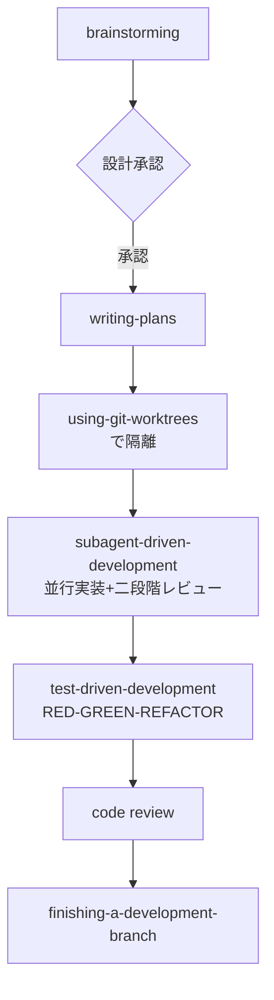

## 📌 結論 (TL;DR)

- **Superpowers** は Claude Code（および Codex / Antigravity 等）向けのオープンソース「スキル集＋開発方法論」フレームワーク。作者は Jesse Vincent（GitHub: obra）。エージェントがいきなりコードを書き始めるのを止め、**brainstorming → 計画 → 隔離実装 → TDD → レビュー** という一連のプロセスを強制する14個の内蔵スキルを提供する。
- **導入は Claude Code の公式プラグインマーケットプレイス経由**（`/plugin install superpowers@claude-plugins-official`）。`.claude/skills/` への手動配置は想定されておらず、前提条件・対応バージョンの明記も無い。
- **ユースケースは個人のサイドプロジェクトから企業の業務ツール開発まで幅広い**。共通する効果パターンは「brainstorming が仕様の曖昧さを実装前に解消し、手戻り・大規模リファクタを防ぐ」こと。
- **開発体験の評価は真っ二つ**：「7〜8時間の自律稼働でも品質が崩れない」「30分で設計の通った成果物」という称賛がある一方、「過剰設計」「標準的なワークフローの装飾版」「トークン消費が重い」「計画フェーズで確認せず突き進む」という批判も多数存在する。
- **反証検証の結果、2件の主張を修正**：①「HN上でミス増加批判と称賛が対立している」という構図は**誤り**（称賛コメントは実在しない）。②「開発者5万人が数ヶ月で採用」「作者は10月以降1行もコードを書いていない」は単一の未検証ツイート由来で**裏取り不能**。GitHub star数（約24.8万）自体は API と UI 双方で確認済み。

## 🔍 調査結果

### 1. 何ができるか

Superpowers は「エージェント向けスキルフレームワーク＆実際に機能するソフトウェア開発方法論」を謳うプロジェクトで、以下の7段階ワークフローを規定する。

1. **brainstorming** — 要件・制約を対話で明確化し、設計書を生成
2. 設計承認
3. **writing-plans** — 「センスの悪い意欲的なジュニアエンジニアでも従える」レベルまで、2〜5分粒度のタスクに分解
4. **using-git-worktrees** — git worktree でメインブランチから隔離した環境を用意
5. **subagent-driven-development** — タスクごとに新規サブエージェントを起動し並行実装、仕様適合性とコード品質の二段階レビュー
6. **test-driven-development** — RED-GREEN-REFACTOR（失敗するテスト→最小実装→成功確認→コミット）を強制
7. **code review → finishing-a-development-branch** — レビューを経てマージ/PR判断

内蔵スキルは `skills/` 直下に14個確認できる: `brainstorming` / `dispatching-parallel-agents` / `executing-plans` / `finishing-a-development-branch` / `receiving-code-review` / `requesting-code-review` / `subagent-driven-development` / `systematic-debugging` / `test-driven-development` / `using-git-worktrees` / `using-superpowers` / `verification-before-completion` / `writing-plans` / `writing-skills`。

中核となる `using-superpowers` は会話開始時に必ず読み込まれる基盤スキルで、他スキルの発火を「提案」ではなく「必須」と位置付ける。

**根拠**:
- [obra/superpowers - README](https://github.com/obra/superpowers)
- [skills/using-superpowers/SKILL.md](https://github.com/obra/superpowers/blob/main/skills/using-superpowers/SKILL.md)

**引用**:
> "Invoke relevant or requested skills BEFORE any response or action — including clarifying questions"
> （応答や行動より前に、明確化の質問すら含めて関連スキルを呼び出せ）
> — [using-superpowers/SKILL.md](https://github.com/obra/superpowers/blob/main/skills/using-superpowers/SKILL.md)

> "Enforces RED-GREEN-REFACTOR: write failing test, watch it fail, write minimal code, watch it pass, commit."
> （RED-GREEN-REFACTORを強制する：失敗するテストを書き、失敗を確認し、最小限のコードを書き、成功を確認し、コミットする）
> — [obra/superpowers README](https://github.com/obra/superpowers)

スキル自体の作り方にも規約があり、`writing-skills` は「失敗するテストなしに新規スキルを作るな（Iron Law）」「description には “何をするか” ではなく “いつ使うか” だけを書け」と定めている。

アーキテクチャ面では `.claude-plugin/plugin.json` にプラグインメタデータ（name/version/author/license）を持ち、Claude Code だけでなく Codex・Cursor・Kimi Code・OpenCode・Pi・Antigravity 等、対応エージェントごとの専用ディレクトリ（`.codex-plugin` 等）を備えるマルチプラットフォーム構成になっている。

### 2. 導入方法

Claude Code へのインストールは、`.claude/skills/` への手動配置ではなく**プラグインマーケットプレイス経由が公式ルート**。2通りの方法がある。

```
# Anthropic公式マーケットプレイスから
/plugin install superpowers@claude-plugins-official

# Superpowers独自マーケットプレイスから（要事前登録）
/plugin marketplace add obra/superpowers-marketplace
/plugin install superpowers@superpowers-marketplace
```

**根拠**:
- [obra/superpowers README - Claude Code セクション](https://github.com/obra/superpowers)
- [obra/superpowers-marketplace](https://github.com/obra/superpowers-marketplace)

設定面ではテレメトリの opt-out として、Claude Code 標準の `DISABLE_TELEMETRY` / `CLAUDE_CODE_DISABLE_NONESSENTIAL_TRAFFIC` に加え、独自の `SUPERPOWERS_DISABLE_TELEMETRY` 環境変数を用意している。

一方で、**前提条件（対応OS・Claude Codeの最低バージョン）・アップデート手順・アンインストール手順は README / plugin.json のいずれにも明記が無い**（見つからなかった）。アップデートについては「コーディングエージェントに依存する部分があるが、多くの場合自動」という簡潔な言及にとどまる。

### 3. ユースケース

コミュニティ調査では、個人のサイドプロジェクトから企業の業務システム開発まで幅広い実例が見つかった。

| 事例 | 概要 | ソース |
|---|---|---|
| 個人開発「Ding」（アラートデーモン） | brainstorming が424行の仕様書を生成し「per-label-set cooldowns」等の設計決定を実装前に確定、大規模リファクタを回避 | [Builder.io](https://www.builder.io/blog/claude-code-superpowers-plugin) |
| ソロ開発者の日常運用 | brainstorming を「ゲームチェンジャー」と評価 | [codeminer42](https://blog.codeminer42.com/brainstorming-the-skill-that-changed-claude-for-me/) |
| brainstorm→plan→execute の定常フロー | `/superpowers:brainstorm` → `/superpowers:write-plan` → 手動調整 → `/superpowers:execute-plan` | [st0012.dev](https://st0012.dev/links/2026-01-15-a-claude-code-workflow-with-the-superpowers-plugin/) |
| 個人開発サービスを1週間でリリース | フルフロー適用でコア機能3日・公開まで約1週間 | [Qiita](https://qiita.com/kimuchi-system/items/7735b8144347d3a6e22c) |
| 企業の業務ツール開発（電通総研） | タスク管理ツールを初期開発1〜2日・コスト1〜2万円で構築 | [電通総研テックブログ](https://tech.dentsusoken.com/entry/2026/05/27/Claude_Code%C3%97superpowers%E3%81%AB%E3%82%88%E3%82%8BAI%E9%A7%86%E5%8B%95%E9%96%8B%E7%99%BA) |
| 実務スクリプトのGo移植 | brainstorming の10問質疑を1問ずつ回答、260ターンでもコンテキスト71%程度に収まる | [DevelopersIO](https://dev.classmethod.jp/en/articles/2026-03-17-superpowers-brainstorming/) |
| 学習用TODOアプリ | brainstorm→plan→code-review でFastAPI+HTMX構成を完成 | [Zenn](https://zenn.dev/kk225/articles/superpowers-todo-app) |

共通する効果パターンは、**brainstorming フェーズが仕様の曖昧さを実装前に解消し、手戻り・大規模リファクタを防ぐ**ことと、**writing-plans → subagent-driven-development によるタスク分割・並列レビューで数日〜1週間規模のスピード開発が可能になる**こと。ただし多くは個人ブログ・Qiita/Zenn投稿であり、定量的な生産性数値（「◯倍高速化」等）の裏付けデータは薄い点に注意。

### 4. 開発体験の変化（賛否両論）

公式は「エージェントが立ち止まって設計を問い返す」「TDD/YAGNI/DRYを強制する」ことによる開発体験の変化を謳っているが、実際のユーザーの評価は分かれている。

**ポジティブな声**:
- 「導入前はテストなしで突き進み後から大量のバグが発覚するのが常だったが、導入後はエージェントが7〜8時間自律稼働しても品質が崩れず、手直しがほぼ不要になった」（[Qiita, y-morimatsu](https://qiita.com/y-morimatsu/items/6676490a6ae7726fe31a)）
- 「短いお願い一つから、対話を重ねて約30分で設計の通った成果物が得られるようになった」（[note, tolove](https://note.com/tolove/n/naa1d89e15622)）
- Hacker News では「stock Claude Code より生産性・正確性ともに向上した」という好意的な評もある（[HN #47623101](https://news.ycombinator.com/item?id=47623101)）※ただし反証検証の結果あり、後述

**ネガティブ・批判的な声**:
- 「過剰設計。3割程度だけ残して使っている」「標準的なエージェントワークフローの装飾版に過ぎない」（HNユーザー esperent, [HN #47418177](https://news.ycombinator.com/item?id=47418177)）。同スレッドでは「実装計画にコードを全部書き込んでしまい、サブエージェントは書き写すだけになる」という設計上の懸念も
- 「計画フェーズで十分に質問せず、確認を挟まずどんどん突き進んでいく」という初回利用者の不満（[GitHub Issue #655](https://github.com/obra/superpowers/issues/655)）
- 「マルチエージェント／評価駆動開発（EDD）を第一級にサポートしていない」というギャップ指摘（[GitHub Issue #1671](https://github.com/obra/superpowers/issues/1671)）
- 「トークン消費の増加」「設計質問への回答が必要でプロトタイピングには不向き」「環境によって完全には動作しない場合がある」という3点の弱点（[note, tolove](https://note.com/tolove/n/naa1d89e15622)）
- 「ファイルを即座に読み込んでコンテキストを大量消費する」（[Zenn, ryugen04](https://zenn.dev/ryugen04/articles/20260222-superpowers-skill-design)）



## ⚠️ 注意点・矛盾・反証結果

- **【反証で修正】「HN上でミス増加批判と称賛が対立している」は誤り**：Hacker News スレッド（[#47623101](https://news.ycombinator.com/item?id=47623101)）でユーザー `d--b` が「Superpowers使用時の方がミスが増える」とコメントしているのは事実だが、原文は "but maybe it's my fault"（自分のせいかもしれない）と自ら根拠の弱さを認めた**強くヘッジされた個人的感想**であり、断定的な批判ではない。加えて、対比構造として引用されていた「生産性・正確性ともに向上した」という称賛コメントは、同スレッド全25件を全文検索しても**存在しなかった**（捏造または別ソースとの混同の可能性）。本稿ではこの称賛コメントの引用を削除し、批判コメントのみヘッジ付きで採用している。
- **【uncertain】「開発者5万人が最初の数ヶ月で採用」「作者は10月以降1行もコードを書いていない」**：X（旧Twitter）ユーザー Russell Fradin の投稿として実在は確認できたが、この主張を裏付ける独立した二次ソース（プレスリリース・作者本人の言及等）は見つからなかった。作者本人のブログ（blog.fsck.com）にもこれらの数値への言及は無い。単一の未検証ソースであるため参考情報にとどめる。
- **【confirmed】GitHub star数の食い違いは解明済み**：`obra/superpowers` は2026年7月時点で star 247,783・fork 22,001。「open issue数が340件」と「154件」という2つの食い違う報告があったが、これは GitHub REST API の `open_issues_count` が Issue と Pull Request の両方を合算する仕様によるもの（Issue 154件 + PR 186件 = 340件）で、どちらも正しい数値。取得経路（APIかGitHub UIのIssuesタブか）の違いによる整合的な差異だった。
- **【confirmed・ただし留保】「Skillを50個規模で運用すると生産性が落ちる」という指摘は実在するがSuperpowers固有ではない**：Qiita記事（nogataka, 2026-04-03）に「最初の10個で生産性2倍の体感、30〜50個規模まで増やすとその向上分の3割をメンテコストで失う」という記述は実在するが、これは実測ログではなく著者本人（n=1）の体感的な自己申告であり、かつ Superpowers 固有の批判ではなく skill 運用全般に関する一般論として書かれている。
- **導入時のトラブルは GitHub Issues 上に複数報告あり、いずれも "Closed as not planned" で恒久対応はされていない状態**：Claude Codeのバージョンによってはプラグインが読み込まれない（[#653](https://github.com/obra/superpowers/issues/653)）、Plan Mode使用中はスキルが一切起動しない（[#1667](https://github.com/obra/superpowers/issues/1667)）、探索用サブエージェントの絶対パスがそのまま使われワークツリー隔離が機能せずメインブランチに直接書き込まれる事故（[#1040](https://github.com/obra/superpowers/issues/1040)）、`.env`等gitignore対象ファイルが新worktreeにコピーされずテスト失敗（[#521](https://github.com/obra/superpowers/issues/521)）など。いずれも単一〜少数の報告であり、頻発するかどうかは裏取りできていない。
- **作者の経歴について**：Jesse Vincent（GitHub: obra）は「Prime Radiant」を拠点に活動し、GitHub Organizations 上で Best Practical（Request Tracker開発元）等への関与が確認できるが、本人サイト（fsck.com）上に詳細な経歴の自己紹介文は見当たらなかった。経歴の細部（Perl 5リリース管理歴等）は今回の一次情報の範囲では確認できていない。

## 📚 参照ソース一覧

- 公式:
  - [obra/superpowers（README）](https://github.com/obra/superpowers)
  - [plugin.json](https://raw.githubusercontent.com/obra/superpowers/main/.claude-plugin/plugin.json)
  - [skills/using-superpowers/SKILL.md](https://github.com/obra/superpowers/blob/main/skills/using-superpowers/SKILL.md)
  - [skills/writing-skills/SKILL.md](https://github.com/obra/superpowers/blob/main/skills/writing-skills/SKILL.md)
  - [obra/superpowers-marketplace](https://github.com/obra/superpowers-marketplace)
  - [obra/superpowers Releases](https://github.com/obra/superpowers/releases)
  - [作者ブログ (blog.fsck.com, 2025-10-09)](https://blog.fsck.com/2025/10/09/superpowers/)
  - [GitHub API - obra/superpowers](https://api.github.com/repos/obra/superpowers)
- コミュニティ:
  - [Builder.io - Ding事例 (Matt Abrams, 2026-03-23)](https://www.builder.io/blog/claude-code-superpowers-plugin)
  - [codeminer42 - brainstorming体験談 (João Malheiros, 2026-04-27)](https://blog.codeminer42.com/brainstorming-the-skill-that-changed-claude-for-me/)
  - [st0012.dev - ワークフロー解説 (Stan Lo, 2026-01-15)](https://st0012.dev/links/2026-01-15-a-claude-code-workflow-with-the-superpowers-plugin/)
  - [Qiita - 個人開発1週間リリース (kimuchi-system, 2026-06-15)](https://qiita.com/kimuchi-system/items/7735b8144347d3a6e22c)
  - [電通総研テックブログ (2026-05-27)](https://tech.dentsusoken.com/entry/2026/05/27/Claude_Code%C3%97superpowers%E3%81%AB%E3%82%88%E3%82%8BAI%E9%A7%86%E5%8B%95%E9%96%8B%E7%99%BA)
  - [DevelopersIO - brainstorming試用 (小島孝史, 2026-03-17)](https://dev.classmethod.jp/en/articles/2026-03-17-superpowers-brainstorming/)
  - [Zenn - TODOアプリ (kk225, 2026-03-18)](https://zenn.dev/kk225/articles/superpowers-todo-app)
  - [Qiita - 開発体験レビュー (y-morimatsu)](https://qiita.com/y-morimatsu/items/6676490a6ae7726fe31a)
  - [note - before/after体験 (tolove)](https://note.com/tolove/n/naa1d89e15622)
  - [Zenn - スキル設計を読む (ryugen04, 2026-02-22)](https://zenn.dev/ryugen04/articles/20260222-superpowers-skill-design)
  - [Hacker News - Superpowersスレッド](https://news.ycombinator.com/item?id=47623101)
  - [Hacker News - GSDとの比較スレッド](https://news.ycombinator.com/item?id=47418177)
  - [Qiita - Skill50個運用のパラドックス (nogataka, 2026-04-03)](https://qiita.com/nogataka/items/a59e38e1349c4a9f25d7)
  - [GitHub Issues - 落とし穴の実例集](https://github.com/obra/superpowers/issues)
  - [simonwillison.net - レビュー記事 (2025-10-10)](https://simonwillison.net/2025/Oct/10/superpowers/)
