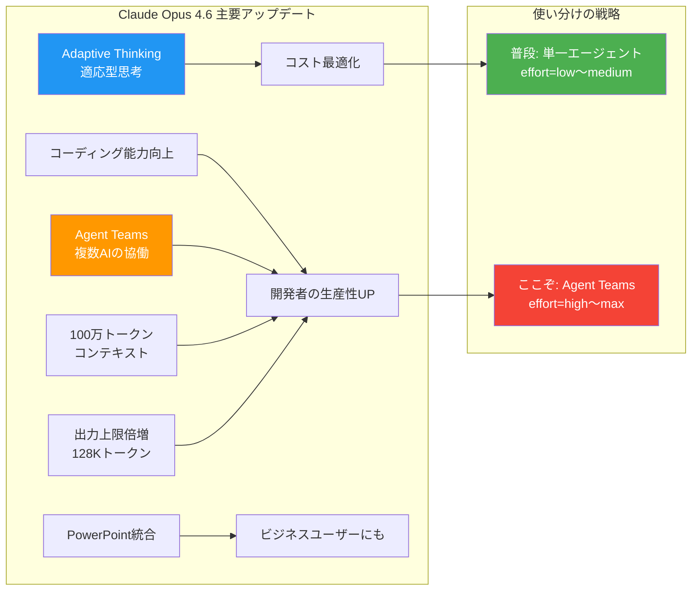

# Claude Opus 4.6 主要アップデートまとめ

> 学習日: 2026-02-10
> ソース: [Claude最新モデル「Opus 4.6」が登場！コーディング性能向上やAIエージェントチームなど主要アップデートを解説してみた](https://www.youtube.com/watch?v=DfoEU5HgGoE)
> ソース種別: YouTube + 関連Web記事
> 関連分野: AI/LLM、Claude Code Skills

---

## 概要

Anthropic社が2026年2月5日にリリースした最新モデル「Claude Opus 4.6」の主要アップデートを学んだ。
コーディング性能の向上に加え、複数AIが協働する「エージェントチーム」機能、100万トークンのコンテキストウィンドウ、適応型思考（Adaptive Thinking）など、AIを「ツール」から「チームメイト」に進化させるアップデートが多数含まれている。

---

## 学んだこと

### 主要ポイント

- **コーディング能力が大幅向上**: ミスの自己発見・修正が強化。Terminal-Bench 2.0で高スコアを記録
- **エージェントチーム機能**: 複数のAIがチームを組み、役割分担して並列で協働する新機能
- **100万トークンのコンテキストウィンドウ**: Opusクラス初。大規模コードベースや大量ドキュメントを一度に処理可能に
- **適応型思考（Adaptive Thinking）**: 問題の難易度に応じてAIが「考える深さ」を自動調整する機能
- **PowerPoint直接統合**: AIがスライド内で直接操作でき、Excel連携でデータ可視化も可能に
- **出力上限が倍増（64K→128K）**: 長文レポートやコードを途切れずに一気に生成可能に

### 前提知識

この内容を理解するための基礎知識:

- **Claudeのモデル構成**: 軽量な「Haiku」、中間の「Sonnet」、最高性能の「Opus」の3グレードがある。今回はOpusのバージョン4.6へのアップデート
- **AIエージェント**: 人間に代わって自律的に判断・行動してくれるAIプログラムのこと
- **コンテキストウィンドウ**: AIが一度の会話で記憶・処理できる情報量。トークン（AIが言葉を処理する最小単位）で計測される
- **トークン**: 英語なら単語の一部、日本語なら1文字〜数文字程度。100万トークンは本数冊分に相当

---

## 詳細

### エージェントチーム（Agent Teams）

今回のアップデートの目玉機能。従来のサブエージェントが「メインからサブへの一方通行の命令」だったのに対し、Agent Teamsでは**エージェント同士が双方向にコミュニケーション**しながら並列で作業する。

#### チームの構成

| 役割 | やること |
|------|---------|
| **リーダー** | 全体計画を立て、メンバーに役割を割り当て、統括する |
| **メンバー** | 特定の専門領域を担当し、自律的に作業。メンバー同士で議論もする |

#### ユースケース

- **コードレビュー**: セキュリティ担当・パフォーマンス担当・テスト担当が並列でレビューし、発見事項を共有
- **デバッグ**: 複数の仮説を別々のエージェントが同時に検証し、結果を突き合わせる
- **リサーチ**: 価格・ベンチマーク・ユーザーレビューを分担して同時調査し、レポートを作成

#### 使い方（Claude Code）

1. 設定で `claude_code_experimental_agent_teams` を `1` に設定
2. `--teammate-mode tmux` オプションで起動
3. tmuxで画面分割され、各エージェントの動きをリアルタイムに確認できる

#### 注意点

- 現在は**リサーチプレビュー**（実験段階）
- エージェント間の通信もトークン消費するため、**1回のタスクで通常の数倍〜数十倍のコストになる可能性**がある
- 単純なタスクでは逆にオーバーヘッドで遅くなるため、**複雑なタスク向き**

### 適応型思考（Adaptive Thinking）

問題の難易度に応じて、AIが「どれくらい深く考えるべきか」を自動判断する機能。APIやClaude Codeから `effort` パラメータ（low / medium / high / max）で手動制御も可能。

- 簡単な質問 → 素早く回答（コスト節約）
- 難しい問題 → じっくり時間をかけて回答（精度重視）

フリーランスとしてAPI利用コストを管理する上で、このパラメータの使い分けが重要になる。

### 100万トークンのコンテキストウィンドウ

Opusクラスとして初めて100万トークンに対応（ベータ版）。加えて「Context Compaction」機能により、長時間のタスクでもコンテキスト不足に陥りにくくなっている。

活用例:
- 大規模コードベース全体を一括で読み込み、全体設計を考慮した提案を得る
- Vue→Nuxt3やPages Router→App Routerの移行で、ガイドライン+既存コードを全部読み込ませる

---

## 全体像

Opus 4.6のアップデートは大きく「性能向上系」と「新機能系」に分かれる。フリーランス個人開発者としては、**コスト意識を持った使い分け**が鍵になる。

---

## 実務への応用

### どう活かせるか

フリーランスフロントエンドエンジニアとして、特に以下の場面で活かせる:

- **knowledge-hubプロジェクト**: Agent Teamsで「RSS取得」「記事分析」「レポート生成」を分担させれば、daily-trendsスキルの処理が高速化・高品質化する可能性がある
- **クライアント案件のリファクタリング**: 100万トークンのコンテキストを活かして、大規模なNext.js/Nuxt3プロジェクト全体を一括で読み込み、精度の高い修正提案を得る
- **バックエンド学習（Go/Python）**: Adaptive ThinkingをmaxにしてDDDやクリーンアーキテクチャの壁打ちをし、深い設計議論をAIと行う

### 具体的なアクション

- Agent Teamsの実験的機能フラグを有効にして、小規模なタスクで試してみる
- `effort` パラメータの使い分けを日常のClaude Code利用に取り入れる
- 100万トークンコンテキストを活かして、案件参画時のコードベース理解に使う

---

## 振り返り

### 一番の収穫

Agent Teams機能の存在と仕組みを知れたこと。「一人フルスタックチーム」を実現する手段として非常に魅力的。ただし、消費トークンがかなり多いため、**普段は単一エージェント、ここぞの場面でAgent Teams**というメリハリのある使い方が現実的。

### まだわからないこと・深掘りしたいこと

- Agent Teamsの実際のトークン消費量がどの程度か（具体的な数値）
- tmuxモードでの実際の操作感・ワークフロー
- Claude vs GPT vs Geminiの競争状況の中で、各社のエージェント機能の比較

---

## ネクストステップ

1. Claude Codeの設定で `claude_code_experimental_agent_teams` を有効にし、小さなタスクで試す
2. `effort` パラメータの使い分けを実践してみる（ボイラープレート生成 → low、設計相談 → high）
3. 他社（GPT、Gemini）のエージェント機能も調べて比較し、使い分け戦略を立てる

---

## 関連リンク

- [Claude Opus 4.6がリリース — 100万トークン・Agent Teams・PowerPoint統合など新機能まとめ（Zenn）](https://zenn.dev/akasara/articles/e81a2b495f4bbe)
- [Anthropic、「Claude Opus 4.6」をリリース。複数のAIが連携する「エージェントチーム」機能を搭載（AISmiley）](https://aismiley.co.jp/ai_news/anthropic-claude-opus-46/)
- [「Claude Opus 4.6」のクレジット配布中（ITmedia）](https://www.itmedia.co.jp/aiplus/articles/2602/06/news086.html)
- [Claude Opus 4.6 is now generally available for GitHub Copilot（GitHub Blog）](https://github.blog/changelog/2026-02-05-claude-opus-4-6-is-now-generally-available-for-github-copilot/)
