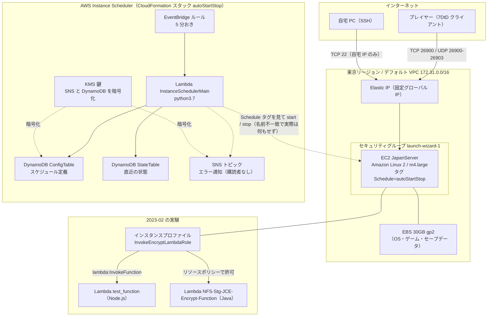

# AWS 旧環境の構成記録: 7 Days to Die サーバーと自動起動停止の仕組み（2020〜2023）

> 学習日: 2026-10-02
> ソース: 自分の AWS アカウントを AWS CLI で全リージョン棚卸しした実機調査（全削除前の記録）
> ソース種別: 書籍・その他（実環境の調査）
> 関連分野: AWS / インフラ基礎 / クラウドのコスト管理

---

## 概要

2020 年に有識者のブログを見ながら作った 7 Days to Die（ゾンビサバイバルゲーム）のマルチプレイ用サーバー環境と、その後に足した「自動起動停止」の仕組み、2023 年の Lambda 実験の残骸を、2026-10-02 に全削除する前に記録したもの。
最後に使ったのは 2023 年 2 月で、それ以降は何もしていないのに月 11 ドル前後（年 135 ドル）の課金が続いていた。
「停止したサーバーでも何にお金がかかるのか」「各部品がどんな役割か」を、当時なにもわからず設定した自分に向けて整理する。

---

## 学んだこと

### 主要ポイント

- 構成は 3 つの時期の積み重ねだった。2020-06〜07 のゲームサーバー本体、2020-09 の自動起動停止（AWS Instance Scheduler）、2023-02 の Lambda 実験
- 「VPC の残骸がある」と思っていたが、全リージョンにあったのは AWS が最初から用意するデフォルト VPC で、自分で作ったネットワークは 1 つもなかった
- EC2 を停止しても、ディスク（EBS）と固定 IP（Elastic IP）は課金され続ける。これが月 7 ドル
- 節約のために入れた自動起動停止の仕組みは、導入した 2020 年 9 月から一度も EC2 を動かしていなかった。EC2 のタグに入れた値がスケジュール名ではなくスタック名だったため、Lambda は対象を見つけられなかった
- 2023-11 に暗号鍵（KMS）を無効化したことで、その仕組みは完全にエラーになり、以後 3 年近く Lambda が 5 分おきに失敗し続けていた。しかも鍵は無効化しても月 1 ドルの課金が止まらない
- 2023 年の実験で作った IAM ユーザー 2 つに、一度も使われていないアクセスキーが有効なまま残っていた。課金はないがセキュリティ上は最優先で消すべきもの

### 前提知識

- **リージョン**: AWS のデータセンターの地域単位（東京、オハイオなど）。リソースはリージョンごとに独立して存在し、コンソールもリージョンを切り替えないと見えない
- **VPC（Virtual Private Cloud）**: AWS 内に作る自分専用の仮想ネットワーク。全リージョンに「デフォルト VPC」が最初から 1 つずつ用意されていて、これは無料
- **EC2**: 仮想サーバー。**EBS** はその中身を保存するディスク。**Elastic IP** は固定のグローバル IP アドレス
- **セキュリティグループ**: サーバーに対するファイアウォール。「どのポートに、どこからの通信を許すか」を列挙する
- **IAM**: 権限管理。ユーザー（人やプログラムのアカウント）・ロール（AWS サービスがかぶる権限の帽子）・ポリシー（許可内容を書いた JSON）の 3 つで構成される
- **Lambda**: サーバーを持たずにコードだけ置いて実行するサービス。**EventBridge** は「5 分おき」のようなタイマー。**DynamoDB** は設定や状態を保存する NoSQL データベース
- **CloudFormation**: 複数のリソースをテンプレートから一括作成する仕組み。「スタック」という単位で作成・削除できる
- **KMS**: 暗号鍵の管理サービス。他のサービスのデータ暗号化に使う

---

## 時系列: いつ何を作ったか

| 時期 | 出来事 | 残っていた痕跡 |
|---|---|---|
| 2020-06-07 | オハイオ（us-east-2）で最初の EC2 を起動。コンソールの初期リージョンのまま試したと思われる | セキュリティグループ launch-wizard-1、キーペア silmo_key |
| 2020-06-30 | 同じ晩に東京で Lightsail を試し、オハイオで 7DtD 用ポートを開けた 2 台目を起動 | Lightsail 用の AWS 管理鍵、launch-wizard-2 |
| 2020-07-01〜02 | 東京（ap-northeast-1）に本番サーバー JapanServer を構築。日本からの遅延を考えて東京に移したと推測 | EC2、EBS、Elastic IP、launch-wizard-1、キーペア silmo_key.pem |
| 2020-09-24 | AWS Instance Scheduler を導入し、サーバーの時間帯運転を狙う（タグ値の誤りで実際には一度も機能せず） | CloudFormation スタック autoStartStop 一式 |
| 2023-02-13〜15 | EC2 から Lambda を呼び出す実験（暗号化処理の検証と思われる）。JapanServer を呼び出し元として起動 | Lambda 2 つ、IAM ユーザー 2 つ、ロール 5 つ、ポリシー 7 つ |
| 2023-02-18 | JapanServer を手動停止。以後一度も起動していない | 停止理由 "User initiated" |
| 2023-11-10 頃 | KMS 鍵を無効化。7 日後の 11-17 に DynamoDB テーブルがアーカイブ状態になり、Instance Scheduler が機能停止 | 鍵の状態 Disabled、テーブル状態 ARCHIVED |
| 2024-02 | AWS がパブリック IPv4 アドレスを有料化。停止中サーバーの固定 IP に課金が始まる | 月 3.7 ドル |
| 2026-10-02 | 全リージョンを棚卸しし、記録を残したうえで全削除 | この記録 |

---

## 全体像

上段がゲームサーバー本体、中段がそれを自動で起動停止する仕組み、下段が 2023 年の実験。削除前の時点で中段は壊れており（KMS 鍵が無効）、下段は一度も本番で使われていない。

---

## 詳細

### 1. ゲームサーバー本体（2020-07〜）

#### EC2 インスタンス JapanServer

| 項目 | 設定 | 意味 |
|---|---|---|
| AMI（OS イメージ） | Amazon Linux 2（2020-05-20 版） | AWS 公式の Linux。ブログの手順どおりに選んだと思われる |
| インスタンスタイプ | m4.large（2 vCPU / 8GB メモリ） | 7DtD サーバーはメモリを食うので汎用の large を選択。24 時間動かすと月 90 ドル前後 |
| 配置 | 東京 ap-northeast-1a、デフォルト VPC のデフォルトサブネット（172.31.32.0/20、パブリック IP 自動付与あり） | 自分でネットワークは作っていない |
| ルートディスク | /dev/xvda に EBS 30GB を接続。「インスタンス削除時にディスクも削除」= 有効 | インスタンスを削除するとセーブデータも消える |
| キーペア | silmo_key.pem（RSA） | SSH ログイン用の鍵。秘密鍵は手元の PC にある |
| タグ | Name=JapanServer、Schedule=autoStartStop | Schedule タグが Instance Scheduler との接点 |
| IAM ロール | InvokeEncryptLambdaRole（2023-02 の実験で後付け） | この EC2 から Lambda を呼べる権限 |
| 詳細モニタリング | 無効 | 1 分間隔の監視は不要と判断（または既定のまま） |
| 状態 | 2023-02-18 に手動停止したまま | 最終起動は 2023-02-15 |

#### EBS ボリューム（ディスク）

30GB、gp2（汎用 SSD）、暗号化なし、2020-07-02 作成。OS・7DtD サーバー本体・ワールドのセーブデータが入っていた。
**停止中のインスタンスでもディスクは残っているので課金される**（東京の gp2 は 1GB あたり月 0.12 ドル → 3.6 ドル）。これが放置コストの第一の原因。

#### Elastic IP（固定 IP）

サーバーを再起動すると通常はグローバル IP が変わる。自動起動停止で毎日止めるので、プレイヤーが同じアドレスで繋げるように固定 IP を割り当てていた。
2024-02 以降、AWS はパブリック IPv4 を 1 時間 0.005 ドルで課金するようになり、停止中のサーバーに付いた固定 IP で月 3.7 ドル。放置コストの第二の原因。

#### セキュリティグループ launch-wizard-1（東京）

EC2 をコンソールのウィザードから作るときに自動で作られる設定で、名前もそれ由来。中身は「どの通信を通すか」の一覧。

| 方向 | プロトコル / ポート | 許可元 | 説明欄 | 意味 |
|---|---|---|---|---|
| 受信 | TCP 26900 | どこからでも（IPv4 と IPv6） | 7dtd | 7DtD のゲーム本体ポート |
| 受信 | UDP 26900〜26903 | どこからでも | 7dtd | 7DtD の通信・Steam 連携用ポート |
| 受信 | TCP 80 | どこからでも | httpd | Web サーバー用。動作確認か管理画面用に開けたと推測 |
| 受信 | TCP 22 | 自宅の IP アドレス 2 つのみ | My Global IP ADDR | SSH。自宅からだけ入れる設定で、ここは正しく絞られていた |
| 送信 | すべて | どこへでも | （既定） | サーバーから外への通信は制限なし |

#### オハイオの残骸（2020-06）

| 名前 | 作成 | 内容 | 推測 |
|---|---|---|---|
| launch-wizard-1 | 2020-06-07 | TCP 80 と TCP 22 をどこからでも許可 | 最初の練習。SSH が全開放で危ない設定だった |
| launch-wizard-2 | 2020-06-30 | 7DtD ポートを全開放、SSH は自宅 IP のみ | 東京版の前身。ここで設定の型ができた |
| キーペア silmo_key | 2020-06-07 | SSH 鍵 | 東京の silmo_key.pem の前身 |

インスタンス本体は削除済みで、これらだけが残っていた。すべて無料。

#### Lightsail の痕跡（2020-06-30）

Lightsail（EC2 を簡略化した月額固定のサービス）用の AWS 管理鍵が東京に残っていた。Lightsail を一度試して EC2 に切り替えたと推測。インスタンスは残っていない。

### 2. 自動起動停止: AWS Instance Scheduler v1.3.3（2020-09〜）

#### 何のための仕組みか

m4.large を 24 時間動かすと月 90 ドル前後かかる。遊ぶ時間帯だけ起動するようにして費用を抑えるために、AWS 公式のソリューション「Instance Scheduler on AWS」（ソリューション ID SO0030）を CloudFormation テンプレートから導入した。

#### 仕組み

1. EventBridge ルールが 5 分おきに Lambda を起動する
2. Lambda は DynamoDB の ConfigTable から「スケジュール定義」（曜日・時刻）を読む
3. アカウント内の EC2 から `Schedule` タグが付いたものを探し、タグの値と同名のスケジュールに従って start / stop を実行する（ここではタグの値が `autoStartStop` で、同名のスケジュールが存在しなかったため何もされなかった。後述）
4. 結果を StateTable に記録し、エラーがあれば SNS トピックに通知する（購読者を設定していなかったので誰にも届かない）

#### 構成部品（スタックが作ったもの）

| 種類 | 名前 | 役割 | 設定 |
|---|---|---|---|
| CloudFormation スタック | autoStartStop | 下記すべてを一括で作成・削除する単位 | 2020-09-24 作成 |
| Lambda 関数 | autoStartStop-InstanceSchedulerMain | 本体。判断して start / stop を叩く | python3.7（既に廃止済みのランタイム）、メモリ 128MB、タイムアウト 300 秒 |
| EventBridge ルール | aws-instance-schedulerscheduling_rule | 5 分おきのタイマー | cron(0/5 * * * ? *)、有効のまま |
| DynamoDB テーブル | ConfigTable | スケジュールと期間（period）の定義 | 10 項目（すべてインストール時のサンプル）。KMS 鍵で暗号化 |
| DynamoDB テーブル | StateTable | 各インスタンスの直近の状態 | 0 件（一度も記録されていない）。KMS 鍵で暗号化 |
| DynamoDB テーブル | MaintenanceWindowTable | SSM メンテナンスウィンドウ連携用 | 未使用 |
| SNS トピック | autoStartStop-InstanceSchedulerSnsTopic | エラー通知 | 購読者なし |
| KMS 鍵 | alias/instance-scheduler-encryption-key | SNS と DynamoDB の暗号化 | 顧客管理鍵（月 1 ドル）。2023-11 に無効化 |
| IAM ロール | SchedulerRole / LambdaFunction ロール | Lambda が EC2 を操作する権限 | スタックが自動生成 |
| ログ | autoStartStop-logs | 動作ログ | 保持 30 日 |
| ログ | /aws/lambda/autoStartStop-InstanceSchedulerMain | Lambda 実行ログ | 保持期限なし → 約 1GB 蓄積 |

#### スタックのパラメータ（導入時に画面で入力した値）

| パラメータ | 値 | 意味 |
|---|---|---|
| TagName | Schedule | EC2 に付けるタグの名前 |
| DefaultTimezone | Asia/Tokyo | スケジュールの時刻を日本時間で解釈 |
| SchedulerFrequency | 5 | 5 分おきに判定 |
| ScheduledServices | EC2 | EC2 のみ対象（RDS は対象外） |
| SchedulingActive | Yes | 有効 |
| Trace | Yes | 詳細ログを出す（ログが 1GB に膨らんだ原因） |
| LogRetentionDays | 30 | autoStartStop-logs の保持日数 |
| MemorySize | 128 | Lambda のメモリ |
| StartedTags / StoppedTags | state=started / state=stopped | 起動停止時に EC2 へ付けるタグ |
| SendAnonymousData | Yes | AWS へ匿名の利用統計を送る |
| Regions / CrossAccountRoles | 空 | 自リージョン・自アカウントのみ |

#### 実際のスケジュール定義（削除後にバックアップから復元して確認）

テーブルは KMS 鍵の無効化でアーカイブ状態になっていたが、鍵を一時的に再有効化し、アーカイブ時のバックアップから一時テーブルに復元して読み取った。10 項目の内訳は次のとおりで、**すべて Instance Scheduler がインストール時に入れるサンプルそのもの**だった。

| 種別 | 名前 | 内容 |
|---|---|---|
| config | scheduler | 全体設定（タグ名 Schedule、タイムゾーン Asia/Tokyo、対象 ec2、リージョン ap-northeast-1、trace 有効） |
| schedule | running / stopped | 常時起動 / 常時停止の固定スケジュール（サンプル） |
| schedule | seattle-office-hours / uk-office-hours | 平日 9〜17 時に起動。シアトル時間 / ロンドン時間（サンプル） |
| schedule | scale-up-down | 平日は t2.micro、週末は t2.nano にサイズ変更（サンプル） |
| period | office-hours / working-days / weekends / first-monday-in-quarter | 上のスケジュールが参照する時間帯の定義（サンプル） |

**`autoStartStop` という名前のスケジュールは存在しなかった。** EC2 に付けたタグ `Schedule=autoStartStop` の値は CloudFormation のスタック名であって、スケジュール名ではない。Lambda はタグの値と同名のスケジュールを探して見つからず、その EC2 を対象外として何もしない。起動停止の履歴を記録する StateTable が 0 件だったこともこれと一致する。
つまり **自動起動停止は 2020 年 9 月の導入時から一度も機能していなかった**。サーバーの起動停止は結局すべて手動だったことになる。
正しくは、ConfigTable に自分用のスケジュール（例: 名前 `game-evening`、期間「毎日 19:00〜24:00」）を追加し、タグの値をその名前にする必要があった。

#### どう壊れていたか

壊れ方は 2 段階あった。

**1 段階目（導入時から）**: 上記のとおりスケジュール名の不一致で、仕組み自体は 5 分おきに動いていたが EC2 には何もしていなかった。エラー通知先の SNS に購読者を設定していなかったので、気づく手段もなかった。

**2 段階目（2023-11-10 頃）**: KMS 鍵が無効化された（コスト削減のつもりか、誤操作かは不明）。鍵で暗号化していた DynamoDB テーブルは 7 日間復号できないと「アーカイブ」状態になり（2023-11-17）、以後は読み書きできない。削除直前のログを見ると、Lambda は 5 分おきに起動して 3〜5 秒動いたあと `KMSDisabledException: ... key is disabled` で終わっていた。設定を読めずにエラー通知を SNS に出そうとし、その SNS も同じ鍵で暗号化されているので通知すら出せない、という二重の詰まり方を 3 年近く繰り返していた。
教訓: **KMS 鍵は無効化しても月 1 ドルの課金は止まらない**（止まるのは「削除をスケジュール」したときだけ）。しかも無効化は、その鍵を使っているサービスをまとめて壊す。

### 3. Lambda 実験（2023-02-13〜15）

名前（NFS-Stg、JCE = Java Cryptography Extension）から、仕事関連の「EC2 から Lambda を呼び、Java で暗号化処理をさせる」構成の検証と思われる。ゲームサーバーの EC2 を呼び出し元として流用した。

| 種類 | 名前 | 役割 | 設定・中身 |
|---|---|---|---|
| IAM ユーザー | EncryptUser、User | 外部プログラムからの呼び出し用に作ったと思われる | アクセスキーが有効なまま、一度も使われず。ポリシー JRE_Encrypt_User_Policy を付与 |
| IAM ポリシー | JRE_Encrypt_User_Policy | Lambda 呼び出し許可 | 許可対象の ARN が AWS ドキュメントのサンプル値（アカウント 123456789012 の MyFunction）のまま。つまり実際には何も許可していなかった |
| IAM ロール | InvokeEncryptLambdaRole（EC2 用） | EC2 が Lambda を呼ぶ権限 | test_function の呼び出しを許可。インスタンスプロファイルとして JapanServer に装着 |
| IAM ポリシー | InvokeEncryptLambdaFunction | 上のロール用 | lambda:InvokeFunction を test_function に限定 |
| IAM ポリシー | test_invoke_lambda | NFS-Stg-JCE-Encrypt-Function の呼び出し許可 | どこにも付与されていない（作って終わり） |
| Lambda | test_function | 動作確認用 | Node.js 18、128MB、3 秒。中身は AWS の「SNS メッセージを受け取ってログに出す」サンプルそのまま |
| Lambda | NFS-Stg-JCE-Encrypt-Function | 暗号化処理の本体のはず | Java 11、512MB、15 秒。中身は AWS の Java サンプル「example.Hello」（2019 年ビルド）で、暗号化コードは入っていない |
| IAM ロール | JRE_Encrypt-role、NFS-Stg-JCE-Encrypt-Function-role ×2、test_function-role | 各 Lambda の実行ロール | Lambda コンソールが自動生成。ログ書き込み権限（AWSLambdaBasicExecutionRole-xxxx）のみ。同じ関数のロールが 2 つあるのは作り直した痕跡 |

Lambda 側のリソースポリシー（誰が呼べるか）には「InvokeEncryptLambdaRole から NFS-Stg-JCE-Encrypt-Function を呼んでよい」が設定されていた。試行錯誤の途中で止まった状態と見られる。

### 4. 何にいくらかかっていたか

| 項目 | 月額（USD） | 備考 |
|---|---|---|
| EBS 30GB gp2 | 3.60 | 停止中でも課金 |
| Elastic IP（停止中インスタンスに付与） | 3.72 | 2024-02 の有料化以降 |
| KMS 顧客管理鍵 | 1.00 | 無効化しても課金 |
| KMS（請求上は鍵 3 本分） | 2.00 | AWS 管理鍵 2 本分が計上されており説明がつかない。削除後の請求で確認 |
| 税 | 1.0 前後 | |
| 合計 | 約 11.3 | 直近 12 か月は毎月 11.0〜11.4 ドルで一定（年 135 ドル） |

無料だったもの: 停止中の EC2 本体、Lambda（失敗し続けていたが無料枠内）、DynamoDB、SNS、ログ（5GB 未満）、VPC・セキュリティグループ・キーペア。

---

## 実務への応用

### どう活かせるか

- 次に何かを AWS で作るときは「止めたら無料」ではなく、**ディスク・固定 IP・KMS 鍵・NAT Gateway は止めても課金される**ことを前提に設計する
- 手動でぽちぽち作ると今回のように残骸が散らばる。CloudFormation / CDK / Terraform でまとめて作れば、スタック削除 1 回で消える
- IAM ユーザーのアクセスキーは「作ったら使う、使わないなら消す」。使っていないキーは侵入経路になるだけ

### 具体的なアクション

- AWS Budgets で月 5 ドルを超えたらメール通知する設定を入れる（放置コストの早期発見）
- 日常のコンソール操作は root ユーザーではなく、管理者権限の IAM ユーザー（または IAM Identity Center）で行う
- 次にゲームサーバーを立てるなら、遊ばない期間はスナップショットを取ってインスタンスごと削除する運用にする

---

## 振り返り

### 一番の収穫

「VPC の残骸がある」という認識は間違いで、自分で作ったネットワークは 1 つもなかった。本当の残骸は、停止したサーバーのディスクと固定 IP、そして壊れたまま 3 年動き続けた自動化の仕組みだった。何が課金されるかは、画面を眺めるより請求の内訳を見る方が早い。
もう 1 つ、節約のために入れたはずの自動起動停止は、タグの値を 1 つ間違えていたせいで最初から動いていなかった。「入れた」と「動いている」は別物で、動作確認と通知先の設定までやって初めて仕組みになる。

### まだわからないこと・深掘りしたいこと

- KMS の請求が鍵 3 本分になっていた理由（AWS 管理鍵は無料のはず）
- 2023-11 に KMS 鍵を無効化した経緯
- Instance Scheduler の現行版（v3 系）での構成の違い

---

## 削除の記録（2026-10-02）

AWS CLI（AdministratorAccess を付けた専用 IAM ユーザー）から Claude Code で実施。順番と結果は次のとおり。

| 順 | 対象 | 操作 | 結果 |
|---|---|---|---|
| 1 | Elastic IP | 関連付け解除 → 解放 | 完了 |
| 2 | EC2 JapanServer | 終了（terminate）。ルート EBS は「終了時に削除」設定のため連動して消去 | 完了。東京の EBS はゼロに |
| 3 | CloudFormation スタック autoStartStop | スタック削除（Lambda、DynamoDB ×3、SNS、KMS 鍵、EventBridge ルール、IAM ロール ×2、ログ autoStartStop-logs を一括） | 完了（約 10 分）。KMS 鍵は「削除予定」になる。後述の復元作業のため一度取り消し、最短の 7 日後（2026-10-09）削除で設定し直した。待機中は課金なし |
| 4 | IAM ユーザー EncryptUser、User | アクセスキー削除 → ポリシー解除 → ユーザー削除 | 完了 |
| 5 | IAM ロール ×5、インスタンスプロファイル ×1、カスタムポリシー ×7 | ポリシー解除 → ロール削除 → ポリシー削除 | 完了 |
| 6 | Lambda test_function、NFS-Stg-JCE-Encrypt-Function | 関数削除 | 完了 |
| 7 | オハイオの launch-wizard-1、launch-wizard-2、キーペア silmo_key | 削除 | 完了 |
| 8 | 東京の launch-wizard-1、キーペア silmo_key.pem | EC2 終了後に削除 | 完了 |
| 9 | ログ /aws/lambda/autoStartStop-InstanceSchedulerMain（約 1GB） | スタック外のため手動削除 | 完了 |
| 10 | DynamoDB アーカイブ時バックアップ ×3 | 空の 2 つ（StateTable、MaintenanceWindowTable）を先に削除。ConfigTable のバックアップは次の読み取りのために一旦残した | 完了 |
| 11 | スケジュール定義の読み取り | コンソールで KMS 鍵の削除をキャンセル → 有効化（ここだけユーザー操作）→ CLI でバックアップから一時テーブルに復元 → 読み取り → 一時テーブルとバックアップを削除 → 鍵を再度削除予定に | 完了。結果は「実際のスケジュール定義」に記載 |

**残したもの**: 全リージョンのデフォルト VPC（AWS 標準、無料）、CLI 用 IAM ユーザー claude-admin、root ユーザー、削除予定の KMS 鍵（2026-10-09 に自動で消える）。

**途中で止まったこと**: KMS 鍵の再有効化は Claude Code の自動モードの安全判定で拒否された。そのため鍵の削除キャンセルと有効化だけはユーザーがコンソールで操作し、復元以降を CLI で行った。

**削除後の確認**: 全 17 リージョンを再棚卸しし、残っているのはデフォルト VPC、IAM ユーザー claude-admin、削除予定の KMS 鍵のみ（終了済み EC2 の表示は 1 時間ほどで自動的に消える）。

**削除で学んだ順序の勘所**:
- Elastic IP は EC2 に紐付いたままだと解放できないので、先に関連付けを解除する
- セキュリティグループは、それを使っているインスタンスが完全に終了するまで消せない
- IAM はポリシー → ロール（またはユーザー）の順で「付いているものを外してから本体を消す」
- CloudFormation で作ったものはスタック削除 1 回で済むが、Lambda の実行ログのようにスタック外に自動生成されたものは残る
- KMS 鍵は「削除予定」にしても待機期間（7〜30 日）内なら取り消せる。その鍵で暗号化したバックアップを読むには鍵が有効である必要があるので、読みたいものがあるなら鍵を消す前に済ませる

---

## ネクストステップ

1. 来月の請求で KMS の 2 ドルが消えているか確認する
2. AWS Budgets のアラートを設定する
3. 日常用の管理者 IAM ユーザーを作り、root ログインをやめる

---

## 関連リンク

- [Instance Scheduler on AWS（公式ソリューション）](https://aws.amazon.com/solutions/implementations/instance-scheduler-on-aws/)
- [AWS KMS 料金（公式）](https://aws.amazon.com/kms/pricing/)
- [パブリック IPv4 アドレスの有料化（AWS 公式ブログ）](https://aws.amazon.com/blogs/aws/new-aws-public-ipv4-address-charge-public-ip-insights/)
- [DynamoDB の暗号化と、KMS 鍵が使えなくなった場合の挙動（公式ドキュメント）](https://docs.aws.amazon.com/amazondynamodb/latest/developerguide/encryption.howitworks.html)
